- 
- [1 前台项目准备](#1-前台项目准备)
    - [1.1 项目描述](#11-项目描述)
    - [1.2 项目的功能界面](#12-项目的功能界面)
    - [1.3 项目打包](#13-项目打包)
    - [1.4 使用 antd-mobile 实现按需打包并且自定义 anti-mobile 主题颜色](#14-使用-antd-mobile-实现按需打包并且自定义-anti-mobile-主题颜色)
      - [1.4.1 准备工作](#141-准备工作)
      - [1.4.2 antd-mobile 按需加载](#142-antd-mobile-按需加载)
      - [1.4.3 antd-mobile 定制主题颜色](#143-antd-mobile-定制主题颜色)
- [2 前台组件的初步搭建](#2-前台组件的初步搭建)
  - [2.1 创建根组件，3 个一级路由组件](#21-创建根组件3-个一级路由组件)
  - [2.2 引入 redux](#22-引入-redux)
  - [2.3 实现登录和注册操作的页面](#23-实现登录和注册操作的页面)
    - [2.3.1 静态注册界面的实现](#231-静态注册界面的实现)
    - [2.3.2 实现静态登录界面](#232-实现静态登录界面)
- [3 搭建后台应用，完成后台准备工作](#3-搭建后台应用完成后台准备工作)
  - [3.1 创建 node+express 应用](#31-创建-nodeexpress-应用)
  - [3.2 实现后台应用自动重运行---nodemon 包](#32-实现后台应用自动重运行---nodemon-包)
  - [3.3 在后台产生一个用于响应 POST 请求的路由](#33-在后台产生一个用于响应-post-请求的路由)
  - [3.4 测试后台注册操作的 Post 请求响应路由是否设置成功](#34-测试后台注册操作的-post-请求响应路由是否设置成功)
- [4 使用 mongoose 操作数据库](#4-使用-mongoose-操作数据库)
  - [4.1 回顾数据库的几个基本操作](#41-回顾数据库的几个基本操作)
  - [4.2 使用 vscode 操作数据库](#42-使用-vscode-操作数据库)
- [5 完成注册登录的后台处理](#5-完成注册登录的后台处理)
  - [5.1 连接数据库，定义集合模型](#51-连接数据库定义集合模型)
  - [5.2 定义用户注册的响应路由：](#52-定义用户注册的响应路由)
  - [5.3 定义用户登录的响应路由：](#53-定义用户登录的响应路由)
- [6 完成注册、登录的前台处理](#6-完成注册登录的前台处理)
    - [6.1 axios-ajax 与后台交互](#61-axios-ajax-与后台交互)
    - [6.2 redux 状态管理](#62-redux-状态管理)
  - [6.3 解决跨域请求问题：](#63-解决跨域请求问题)
- [7 完成用户的信息完善界面](#7-完成用户的信息完善界面)
  - [7.1 完成组件的静态页面](#71-完成组件的静态页面)
    - [7.1.1 头像部分单独作为一个 UI 组件](#711-头像部分单独作为一个-ui-组件)
    - [7.1.2 老板信息完善页面的静态实现](#712-老板信息完善页面的静态实现)
    - [7.1.3 大神信息完善页面的静态实现](#713-大神信息完善页面的静态实现)
  - [7.2 动态交互](#72-动态交互)
    - [7.2.1 数据收集](#721-数据收集)
    - [7.2.2 前后台交互](#722-前后台交互)
- [8 主界面](#8-主界面)
  - [8.1 实现自动登陆](#81-实现自动登陆)
  - [8.2 主界面的子组件——老板列表和大神列表的框架实现](#82-主界面的子组件老板列表和大神列表的框架实现)
    - [8.2.1 大神用户的老板列表](#821-大神用户的老板列表)
    - [8.2.2 老板用户的大神列表](#822-老板用户的大神列表)
    - [8.2.3 信息列表：](#823-信息列表)
    - [8.2.4 个人中心：](#824-个人中心)
    - [8.2.5 发生错误时的组件](#825-发生错误时的组件)
    - [8.2.6 在 main 中动态化引入子组件](#826-在-main-中动态化引入子组件)
    - [8.2.7 制作底部导航栏组件](#827-制作底部导航栏组件)
    - [8.2.8 解决问题 1：底部导航栏位置错误](#828-解决问题-1底部导航栏位置错误)
    - [8.2.9 解决问题 2：底部导航栏显示了四个路由组件](#829-解决问题-2底部导航栏显示了四个路由组件)
- [9 个人中心](#9-个人中心)
  - [9.1 显示静态界面](#91-显示静态界面)
  - [9.2 实现动态化处理：关联显示当前登录的用户信息](#92-实现动态化处理关联显示当前登录的用户信息)
  - [9.3 退出登录操作](#93-退出登录操作)
- [10 大神/老板列表功能](#10-大神老板列表功能)
  - [10.1 后台：定义获取指定用户列表的路由](#101-后台定义获取指定用户列表的路由)
  - [10.2 前台:ajax 请求](#102-前台ajax-请求)
  - [10.3 redux 管理](#103-redux-管理)
  - [10.4 建立共同的组件 UserList](#104-建立共同的组件-userlist)
  - [10.5 修改 Laoban 组件和 Dashen 组件](#105-修改-laoban-组件和-dashen-组件)
  - [10.6 解决两个布局问题](#106-解决两个布局问题)
    - [10.6.1 解决第一个问题](#1061-解决第一个问题)
    - [10.6.2 解决第二个问题](#1062-解决第二个问题)
    - [10.3 解决个人中心顶部导航栏和底部导航栏遮挡用户信息的问题](#103-解决个人中心顶部导航栏和底部导航栏遮挡用户信息的问题)
- [11 学习 socket.io 的使用](#11-学习-socketio-的使用)
  - [11.1 socket.io 简介](#111-socketio-简介)
    - [11.2 使用 socket.io 的例子](#112-使用-socketio-的例子)
      - [11.2.1 服务器端](#1121-服务器端)
      - [11.2.2 客户端](#1122-客户端)
- [12 实现实时聊天](#12-实现实时聊天)
  - [12.1 聊天功能组件：chat.jsx](#121-聊天功能组件chatjsx)
    - [12.1.1 服务器端：](#1211-服务器端)
      - [12.1.1.1 定义数据库的集合模型](#12111-定义数据库的集合模型)
      - [12.1.1.2 定义后台发送 ajax 请求对应的路由](#12112-定义后台发送-ajax-请求对应的路由)
    - [12.1.2 前端部分](#1212-前端部分)
      - [12.1.2.1 创建聊天界面的静态组件 Chat](#12121-创建聊天界面的静态组件-chat)
      - [12.1.2.2 实现前后台的收发消息](#12122-实现前后台的收发消息)
  - [12.2 实现用户间收发消息实时显示](#122-实现用户间收发消息实时显示)
    - [12.2.1 获取当前用户的聊天消息列表](#1221-获取当前用户的聊天消息列表)
      - [12.2.1.1 指定发送 ajax 请求的函数](#12211-指定发送-ajax-请求的函数)
      - [12.2.1.2 Redux 部分](#12212-redux-部分)
    - [12.2.2 实现已获取到的消息列表数据的动态显示](#1222-实现已获取到的消息列表数据的动态显示)
    - [12.2.3 实现收发消息(单个消息)的实时显示](#1223-实现收发消息单个消息的实时显示)
    - [12.2.4 在 Chat 组件中添加表情功能](#1224-在-chat-组件中添加表情功能)
  - [12.3 显示分组消息列表 message.jsx](#123-显示分组消息列表-messagejsx)
    - [12.3.1 完成静态组件](#1231-完成静态组件)
    - [12.3.2 实现动态化显示最后一条消息](#1232-实现动态化显示最后一条消息)
  - [12.3 未读消息数量显示](#123-未读消息数量显示)
    - [12.3.1 每一个分组的未读数量显示](#1231-每一个分组的未读数量显示)
    - [12.3.2 总的未读数量获取及显示](#1232-总的未读数量获取及显示)
    - [12.3.3 更新未读消息的数量](#1233-更新未读消息的数量)
      - [12.3.3.1 编写后台路由](#12331-编写后台路由)
      - [12.3.3.2 编写前台请求](#12332-编写前台请求)
  - [12.4 给老板列表或者大神列表添加动画效果](#124-给老板列表或者大神列表添加动画效果)

# 1 前台项目准备

### 1.1 项目描述

- (1) 这是一个前后台分离的招聘的 SPA 应用，包括前台应用和后台应用

- (2) 包括用户注册、登录，大神列表、老板列表，实时聊天等模块

- (3) 前端：使用 React+ES6+Webpack 等技术

- (4) 后端：使用 Node+express+mongodb+socketIO 等技术

  - nodejs 是一个平台 ，一个基于Chrome javascript  运行时建立的平台，它是对chrome V8引擎进行了封装的运行环境，简单说nodejs就是把浏览器的解释器封装起来作为服务器运行平台，用类似javascript的结构语法进行编程
  - MongoDB 是由C++语言编写的，是一个基于分布式文件存储的开源数据库系统。MongoDB 将数据存储为一个文档，数据结构由键值(key=>value)对组成。MongoDB 文档类似于 JSON 对象。字段值可以包含其他文档，数组及文档数组。
  - SocketIO将WebSocket、AJAX和其它的通信方式全部封装成了统一的通信接口，也就是说，我们在使用SocketIO时，不用担心兼容问题，底层会自动选用最佳的通信方式。因此说，WebSocket是SocketIO的一个子集。

- (5) 采用模块化、组件化、工程化的模式开发

  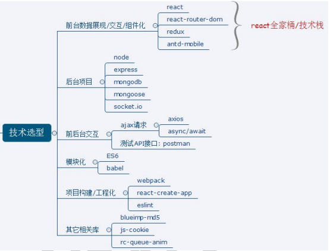

### 1.2 项目的功能界面

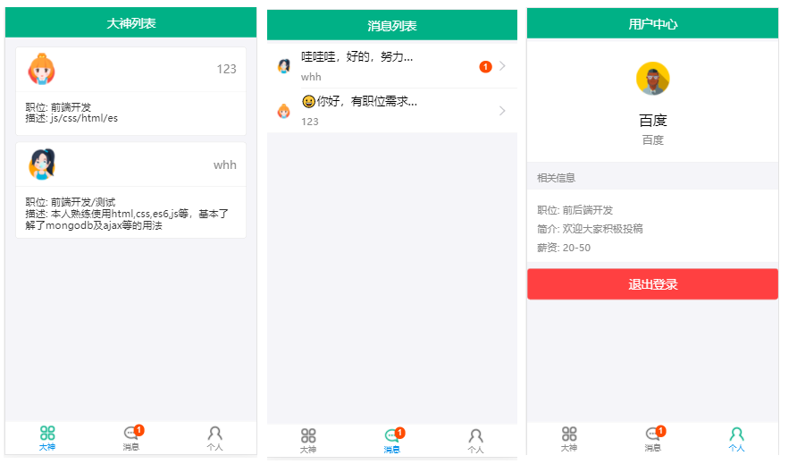


前端路由：

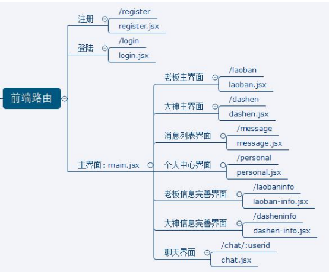

可以看出，总共存在三级路由组件，第一级就是入口文件。第二级包含注册、登录和主界面三个路由组件，并且主界面的路径为'/',这个组件是入口文件的默认界面。第三级就是老板、大神主界面及消息列表等，拿老板主界面路由组件为例，其完整路径就是`http:localhost:3000/#/laoban`

在入口文件中需要路由二级路由组件，在main中需要路由其他7个三级路由组件

### 1.3 项目打包

- 生成打包文件：npm run build
- 下载静态服务器：npm install -g serve
- 运行打包文件：serve build
- 如果想通过 npm 命令运行打包文件，可以在项目文件夹的 package.json 文件的 scripts 中添加`"client": "serve build"`,然后通过 npm run client 实现打包文件的运行
  - 可以发现 npm start，npm run build 等都是这样设定 npm 命令的

```
"scripts": {
    "start": "react-scripts start",
    "build": "react-scripts build",
    "test": "react-scripts test",
    "eject": "react-scripts eject",
    "client": "serve build"
},
```

### 1.4 使用 antd-mobile 并且实现按需打包并且自定义 anti-mobile 主题颜色

- 参考：https://www.jianshu.com/p/7097348cd900

#### 1.4.1 准备工作

- 首先需要按照antd-mobile的要求，因为我们需要实现的是移动端的应用，故需要对于页面的meta进行设置

- 另外，需要解决移动端点击事件的300ms延迟问题，三个办法

  ```
  300 毫秒延迟的主要原因是解决双击缩放(double tap to zoom)。双击缩放，顾名思义，即用手指在屏幕上快速点击两次，iOS 自带的 Safari 浏览器会将网页缩放至原始比例。
  
  如果页面内存在一个链接，当用户一次点击屏幕之后(还没来得及点击第二次或者没有想要点击第二次)，浏览器并不能立刻判断用户是确实要打开这个链接，还是想要进行双击操作。所以浏览器中手动点击和真正触发click事件之间存在300ms延迟，如果没有二次点击，则说明是打开链接
  
  在移动端的click事件可以拆解为：touchstart -> touchmove -> touchend -> click，浏览器在 touchend 之后会等待约 300ms ，如果没有再次点击行为，则触发 click 事件。 而浏览器等待约 300ms 的原因是，判断用户是否是双击行为，双击过程中就不适合触发 click 事件了。 由此可以看出 click 事件触发代表一轮触摸事件的结束。
  
  方法1： Chrome on Android (all versions)：直接关闭缩放,那双击缩放的功能就没有意义了，此时浏览器可以禁用默认的双击缩放行为并且去掉300ms的点击延迟。
  <meta name="viewport" content="width=device-width, user-scalable=no"> 
  或者：
  <meta name="viewport" content="width=device-width, initial-scale=1, minimum-scale=1, maximum-scale=1">
  
  方法2：对于Android版chrome 32+浏览器
  <meta name="viewport" content="width=device-width">
  因为双击缩放主要是用来改善桌面站点在移动端浏览体验的，而随着响应式设计的普及，很多站点都已经对移动端坐过适配和优化了，这个时候就不需要双击缩放了，如果能够识别出一个网站是响应式的网站，那么移动端浏览器就可以自动禁掉默认的双击缩放行为并且去掉300ms的点击延迟。
  它没有完全禁用缩放，而只是禁用了浏览器默认的双击缩放行为，但用户仍然可以通过双指缩放操作来缩放页面。
  
  方法3：IE支持，其他浏览器支持不完善
  	IE11: touch-action: manipulation; 去除某些元素上的双击缩放功能
  	IE10：-ms-touch-action: manipulation.
  
  方法4：使用FastClick.js：除了解决300ms延迟外，还可以解决单击穿透问题
  
  FastClick 是 FT Labs 专门为解决移动端浏览器 300 毫秒点击延迟问题所开发的一个轻量级的库。FastClick的实现原理是在检测到touchend事件的时候，会通过DOM自定义事件立即触发模拟一个click事件，并把浏览器在300ms之后的click事件阻止掉。
  ```

  

```
// width=device-width  视口宽度 = 设备的可见区域宽度
// initial-scale=1, maximum-scale=1, minimum-scale=1, user-scalable=no 禁止缩放
<meta name="viewport" content="width=device-width, initial-scale=1, maximum-scale=1, minimum-scale=1, user-scalable=no" />
  <script src="https://as.alipayobjects.com/g/component/fastclick/1.0.6/fastclick.js"></script>
  <script>
    if ('addEventListener' in document) {
      document.addEventListener('DOMContentLoaded', function() {
        FastClick.attach(document.body);
      }, false);
    }
    if(!window.Promise) {
      document.writeln('<script src="https://as.alipayobjects.com/g/component/es6-promise/3.2.2/es6-promise.min.js"'+'>'+'<'+'/'+'script>');
    }
  </script>
```

#### 1.4.2 antd-mobile 按需加载

creat-react-app 初始化项目后，我们对项目的启动是通过 react-scripts 实现的。

1. 说到 webpack 配置，很多人都知道在项目根目录下创建 webpck-config.js 文件，然后在该文件中配置参数即可。但是由于create-react-app脚手架工具已经对webpack做了一层封装，所以不太好去配置.babelrc文件。
   1. 使用比较极端的方法是可以使用 npm run eject 命令将 webpack.config.js 暴露出来。然后在该配置文件中进行修改。但其一，该命令是不可逆的。也就是一旦执行了此命令。webpack.config.js 文件就永久的暴露出来。其二，如果只是修改一个很小的配置项。
   2. 是否可以不执行 npm run eject 也能够配置 webpack 昵。这就是 customize-cra 的作用。
   3. cra:Create-React-App,customize-cra就是定制CRA，即修改使用create-react-app脚手架创建的react应用的webpack配置
   4. 而react-app-rewired就是修改项目的启动过程，加载 webpck-config.js 中的配置，从而实现antd样式的引入和按需加载，如果不修改启动方式，则不会执行添加的webpack配置

3. [babel-plugin-import](https://github.com/ant-design/babel-plugin-import) 是一个用于按需加载组件代码和样式的 babel 插件，引入 antd 样式文件，需要下载 `babel-plugin-import`

- 其次需要下载一些依赖包：`babel-plugin-import react-app-rewired customize-cra`

```
npm install --save-dev babel-plugin-import react-app-rewired customize-cra
```

- 然后修改 package.json 文件，使用 react-app-rewired 启动、编译项目：

```
/* package.json */
"scripts": {
   "start": "react-app-rewired start",
   "build": "react-app-rewired build",
   "test": "react-app-rewired test",
}
```

- 然后在项目根目录下创建一个`config-overrides.js`，用于修改默认配置

```
module.exports = function override(config, env) {
  // do stuff with the webpack config...
  return config;
};
```

- 这里使用 customize-cra 对 webpack 配置进行覆盖，避免将 webpack 直接暴露出来。修改 config-overrides.js 文件：

```
 const { override, fixBabelImports } = require('customize-cra');

 module.exports = override(
   fixBabelImports('import', {
     libraryName: 'antd-mobile',
     libraryDirectory: 'es',
     style: 'css',
   }),
 );
```

- 修改 antd-mobile 组件导入方式：`import { Button } from 'antd-mobile';`
- 然后重启项目，就可以看到组件样式存在了

#### 1.4.3 antd-mobile 定制主题颜色

antd-mobile 的样式使用了 [Less](http://lesscss.org/) 作为开发语言，并定义了一系列全局/组件的样式变量，你可以根据需求进行相应调整。

- 下载相关的依赖包,注意：less-loader 需要制定版本号，否则会报错

```
npm install --save-dev less style-loader css-loader
npm install --save-dev less-loader@5.0.0
```

- 修改 config-overrides.js 文件实现less样式的按需加载：使用 addLessLoader 插入 less-loader，`修改style为true`，确保加载 less 文件。
- 修改 config-overrides.js 文件实现主题颜色的更改：根据 modifyVars 项自由定制主题，一般由外部导入主题包赋值给 modifyVars

```
const { override, fixBabelImports, addLessLoader } = require('customize-cra');

module.exports = override(
    // 修改主题颜色
    addLessLoader({
      javascriptEnabled: true,
      modifyVars: {
        "@brand-primary": "#1cae82", // 正常
     	"@brand-primary-tap": "#1DA57A", // 按下
        "@color-text-base-inverse": "#3f51b5"  // 字体的颜色
      },
    }),
    // less按需加载
    fixBabelImports('import', {
      libraryName: 'antd-mobile',
      libraryDirectory: 'es',
      // 要修改，否则只会加载css文件
      style: true,
    }),
);
```

# 2 前台组件的初步搭建

## 2.1 创建根组件，3 个一级路由组件

在入口文件中，先创建 register,login,main 组件，main组件的路径默认是/

	- main组件是整个应用的主页面
	- register是注册界面
	- login是登录界面
	
	首先下载依赖包：`npm install react-router-dom --save`
	定义路由组件：
	  一般路由组件均会与 redux 进行交互，所以会将路由组件放在 containers 中
	  创建三个空的一级路由组件：注册界面，登录界面，主界面(老板列表/大神列表)
	  在入口文件中引入相关的路由组件，实现初始化

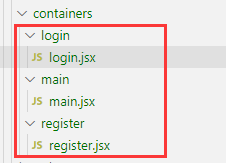

创建注册和登录组件的路由组件：

```
// 入口js文件:src/index.js
import React from 'react'
import ReactDOM from 'react-dom'
import {Button} from 'antd-mobile'
import {HashRouter, Route, Switch} from 'react-router-dom'

import Register from './containers/register/register'
import Login from './containers/login/login'
import Main from './containers/main/main'

ReactDOM.render(
  (
    <HashRouter>
      <Switch>
        <Route path='/register' component={Register}></Route>
        <Route path='/login' component={Login}></Route>
        {/* 除了path是上面两个外，其余路径均会显示Main组件 */}
        <Route component={Main}></Route>
      </Switch>
    </HashRouter>
  ),
  document.getElementById('root')
)
```

## 2.2 引入 redux

- 先下载依赖包:
  - redux 负责管理组件状态，主要就是创建 store 对象
  - react-redux 负责减小耦合，提供了 Provider 组件和 connect 连接器
  - redux-thunk 在 redux 中实现异步任务
  - redux-devtools-extension 是 redux 调试工具，添加该模块后，结合浏览器提供的redux-devtools插件就可以实现state的实时监听了

```
// 注意：redux不能下载最新版本
npm install --save redux@3.7.2 react-redux redux-thunk
npm install --save-dev redux-devtools-extension
```

redux 部分的内容比较固定，先在 redux 文件夹中创建相关的文件
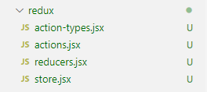

由于 store.js 文件内容比较固定，就是从包中加载得到 store 对象，但是由于它需要使用到 reducers.js 中设定的纯函数，所以先按照纯函数的形式大致定义 reducers.js 的代码如下：

```
/*
包含n个reducer函数：根据老的state和指定的action返回一个新的state
*/
import {combineReducers} from 'redux'

function xx(state=0, action){
    return state;
}

function yy(state=0, action){
    return state;
}

// 合并所有的reducer函数，向外暴露
export default combineReducers({
    xx,
    yy
})

// 向外暴露的结构：{xx:0, yy:0}
```

然后确定 store.js 文件，得到 store 对象：

```
/*
redux最核心的管理模块:这个代码比较固定
*/

import {createStore, applyMiddleware} from 'redux'
import thunk from 'redux-thunk'
import {composeWithDevTools} from 'redux-devtools-extension'

import reducers from './reducers'

var store = createStore(
    reducers,
    composeWithDevTools(applyMiddleware(thunk))
)
// 向外暴露store对象
export default store;
```

最后在 index.js 入口文件中引入 store 对象及相关的组件：

```
// 入口js文件
import React from 'react'
import ReactDOM from 'react-dom'
import {HashRouter, Route, Switch} from 'react-router-dom'
import {Provider} from 'react-redux'

import Register from './containers/register/register'
import Login from './containers/login/login'
import Main from './containers/main/main'
import store from './redux/store'

ReactDOM.render(
  (
      <Provider store={store}>
        <HashRouter>
          <Switch>
            <Route path='/register' component={Register}></Route>
            <Route path='/login' component={Login}></Route>
            {/* 除了path是上面两个外，其余路径均会显示Main组件 */}
            <Route component={Main}></Route>
          </Switch>
        </HashRouter>
      </Provider>
  ),
  document.getElementById('root')
)
```

- 项目运行后，发现在调试工具中 state 有值，则上面的内容设置成功
- 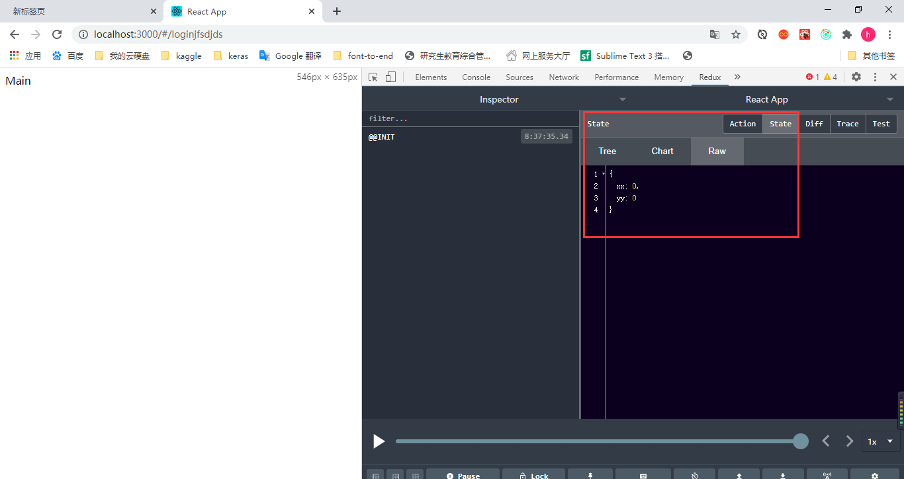

## 2.3 实现登录和注册操作的页面

### 2.3.1 Logo组件

Logo是一个普通组件，所以直接放在components中即可

```
import React, { Component } from 'react'

import logo from './logo.png'
import './logo.less'

export default class Logo extends Component {
    render() {
        return (
            <div className='logo-container'>
                
            </div>
        )
    }
}

```

样式如下

```
.logo-container {
    text-align: center;
    margin:10px 0;
    .logo-img {
        width: 240px;
        height: 240px;
    }
}
```


### 2.3.2 静态注册界面的实现

- 界面比较简单，基本的组件都是由 antd-mobile 提供的，可以去官网查看每个组件的具体用法，都比较简单

第一步：

```
import React, { Component } from "react";
import {NavBar, WingBlank,List,InputItem, Radio} from 'antd-mobile'

import Logo from '../../components/logo'
const ListItem = List.Item;

export default class Register extends Component {
  render() {
    return <div>
      <NavBar>硅&nbsp;谷&nbsp;直&nbsp;聘</NavBar>
      <Logo></Logo>
      <WingBlank>
        <List>
         <InputItem placeholder='请输入用户名：'>用户名：</InputItem>
         <InputItem placeholder='请输入密码：'>密&nbsp;码:</InputItem>
         <InputItem placeholder='确认密码'>确认密码：</InputItem>
         <ListItem>
           用户类型：<Radio>大神</Radio>&nbsp;&nbsp;&nbsp;<Radio>老板</Radio>
         </ListItem>
        </List>
      </WingBlank>
    </div>;
  }
}
```

第二步：添加状态和事件

```
/*
    注册路由组件
*/

import React from 'react'
import {NavBar, WingBlank, List, InputItem, WhiteSpace, Radio, Button} from 'antd-mobile'

import Logo from '../../components/logo/logo'

const ListItem = List.Item;
export default class Register extends React.Component{
    state = {
        username: '',    //用户名
        password: '',    // 密码
        password2: '',   // 确认密码
        type: 'laoban'         // 用户类型
    }

    register = () => {
      // 获取注册的信息
        console.log(this.state);
    }

    handleChange = (name, value) => {
        // 更新状态,要用[name]，这样才会作为变量，否则就会直接去查找state中的name属性，而state中没有name属性
        this.setState({[name]:value})
    }

    toLogin =() =>{
        // 已有账户，则进入登录界面
        this.props.history.replace('/login');
    }

    render(){
        const {type} = this.state;
        return (
            <div>
                <NavBar>硅&nbsp;谷&nbsp;直&nbsp;聘</NavBar>
                <Logo></Logo>
                {/* WingBlank表示两边留白  WhiteSpace表示上下留白 */}
                <WingBlank>
                    <List>
                        <InputItem placeholder='请输入用户名' onChange={value => {this.handleChange('username',value)}}>用户名：</InputItem>
                        <WhiteSpace />
                        <InputItem placeholder='请输入密码' type='password' onChange={value => {this.handleChange('password',value)}}>密&nbsp;&nbsp;&nbsp;码：</InputItem>
                        <WhiteSpace />
                        <InputItem placeholder='请再次输入密码进行确认' type='password' onChange={value => {this.handleChange('password2',value)}}>确认密码：</InputItem>
                        <ListItem>
                            <span>用户类型：</span>&nbsp;&nbsp;&nbsp;
                            <Radio checked={type==='dashen'} onChange={()=>this.handleChange('type','dashen')}>大神</Radio>&nbsp;&nbsp;&nbsp;&nbsp;&nbsp;&nbsp;
                            <Radio checked={type==='laoban'} onChange={()=>this.handleChange('type','laoban')}>老板</Radio>
                        </ListItem>
                        <Button type='primary' onClick={this.register}>注&nbsp;&nbsp;&nbsp;册</Button>
                        <Button onClick={this.toLogin}>已有账户</Button>
                    </List>
                </WingBlank>
            </div>
        )
    }
}
```

### 2.3.3 实现静态登录界面

第一步：

```
import React, { Component } from "react";
import {NavBar, WingBlank,List,InputItem, Radio, Button} from 'antd-mobile'

import Logo from '../../components/logo'
const ListItem = List.Item;

export default class Login extends Component {
  render() {
    return <div>
      <NavBar>硅&nbsp;谷&nbsp;直&nbsp;聘</NavBar>
      <Logo></Logo>
      <WingBlank>
        <List>
         <InputItem placeholder='请输入用户名：'>用户名：</InputItem>
         <InputItem placeholder='请输入密码：'>密&nbsp;码:</InputItem>
         <Button type='primary'>登&nbsp;录</Button>
         <Button>还没有账户?</Button>
        </List>
      </WingBlank>
    </div>;
  }
}

```

第二步：初始化状态并且定义事件

```
/*
    登录路由组件
*/

import React from 'react'
import {NavBar, WingBlank, List, InputItem, WhiteSpace, Button} from 'antd-mobile'

import Logo from '../../components/logo/logo'

export default class Login extends React.Component{

    state = {
        username: '',  // 用户名
        password: ''   // 密码
    }

    handleChange = (name, value) => {
        // 修改状态值
        this.setState({[name]:value});
    }

    logIn = () => {
        // 得到状态值，也就是文本框中输入的表单数据
        console.log(this.state);
    }

    toRegister = () => {
        // 还没有账户，则直接进入注册界面
        this.props.history.replace('/register');
    }
    render(){
        return (
            <div>
                <NavBar>硅&nbsp;谷&nbsp;直&nbsp;聘</NavBar>
                <Logo></Logo>
                {/* 表示两边留白 */}
                <WingBlank>
                    <List>
                        <InputItem placeholder='请输入用户名' onChange={value => {this.handleChange('username', value)}}>用户名：</InputItem>
                        <WhiteSpace />
                        <InputItem placeholder='请输入密码' type='password' onChange={value => {this.handleChange('password', value)}}>密&nbsp;&nbsp;&nbsp;码：</InputItem>
                        <WhiteSpace />
                        <Button type='primary' onClick={this.logIn}>登&nbsp;&nbsp;&nbsp;录</Button>
                        <Button onClick={this.toRegister}>还没有账户?点击注册</Button>
                    </List>
                </WingBlank>
            </div>
        )
    }
}
```

# 3 搭建后台应用，完成后台准备工作

## 3.1 创建 node+express 应用

- 1 在 vscode 中先安装 express 插件
  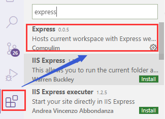
- 2 再安装 express 应用生成器：`npm install -g express-generator`
- 3 产生 express 应用：`express -e app_name`
  - 使用`-e`是因为这样产生的应用下的 views 文件夹下是.ejs 文件
  - `express -e app_name`or`express app_name`在 views 文件夹下会产生`.jade`文件
  - 使用`express --no-view app_name`产生的是 html 界面，在 public 文件夹下
- 4 安装其他的依赖包:`npm install`
  - express 创建项目的时候，对于一些依赖的模块，在 package.json 中的 dependences 中说明了，用命令 npm install 初始化一下，把这些 express 依赖的库装入。
- 5 运行项目：`npm start`,然后在浏览器的 3000 端口查看结果：http://127.0.0.1:3000/
  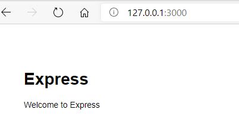

- 6 目录结构：

```
  bin, 存放启动项目的脚本文件,管理的是使用 url 访问项目的端口号，以及url访问出错情况下的一些处理
  node_modules, 存放所有的项目依赖库。
  public，静态文件(css,js,img)
  routes，路由文件(MVC中的C,controller)
  views，页面文件(Ejs模板)
  package.json，项目依赖配置及开发者信息
  app.js，应用核心配置文件
```

## 3.2 实现后台应用自动重运行---nodemon 包

- 每次修改应用代码，都需要重新执行命令 npm start 才会生效，太麻烦了
- 解决：使用 nodemon 包，下载`npm install --save-dev nodemon`
- 在 json 文件中配置：`"start":"nodemon ./bin/www"`
- 这样，npm start 后，只要修改任何文件的内容，保存之后，就会自动重启整个项目

## 3.3 在后台产生一个用于响应 POST 请求的路由

用户请求的信息如下：

    a)path 为: /register
    b)请求方式为: POST
    c)接收 username 和 password 参数
    d)admin 是已注册用户
    e)注册成功返回: {code: 0, data: {\_id: 'abc', username: ‘xxx’, password:’123’}
    f)注册失败返回: {code: 1, msg: '此用户已存在'}

- 在`routes->index.js`中添加以下代码：

```
// 注册一个路由: 用户注册

router.post('/register', function (req, res) {
  console.log('register()')
  // 1. 获取请求参数
  const {username, password} = req.body
  // 2. 处理
  if(username==='admin') { // 注册会失败
    // 返回响应数据(失败)
    res.send({code: 1, msg: '此用户已存在222'})
  } else { // 注册会成功
    // 返回响应数据(成功)
    res.send({code: 0, data: {id: 'abc123', username, password}})
  }
})
```

## 3.4 测试后台注册操作的 Post 请求响应路由是否设置成功

- 测试 Post 请求的路由是否设置成功的软件：postman
- 因为我们设置的是 post 请求的响应，而浏览器一般发送的都是 get 请求，所以需要借助这个软件操作
  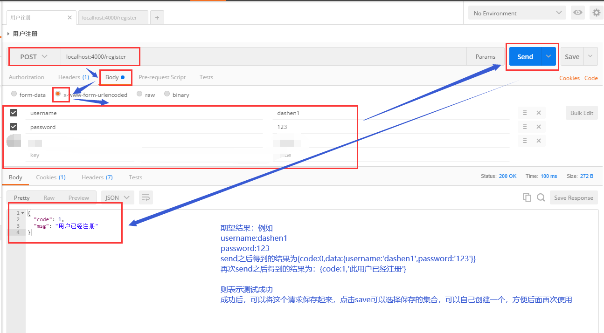

# 4 使用 mongoose 操作数据库

- 先下载 mongoose 包和一个用于实现 md5 加密的包`npm install --save mongoose blueimp-md5`
- 在`gzhipin-server`文件夹下创建一个文件`db-->db_test.js`,用户回顾并且测试相关的数据库操作方法

## 4.1 回顾数据库的几个基本操作

```
/*
测试使用mongoose操作mongodb数据库
1. 连接数据库
  1.1. 引入mongoose
  1.2. 连接指定数据库(URL只有数据库是变化的)
  1.3. 获取连接对象
  1.4. 绑定连接完成的监听(用来提示连接成功)
2. 得到对应特定集合的Model
  2.1. 字义Schema(描述文档结构)
  2.2. 定义Model(与集合对应, 可以操作集合)
3. 通过Model或其实例对集合数据进行CRUD操作
  3.1. 通过Model实例的save()添加数据
  3.2. 通过Model的find()/findOne()查询多个或一个数据
  3.3. 通过Model的findByIdAndUpdate()更新某个数据
  3.4. 通过Model的remove()删除匹配的数据
 */

//  引入md5加密包
const md5 = require('blueimp-md5');  //得到一个md5加密函数

 // 连接数据库
 // 1.1. 引入mongoose
 const mongoose = require('mongoose');
//  1.2. 连接指定数据库(URL只有数据库是变化的)
 mongoose.connect('mongodb://localhost:27017/gzhipin_test', { useNewUrlParser: true, useUnifiedTopology: true });
//  1.3. 获取连接对象
 const conn = mongoose.connection;
//  1.4. 绑定连接完成的监听(用来提示连接成功)
 conn.on("connected",function(){
     // 连接成功回调
     console.log('数据库连接成功...')
 })

//  2. 得到对应特定集合的Model
//   2.1. 字义Schema(描述文档结构)
var Schema = mongoose.Schema;
var userSchema = new Schema({
    username: {type:String,required:true}, // 用户名
    password: {type:String,required:true}, // 密码
    type: {type:String,required:true} //用户类型，dashen或者laoban
})
//   2.2. 定义Model(与集合对应, 可以操作集合)
var UserModel = mongoose.model('user',userSchema);  //集合名users


// 3. 通过Model或其实例对集合数据进行CRUD操作
//   3.1. 通过Model实例的save()添加数据
function testSave(){
    const userModel = new UserModel({
        username: '百度老板',
        password: md5('baidulaoban'),
        type: 'dashen'
    })
    // 调用save保存数据
    userModel.save(function(err,userdocs){
        if(!err){
            console.log(userdocs);
        }
    })
}
// testSave()
//   3.2. 通过Model的find()/findOne()查询多个或一个数据
function testFind(){
    // find查询多个，没有匹配则返回[]
    UserModel.find({},function(err,userdocs){
        if(!err){
            console.log(userdocs);
        }
    })
    // 查询匹配的第一个，没有匹配返回null
    UserModel.findOne({_id:'5f7d6937e216a53e741f7caa'},function(err,userdoc){
        if(!err){
            console.log(userdoc);
        }
    })
}
// testFind()
//   3.3. 通过Model的findByIdAndUpdate()更新某个数据
function testUpdate(){
    // 查询匹配的第一个，没有匹配返回null
    UserModel.findByIdAndUpdate({_id:'5f7d6937e216a53e741f7caa'},{$set:{username:'阿里巴巴'}},function(err,userdoc){
        // 这里可以不用$set,直接{username:'阿里巴巴'}即可更改
        if(!err){
            // 返回的doc是改变之前的内容
            console.log(userdoc);
        }
    })
}
// testUpdate()
//   3.4. 通过Model的remove()删除匹配的数据
function testRemove(){
    // 查询匹配的第一个，没有匹配返回null
    UserModel.remove({_id:'5f7d6937e216a53e741f7caa'},function(err,res){
        if(!err){
            // 返回的是{ ok: 1, n: 1, deletedCount: 1 }
            // res.n表示匹配的doc的数量，ok:1表示删除成功，res.deletedCount表示删除的doc的数量
            console.log(res);
        }
    })
}
testRemove()
```

## 4.2 使用 vscode 操作数据库

- 下载插件`Azure Cosmos DB`
  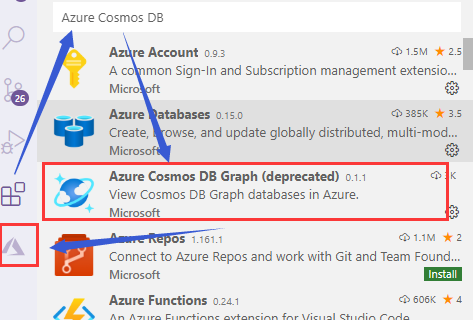
- 然后点击最后的小图标，`Attach Database Accounts-->mongodb-->选择对应的数据库`
  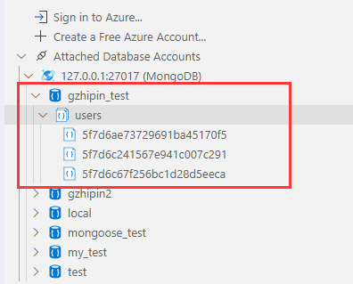

# 5 完成注册登录的后台处理

## 5.1 连接数据库，定义集合模型

- 1 连接数据库，定义用户集合模型，方便进行新用户注册的查询和保存管理`db/models.js`

```
// 1. 连接数据库
// 1.1. 引入mongoose
const mongoose = require('mongoose');
// 1.2. 连接指定数据库(URL只有数据库是变化的)
mongoose.connect('mongodb://localhost:27017/gzhipin',{ useNewUrlParser: true, useUnifiedTopology: true })
// 1.3. 获取连接对象
const conn = mongoose.connection;
// 1.4. 绑定连接完成的监听(用来提示连接成功)
conn.on('connected',function(){
    console.log('数据库连接成功....');
})
// 2. 定义出对应特定集合的Model并向外暴露
// 2.1. 字义Schema(描述文档结构)
var Schema = mongoose.Schema;
var userSchema = new Schema({
    username: {type:String, required:true},  //用户名
    password: {type:String, required:true},  // 密码
    type: {type:String, required:true},      // 类型dashen或者laoban
    header:{type:String},  //头像名称
    post:{type:String},    // 职位
    info:{type:String},    // 个人或者职位简介
    company:{type:String}, // 公司名称
    salary:{type:String}   // 工资
})
// 2.2. 定义Model(与集合对应, 可以操作集合)
const UserModel = mongoose.model('user',userSchema);
// 2.3. 向外暴露Model
exports.UserModel = UserModel;
```

## 5.2 定义用户注册的响应路由：

注意：我们在注册和登录成功的环节加入了cookie，保存用户的登录信息，这样在maxAge的时间内就可以实现免登录

在`routes-->index.js`中修改注册路由：

```
// 加密
const md5 = require('blueimp-md5')
// 引入用户的集合模型，实现新用户数据的保存
const UserModel = require('../db/models').UserModel;

// 处理注册请求的路由
router.post('/register',function(req,res){
  // 获取请求参数
  const {username,password,type} = req.body;
  // 处理
    // 判断用户是否已经存在，存在则不能注册，返回错误信息，不存在则保存注册信息
    UserModel.findOne({username},function(err,userdox){
      // 如果user有值，则存在，不能注册
      if(userdox){
        // 返回错误信息
        res.send({code:1, msg:'用户已经注册'});
      }else{
        // 保存用户信息到数据库并且返回响应信息
        // 密码的保存不能以明文的方式，需要加密
        var userModle = new UserModel({username,password:md5(password),type});
        userModle.save(function(err,userdox){
          // 生成一个cookie,并交给浏览器，这样我们在登录完成后，在1天内再次打开该网页，就可以实现免登录
       	  // 1000表示1秒钟，1000*60*60*24表示1天,此条cookie信息在浏览器中保存的时间
          res.cookie("userid",userdox.id,{maxAge:1000*60*60*24*7});  //
          //返回包含user的json数据
          // 响应数据中不要携带密码，所以自己先封装一个对象
          const data = {username,type,_id:userdox._id}
          res.send({code:0, data});
        })
      }
    })
  // 返回响应数据
})
```

测试注册路由，使用 postman 软件

    先注册一个新用户，发送请求，然后再次发送请求，会返回{code:1, msg:'用户已经注册'}
    这就表明成功
    注意：新用户需要同时输入username,password,type这三个信息才可以注册成功，因为在文档的规范中这三个是必须的required


## 5.3 定义用户登录的响应路由：

在`routes-->index.js中`定义登录路由：

```
// 登录的路由
router.post('/login',function(req,res){
  // 获取请求参数
  const {username,password} = req.body;
  // 处理
    // 根据username和password查询，没有则用户不存在，提示错误信息，有则返回登陆成功的信息
    const filter = {password:0,_v:0}; 
    // 过滤掉filter中的信息，返回的userdox中不应该包含密码，另外，其他不想要的信息也可以过滤掉
  UserModel.findOne({username,password:md5(password)},filter,function(err,userdox){
    if(userdox){
      // 登陆成功
      // 生成一个cookie，1000表示1秒钟，1000*60*60*24*7表示7天
      res.cookie("userid",userdox.id,{maxAge:1000*60*60*24*7});
      // 返回登陆成功的信息
      res.send({code:0,data:userdox})  // 这里返回的数据中就不会包含filter中的内容了
    }else{
      res.send({code:1,msg:'用户名或者密码不正确'})
    }
  })
  // 返回响应结果
})
```

测试登录路由

# 6 完成注册、登录的前台处理

### 6.1 axios-ajax 与后台交互

    (1) 下载依赖包：`npm --save install axios`
    (2) 在`src-->api--->ajax.js`中建立发送 ajax 请求的函数，将 post 请求和 get 请求封装在一个函数中

在`src/api/ajax.js`中：

```
// 能发送ajax请求的函数模块
import axios from 'axios'
export default function ajax(url,data={},method='GET'){
	
    if(method === "GET"){
    	// get请求方法的url:原始url?key1=value1&key2=value2
        // data的格式：{username:tom,password:123}
        // paramStr: username=tom&password=123
        let paramStr = '';
        Object.keys(data).forEach(key => {
            paramStr += ( key + '=' + data[key] +'&');
        })
        if(paramStr){
            paramStr = paramStr.substring(0,paramStr.length-1);
        }
        // 使用axios发送get请求
        return axios.get(url+'?'+paramStr);
    }else{
    	// post方法
        return axios.post(url,data);
    }
}
```

在`api--->index.js`中定义注册时发送 ajax 请求、登录时发送 ajax 请求的方法：

```
/*
包含了n个接口请求的模块
*/
import ajax from './ajax'

// 注册接口
export const reqRegister = (user) => ajax('/register', user, 'POST')
// 登陆接口
export const reqLogin = ({username, password}) => ajax('/login',{username, password}, 'POST')
```

### 6.2 redux 状态管理

    (1) 首先需要产生一个 action 对象
    (2) 然后由 dispatch 方法将 action 对象传递给 reducer
    (3) reducer 根据旧的 state 和 action 对象产生新的 state,可以有多个小的 reducers,每个 reducers 分别独立地操作 state tree 的不同部分
    (4) store 对象负责更新 state,并且由于容器组件将 state 作为 props 传递给了展示组件 Register,所以 state 更新后，展示组件就会渲染更新的部分

首先确定我们需要管理的状态及其形式，由于用户在注册和登录时会输入自己的信息，这些信息都需要保存到后台中，后台响应后会将部分信息返回到前台实现状态管理，所以就存在一个状态user,并且

```
user的结构：  不需要有password，因为密码不会返回

import {combineReducers} from 'redux'

const initUser = {
	username:'', // 用户名
	type:'',  //用户类型dashen  laoban
	msg:''  // 错误提示信息
}
const user = (state = initUser,action) => {
    return state;
}

export default combineReducers({user});
```

确定需要使用的 action 行为名称，在`action-type.js`:保存 action 对象的名称类型，是干什么事的

```
// 用户注册成功或者登陆成功时需要dispatch的内容
export const AUTH_SUCCESS = 'auth_success'  //注册或者登陆成功的action-type
export const ERROR_MSG = 'error_msg'
```

在`action.js`中产生 action 对象

```
/*
包含多个action creators
    异步action
    同步action
*/
import {reqRegister,reqLogin} from '../api'
import {AUTH_SUCCESS,ERROR_MSG} from './action-types'

// 授权成功的同步action对象
const authSuccess = (user) => ({type:AUTH_SUCCESS, data:user})
// 授权失败，错误提示信息的同步action对象
const errorMsg = (msg) => ({type:ERROR_MSG, data:msg})

// 注册异步action
export const register = (user) => {

    // 注册时的user是由表单项组成的，注册时需要填写以下四项内容，所以解析得到的就是这四项
    const {username,password,password2,type} = user;

    // 做表单的前台验证
    if(!username) {
        return errorMsg('用户名不能为空');
    }
    else if(password !== password2) {
        return errorMsg('两次输入密码不一致');
    }

    //表单数据合法，返回一个发ajax请求的异步action函数
    return async dispatch => {
        // 发送注册的异步请求   使用await可以直接获取到response，不使用await得到的是promise对象
        // 还需要再then再得到response
        // 但是一旦某个语句使用了await,就需要在其前面添加async
        /*

        // 这里用的是之前定义的发送注册ajax请求的函数，返回的是Promise对象
        const promise = reqRegister(user);
        promise.then(response => {
            const result = response.data;  {code:0/1,data:user,msg:''}
        })
        */
        const response = await reqRegister({username,password,type});
        const result = response.data;
        // result两种形式:{code:0,data},{code:1,msg}
        // 根据发送ajax请求后，响应报文的设定，code:0表示注册成功，用户信息已经添加到数据库中
        // code:1表示该用户已经注册过或者必须需要填写的项没有填写
        if(result.code === 0){
            // 成功,分发授权成功的同步action
            dispatch(authSuccess(result.data));
        }else{
            // 失败,分发提示错误信息的同步action
            dispatch(errorMsg(result.msg))    // 此用户已经注册过了
        }
    }
}

// 登录异步action
export const login = (user) => {
    const {username,password} = user;
    // 做表单的前台验证
    if(!username) {
        return errorMsg('用户名不能为空');
    }
    else if(!password) {
        return errorMsg('密码不能为空');
    }

    return async dispatch => {
        // 发送注册的异步请求   使用await可以直接获取到response，不使用await得到的是promise对象
        // 还需要再then再得到response
        // 但是一旦某个语句使用了await,就需要在其前面添加async
        /*
        const promise = reqLogin(user);
        promise.then(response => {
            const result = response.data;  {code:0/1,data:user,msg:''}
        })
        */
        const response = await reqLogin({username,password});
        const result = response.data;
        if(result.code === 0){
            // 成功,分发授权成功的同步action
            dispatch(authSuccess(result.data));
        }else{
            // 失败,分发提示错误信息的同步action
            dispatch(errorMsg(result.msg))      // 这里会提示什么信息呢？？？？
        }
    }
}
```

获得新的 state,在 reducers.jsx 中定义纯函数：

```
/*
包含n个reducer函数：根据老的state和指定的action返回一个新的state
*/
import {combineReducers} from 'redux'

import {AUTH_SUCCESS,ERROR_MSG} from './action-types'

// 产生user状态的reducer
const initUser = {
    username: '',   // 用户名
    type: '',   //用户类型
    msg: '',   // 存放错误提示信息
}
function user(state=initUser, action){
    switch (action.type){
        case AUTH_SUCCESS:   //data存放user
            return {...state, ...action.data};
        case ERROR_MSG:   // data存放msg
            return {...state, msg:action.data};
        default:
            return state;
    }
}

// 合并所有的reducer函数，向外暴露
export default combineReducers({
    user
})

// 向外暴露的结构：{user:{}}
```

在 containers/register/register.jsx 中:

    （1）引入 react-redux 包中的 connect 函数，将 store 对象中的 state 属性及产生异步 action 对象的 register 函数传递给 Register 组件
    （2）为注册按钮添加事件单击函数，单击注册按钮后自动发送注册 ajax 异步请求

```
import {connect} from 'react-redux'
import { register } from "../../redux/action";

class Register extends React.components{

  // 点击注册调用,this
  register = () => {
    // console.log(this.state);
    // 不需要传入password2,
    this.props.register(this.state);
  }
  ...
}

export default connect(
    state => ({user:state.user}),
    {register}
)(Register)
```

## 6.3 解决跨域请求问题：

前端应用端口号为 3001,后台应用端口号为 4000，所以前端去想后台发送请求就属于跨域：

    解决办法：加入代理
      在 package.json 中添加"proxy": "http://localhost:4000"
    原理：前台应用 3000，添加一个代理服务器帮忙将请求转发到另一个端口实现请求,我们并不是向代理服务器发送请求，而是让它帮忙转发请求，起到桥梁的作用

## 6.4 提示错误信息

在注册界面，如果注册失败或者该用户已经注册，则在后台会返回一个msg,在定义reducers中，我们初始化state时存了一个msg,则它会直接传递给Register组件，所以为了将错误信息直接显示在Register组件的页面中，需要下面的修改：

```
class Register extends React.Component {
  render() {
    const { msg } = this.props.user;
    return (
        <div>
        	...
            <List>
              {msg ? <div className="error-msg">{msg}</div> : null}
              ...
            </List>
          </WingBlank>
        </div>
      );
  }
```

并且在`src/assets/css/index.less`中为其添加样式，并且在客户端的入口文件中引入：

```
.error-msg {
  color: red;
  text-align: center;
  font-size: 18px;
}
```

## 6.5 重定向的问题

我们在完成注册界面的信息，点击注册按钮后，还需要实现页面的跳转，跳转到用户的信息完善界面，这时候就需要记录一个redirectTo,检测到用户注册成功后，就跳转界面，所以这个变量应该保存在reducers中的state中,并且只在注册成功的时候跳转

```
const initUser = {
  username: "", // 用户名
  type: "", //用户类型
  msg: "", // 存放错误提示信息
  redirectTo: "",
};
function user(state = initUser, action) {
  switch (action.type) {
    case AUTH_SUCCESS: //data存放user
      return { ...state, ...action.data, redirectTo: "/" };
    case ERROR_MSG: // data存放msg
      return { ...state, msg: action.data };
    default:
      return state;
  }
}
```

则就需要在注册界面对于该信息进行接收，并且判断，如果redirectTo为空，则表示注册未成功，则显示注册界面，如果为空，则需要跳转界面

```
import { Redirect } from "react-router-dom";

class Register extends React.Component {
  render() {
    const { redirectTo } = this.props.user;
    if (redirectTo !== "") {
      return <Redirect to={redirectTo}></Redirect>;
    } else {
      return (...);
    }
  }
}
```

同理在登录界面也需要添加上述信息。

# 7 完成用户的信息完善界面

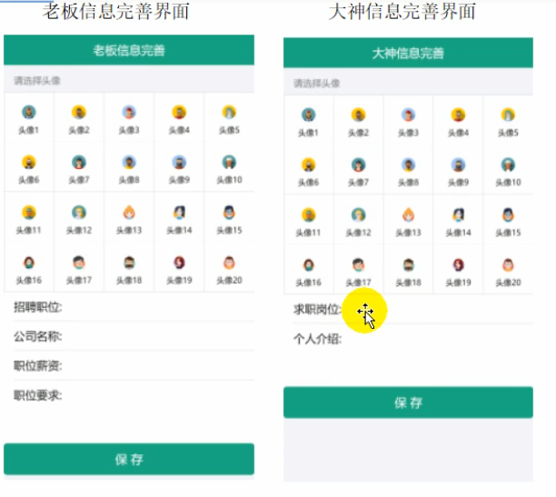
可以看到这两个界面对应两个路由组件 LaobanInfo、dashenInfo，可以看到在选择头像并且进行信息的补充之后需要保存信息，即需要将信息保存到数据库中，也就是需要进行交互，所以应该将这两个组件放在 containers 中

## 7.1 完成组件的静态页面

**需要注意：大神信息和老板信息路由组件的路径均是相对于Main组件而言的，而Main组件在客户端的入口文件中的相对路径是/,所以这两个路由组件的路径就变成了`http:localhost:3000/#/laobaninfo`**

首先需要实现两个主界面的路由组件，在`src/containers/main/main.jsx`中：

```
import React, { Component } from "react";
import {Switch,Route} from 'react-router-dom'

import MasterInfo from '../masterInfo'
import BossInfo from '../bossInfo'

// 主界面的路由组件
export default class Main extends Component {
  render() {
    return <div>
      <Switch>
        <Route path='/masterinfo' component={MasterInfo}></Route>
        <Route path='/bossinfo' component={BossInfo}></Route>
      </Switch>
    </div>
  }
}
```

并且测试两个界面能否正确显示：http://localhost:3000/#/masterinfo

下面的工作就是完成两个路由组件的静态页面：

观察两个组件可以发现具有相同的一部分，头像选择部分的形式相同，所以可以将这一部分单独拎出来作为一个 UI 组件:headerSelector:

### 7.1.1 头像部分单独作为一个 UI 组件

在`src/components/header-selector/header-selector.jsx`中：

这一块主要需要了解antd-mobile中Grid标签的使用方法及在代码内容引入资源的require用法,注意，使用require()直接引入的是一个js模块，需要将其默认暴露的数据拿到，即`require(url).default`

```
import React from "react";
import { List, Grid } from "antd-mobile";

export default class HeaderSelector extends React.Component {
  constructor(props) {
    super(props);

    // 准备需要显示的数据
    this.headerList = [];
    for (let i = 0; i < 20; i++) {
      this.headerList.push({
        text: "头像" + (i + 1),
        // 不能使用import,并且用的不是单引号，模板字符串用的是``
        icon: require(`./images/头像${i + 1}.png`).default,
      });
    }
  }

  render() {
    // 头部界面
    const listHeader = "请选择头像";
    return (
      <div>
        <List renderHeader={() => listHeader}>
          {/* columnNum 指定Grid的列数 */}
          <Grid data={this.headerList} columnNum={5}></Grid>
        </List>
      </div>
    );
  }
}
```

存在问题：不知道为啥，头像图片不能正确显示

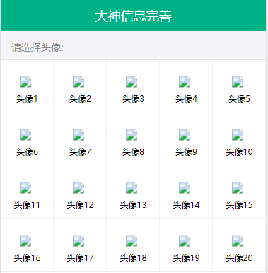

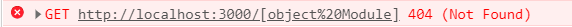

找到了问题: 因为require直接引入得到的是一个js模块，我们需要取出模块中存放的地址值，就需要使用`require().default`

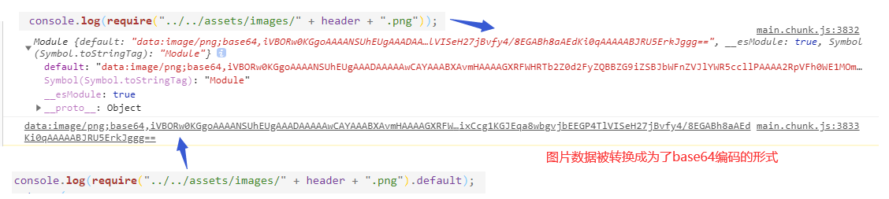

### 7.1.2 老板信息完善页面的静态实现

```
/*
老板信息完善的路由容器组件
*/

import React from "react";
import { connect } from "react-redux";
import { NavBar, InputItem, TextareaItem, Button } from "antd-mobile";

import HeaderSelector from "../../components/header-selector/header-selector";

class LaobanInfo extends React.Component {
  handleChange = (name,value) => {
    this.setState({[name]:value});
  }
  save = () => {
    console.log(this.state);
  };
  render() {
    return (
      <div>
        <NavBar>老板信息完善</NavBar>
        <HeaderSelector></HeaderSelector>
        <InputItem placeholder="请输入职位" onChange={(value)=>{this.handleChange('post',value)}}>招聘职位：</InputItem>
        <InputItem placeholder="请输入公司名称" onChange={(value)=>{this.handleChange('company',value)}}>公司名称：</InputItem>
        <InputItem placeholder="请输入该职位的薪资" onChange={(value)=>{this.handleChange('salary',value)}}>职位薪资：</InputItem>
        <TextareaItem
          title="职位要求："
          rows={3}
          placeholder="请输入该职位的要求"
         onChange={(value)=>{this.handleChange('info',value)}}/>
        <Button type="primary" onClick={this.save}>保&nbsp;&nbsp;&nbsp;存</Button>
      </div>
    );
  }
}

export default connect((state) => ({}), {})(LaobanInfo);
```

### 7.1.3 大神信息完善页面的静态实现

```
/*
大神信息完善的路由容器组件
*/

import React from "react";
import { connect } from "react-redux";
import { NavBar, InputItem, TextareaItem, Button } from "antd-mobile";

import HeaderSelector from "../../components/header-selector/header-selector";

class DashenInfo extends React.Component {
    handleChange = (name,value) => {
        this.setState({[name]:value});
    }
    save = () => {
        console.log(this.state);
    };
  render() {
    return (
      <div>
        <NavBar>大神信息完善</NavBar>
        <HeaderSelector></HeaderSelector>
        <InputItem placeholder="请输入理想职位" onChange={(value)=>{this.handleChange('post',value)}}>应聘职位：</InputItem>
        <TextareaItem
          title="个人介绍："
          rows={3}
          placeholder="请简单介绍自己"
         onChange={(value)=>{this.handleChange('info',value)}}/>
        <Button type="primary" onClick={this.save}>保&nbsp;&nbsp;&nbsp;存</Button>
      </div>
    );
  }
}

export default connect((state) => ({}), {})(DashenInfo);
```


## 7.2 动态交互

### 7.2.1 数据收集

分析：
老板信息收集主要有 5 个部分：老板的头像、提供的职位、公司、薪资、职位要求

    在Grid中有一个事件点击onClick函数,点击某个头像就会给其onClick函数传入两个参数：text,icon,这两个参数就是设置头像需要使用的
      但是我们的头像文本header保存在父组件LaobanInfo中，如果我们想要在子组件HeaderSelector中修改父组件的state属性，就应该在父组件中定义一个函数setHeader进行修改，然后将该函数传递给子组件
    
      在HeaderSelector组件中，由于点击某个头像之后，显示的文本会从"请选择头像"变为"已选择头像"，所以需要设置一个state属性去判断，该state={icon:null},icon是一个图片对象，点击了某个头像后，就会更新该组件的state，此时icon就变成了一个有内容的对象，通过判断icon是否有内容，就可以选择是显示"请选择头像"，还是显示"已选择头像icon"
    
      在点击了某个头像并且更新了icon后，还需要更新父组件的状态中的header属性,就可以调用父组件传过来的setHeader(text)。

header-selector:

```
export default class HeadSelector extends Component {
    state = {
        icon:null
    }
    
    handleClick = ({text,icon}) => {
        this.setState({icon})
        this.props.setHeader(text)
    }
    render() {
        const {icon} = this.state;
        const listheader = icon ? <div>已选择头像：</div>:'请选择头像:';
        return (
            <div>
                <List renderHeader={()=>listheader}>
                    <Grid data={this.headerList} columnNum={5} onClick={this.handleClick}></Grid>
                </List>
            </div>
        )
    }
}
```

laobaninfo:

```
class LaobanInfo extends Component {
    state = {
        header:'',
        position:'',
        info:'',
        company:'',
        salary:''
    }
    setHeader = (header) => {
        this.setState({header})
    }
    render() {
    	...
    }
}

export default connect((state)=>({}),{})(LaobanInfo);
```

dasheninfo:

```
class DashenInfo extends Component {
    state = {
        header:'',
        post:'',
        info:''
    }
    
    setHeader = (header) => {
        this.setState({header})
    }
    render() {
    	...
    }
}

export default connect((state)=>({}),{})(DashenInfo);
```

### 7.2.2 **动态计算跳转路径：**

之前定义了一个 redirectTo 属性，用于在注册/登录成功之后跳转页面，但是目前我们都是写定的'/',即它在注册/登录成功之后都会直接跳转到主页面 main,但是现在添加了信息完善功能，在注册成功之后还需要进行信息的完善，所以需要修改它:src/utils/index.js

```
/*
用户主界面
    大神：/dashen
    老板 /laoban
用户的信息完善界面
    大神 /dasheninfo
    老板 /laobaninfo

确定是否要跳转到信息完善界面：
    首先判断用户类型：看user.type
        确定是大神还是老板
    判断是否已经完善信息：就是看user.header是否有值    header:'头像3'
        已经完善过信息的：header是有值的
        没有完善过信息的：header是空串

*/

// 返回对应的路由路径
export function getRedirectTo(type, header) {
  let path = "";
  // type
  if (type === "laoban") {
    path = "/laoban";
  } else {
    path = "/dashen";
  }
  // header
  if (!header) {
    // header为空，则需要完善信息，返回信息完善界面
    path += "info";
  }
  return path;
}
```

然后在 reducer.js 再进行修改：

```
function user(state = initUser, action) {
  switch (action.type) {
    case AUTH_SUCCESS: //data存放user
    // ---------关键代码：start---------
      const { type, header } = action.data;
      return {
        ...state,
        ...action.data,
        redirectTo: getRedirectTo(type, header),
        ---------关键代码：end---------
      };
    case ERROR_MSG: // data存放msg
      return { ...state, msg: action.data };
    default:
      return state;
  }
}
```

但是注意：目前这样写，在注册成功之后会判断 header 为空，从而跳转到用户信息完善界面，在登陆成功之后也会得到相同的结果，但是一般用户在注册成功之后就会完成信息的完善，所以登陆成功之后是不需要完善信息的
但是因为此时还没有实现后台的交互，就是说注册成功并且完善界面之后我们并没有将 header 等信息送到数据库中，注册按钮在发起 ajax 请求后，得到的响应体中并不包含 header,用户的 action 中的 data 中只有下面的内容：

    data:
      type: "laoban"
      username: "laoban4"
      _id: "5f82bface0cc0424e48d01a0"

所以才会导致登录之后也会进入到用户信息完善界面

### 7.2.3 前后台交互

后台：routes/index.js

```
这是用户完善用户信息的，所以传入的参数有：
header,position,company,salary,info
```


```
// 更新用户信息：完善信息的路由
router.post("/update", function (req, res) {
  /* 得到提交的用户数据，即是哪一个用户的信息更新
  但是目前在req.body中并没有用户名或者id,无法和数据库中的id进行匹配获取具体是哪一个用户
  需要使用cookie,在用户注册时已经将用户id存放到了浏览器的cookie中
  所以需要在请求的cookie中先得到userid */
  // 从cookie中获取当前注册的用户的id,cookie是一个对象，内容以键值对的形式存在的
  const userid = req.cookies.userid;
  // 但是我们可以在浏览器的开发端手动删除当前的cookie信息，所以需要判断一下
  // 如果不存在，则返回一个信息提示结果
  if (!userid) {
    return res.send({ code: 1, msg: "请先登录！" });
  }
  // 存在，则根据userid更新该用户在数据库中的信息
  const user = req.body;
  UserModel.findByIdAndUpdate({ _id: userid }, user, function (err, oldUser) {
    if (!oldUser) {
      // cookie数据被篡改了，和数据库中的id不匹配，需要删除该cookie数据
      res.clearCookie("userid");
      return res.send({ code: 1, msg: "请先登录！" });
    } else {
      // 合并用户的信息，user是新添加的用户信息，oldUser是之前的用户信息
      // assign(Object1,Object2,....)  后面的可能会覆盖掉前面的同名属性
      // 响应的数据中不能包含密码，所以先在oldUser中取出username, type, _id
      const { username, type, _id } = oldUser;
      const data = Object.assign(req.body, { username, type, _id });
      return res.send({ code: 0, data });
    }
  });
});
```

前台：

1：定义更新用户信息的ajax接口函数

```
// 完善用户信息接口
export const reqUpdateUser = (user) => ajax("/update", user, "POST");
```

2 : 然后创建发送异步请求的action creator,分两种情况讨论：
    1 更新信息成功，则发布同步action,更新store中的state中的user信息
    2 更新信息失败，则发布同步action,更新store中的state中的msg

```
./action-types
export const RECIEVE_USER = "recieve_user";
export const RESET_USER = "reset_user";

./actions
// 完善用户信息的同步action'
const recieveUser = (user) => ({ type: RECIEVE_USER, data: user });
// 重置用户的同步action
const resetUser = (user) => ({ type: RESET_USER, data: user });
// 完善用户信息的异步action
export const updateUser = function (user) {
  return async (dispatch) => {
    const response = await reqUpdateUser(user);
    const result = response.data; // {code:0,data}  // {code:1.msg}
    if (result.code === 0) {
      // data:{username,type,_id,header,company,salary,info,position}
      // 成功,分发授权成功的同步action
      dispatch(recieveUser(result.data));
    } else {
      // 失败,分发提示错误信息的同步action
      dispatch(resetUser(result.msg)); 
    }
  };
};

./reducers
case RECIEVE_USER:
  // 先不设置路径跳转
  return action.data;
case RESET_USER:
  // 前台cookie信息异常，需要清理掉，直接返回错误信息即可
  return { ...initUser, msg: action.data };
```

在老板信息完善界面：
    1 将action creator通过connect传入LaobanInfo组件的props中，更新保存按钮的点击函数
    2 将store中的state中的user信息传递给LaobanInfo组件的props中，一旦发现信息已经完善，则直接跳转到老板主界面
在大神信息完善界面同理

    ./laobaninfo
    /*
    老板信息完善的路由容器组件
    */
    
    import { Redirect } from "react-router-dom";
    import { updateUser } from "../../redux/actions";
    class LaobanInfo extends React.Component {
      
      save = () => {
        this.props.updateUser(this.state);
      };
      
      render() {
      	// 如果信息已经完善，则自动重定向到对应的主界面
        const { header, type } = this.props.user;
        if (header) {
          const path = type === "dashen" ? "/dashen" : "/laoban";
          return <Redirect to={path}></Redirect>;
        }
        return (
         ...
        );
      }
    }
    
    export default connect((state) => ({ user: state.user }), { updateUser })(
      LaobanInfo
    );


在大神信息完善界面同理：

```
/*
大神信息完善的路由容器组件
*/

import { Redirect } from "react-router-dom";
import { updateUser } from "../../redux/actions";

class DashenInfo extends React.Component {
  save = () => {
    updateUser(this.state);
  };
  render() {
    const { header, type } = this.props.user;
    if (header) {
      const path = type === "dashen" ? "/dashen" : "/laoban";
      return <Redirect to={path}></Redirect>;
    }
    return (
    	...
    );
  }
}

export default connect((state) => ({ user: state.user }), { updateUser })(
  DashenInfo
);

```

### 7.2.4 cookie遭到恶意删除后页面跳转

存在一种特殊情况：在注册或者登陆完成之后跳转到信息完善界面，如果此时cookies的信息被恶意删除或者破坏，则在输入了完善信息后点击保存按钮时需要将页面重新转入登陆界面，请用户重新登陆，这个功能需要在main.jsx中实现：

因为在LaobanInfo和DashenInfo组件中点击提交的时候修改了state中的数据，从而由于Main组件需要渲染对应的数据，就会重新加载，无论信息完善成功与否都会重新渲染Main组件。

如果更新信息成功，则会将id传给state中，如果失败，则只更新msg数据，从而可以根据id判断是否成功

```
import { Switch, Route, Redirect } from "react-router-dom";
import { connect } from "react-redux";

class Main extends Component {
  render() {
    // 检查用户是否登陆，如果没有自动重定向到登录界面
    const userid = this.props.user._id;
    if (!userid) {
      return <Redirect to="/login"></Redirect>;
    }
    return (
      ...
    );
  }
}

export default connect((state) => ({ user: state.user }))(Main);
```

当这个实现后，在最初始我们加载`http://localhost:3000`时，也会直接跳转到login界面

# 8 主界面

## 8.1 实现自动登陆

当浏览器中存在cookies信息，则当我们打开网页：`http://localhost:3000`则可以自动登录并且重定向到当前用户的主界面，即laoban或者dashen主界面

### 8.1.1 实现自动登陆：

    安装js-cookie包：npm install js-cookie --save
    1.在 componentDidMount()中实现：
        (1) 登陆过，但是关掉了该窗口(cookies 中有 userid)，之后再打开没有再次登录(redux 管理的 user 中没有_id)，发送请求获取对应的用户信息
    2.在 render()中实现：
        (2) cookies 中没有 userid(之前没有登录，或者登陆了也注销了) 自动进入 login 界面
        (3) cookies 中有 userid：判断 redux 管理的 user 中是否有_id：
           3.1：没有暂时不做任何显示(因为我们需要在 componentDidMount 中发送请求)
           3.2：有说明再打开又登录了一次，则显示对应的界面(请求的路径)
           		3.2.1 如果请求根路径，会根据 user 的 header 和 type 计算得到一个重定向的路径，
           并且自动重定向
           		3.2.2 如果请求的是其他路径，则根据路由显示

在 src/main/main.jsx 中，先完成除了(1)之外的其余步骤：

```
import Cookies from "js-cookie"; //可以操作前端cookie的对象 set()/remove()

class Main extends React.Component {

  componentDidMount() {
    // (1) 
    const userid = Cookies.get("userid");
    const { _id } = this.props.user;
    if (userid && !_id) {
      // 发送异步请求，获取user信息
      console.log('发送异步请求');
      // 这部分需要先在后台写ajax响应，在前台写发送ajax的方法，以及在redux中调用该方法，dispatch对应的action实现
    }
  }

  render() {

    /* (2) cookies中没有userid,则直接重定向到登录界面 */
    // 读取cookies中的userid
    const userid = Cookies.get("userid");
    if (!userid) {
      // 如果没有，则自动重定向到登录界面
      return <Redirect to="/login"></Redirect>;
    }

    /*
      (3) cookies中有userid
      判断redux管理的user中是否有_id(有则说明打开浏览器界面时又登录了一次)
    */
    const { user } = this.props;
    /*
      在这个添加一个debugger,则在第一次渲染界面上就会出现断点，如果我们之前登陆了，然后关闭了该页面(cookies中有userid)，再次打开访问根路径
      此时cookies中有userid,但是user中没有_id
      		点击下一步：就会进入return null的步骤
      		然后再点击 resume script execution 则会结束第一次render,自动调用componentDidMount,发送异步请求，dispatch(action)，然后更新redux,从而更新Main组件中的user,并且再次render(),到了debugger这儿再次pause,点击 resume script execution 之后
      		此时cookie中有id，并且state中也有id，则说明此时注册或者登陆成功，但是由于访问的是根路径，所以计算得到目标路径，
    */
    debugger;
    if (!user._id) {
      // 如果user没有_id,则返回一个null,不做任何显示  3.1
      return null;
    } else {
      /* 如果有_id,则显示对应的界面，比如大神界面，老板界面，个人中心界面等 */

      // 获取请求的路径
      let path = this.props.location.pathname;
      // 如果请求的是根路径，就需要根据user的header和type计算得到一个重定向的路径，并且自动重定向
      if (path === "/") {    // 3.2.1
        path = getRedirectTo(user.type, user.header);
        return <Redirect to={path}></Redirect>;
      }
    }

	// 3.2.2
    return (
      ...
    );
  }
}
```

### 8.1.2 在后台定义请求响应函数 

在src/routes/index.js

```
// 获取用户信息的路由
router.get("/user", function (req, res) {
  // 从cookie中获取当前注册的用户的id,cookie是一个对象，内容以键值对的形式存在的
  const userid = req.cookies.userid; // cookie中保存的信息会在发请求时自动携带
  // 但是我们可以在浏览器的开发端手动删除当前的cookie信息，所以需要判断一下
  // 如果不存在，则返回一个信息提示结果
  if (!userid) {
    return res.send({ code: 1, msg: "请先登录！" });
  }
  // 存在，则查询对应的user
  UserModel.findOne({ _id: userid }, filter, function (error, user) {
    if (!user) {
      // cookie数据被篡改了，和数据库中的id不匹配，需要删除该cookie数据
      res.clearCookie("userid");
      return res.send({ code: 1, msg: "请先登录！" });
    } else {
      return res.send({ code: 0, data: user });
    }
  });
});
```

### 8.1.3 前台操作

在前台定义发送 ajax 请求的方法 src/index.js:

```
// 获取用户信息,默认是get请求，所以不用写
export const reqUser = () => ajax("/user");
```

在 redux 中定义获取用户信息的 action creator,action.jsx 中：(由于此次请求的返回结果与之前更新用户信息时相同，所以 diapatch 的同步 action creator 也应该相同，故不需要再写同步 action creator,从而 reducer 也不用改了)

```
// 获取用户异步action
export const getUser = () => {
  return async (dispatch) => {
    // 执行异步ajax请求
    const response = await reqUser();
    const result = response.data;
    if (result.code === 0) {
      dispatch(receiveUser(result.data));
    } else {
      dispatch(resetUser(result.msg));
    }
  };
};
```

在 main.jsx 中发送异步请求，获取用户信息：

```
import { getUser } from "../../redux/actions";

componentDidMount() {
  /* 实现异步过程 */
  console.log("componentDidMount()执行啦");

  // (1) 登陆过，但是关掉了该窗口(cookies中有userid)，
  // 之后再打开没有再次登录(redux管理的user中没有_id)
  const userid = Cookies.get("userid");
  const { _id } = this.props.user;
  if (userid && !_id) {

    // -------------------关键代码start----------------
    // 发送异步请求，获取user信息
    // 需要在后台先写请求响应，然后在前台写发送ajax请求的函数、redux等，最后在可以在这里使用
    this.props.getUser();
    /*
      发送请求后更新了redux中的state，从而使得Main组件接收到的user属性发生了改变，从而重新render()
      根据我们在render()中写的内容，此时就会return null
    */

    // -------------------关键代码end----------------
  }
}

export default connect((state) => ({ user: state.user }), { getUser })(Main);
```

## 8.2 主界面的子组件——老板列表和大神列表的框架实现

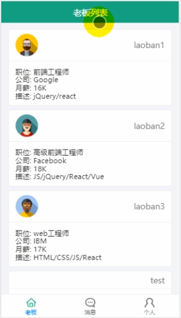

观察这个界面可以发现它有四个路由组件：老板用户的大神列表，大神用户的老板列表，消息列表和个人中心，所以首先先写 4 个路由组件：

### 8.2.1 大神用户的老板列表

在`src/containers/dashen/dashen.jsx`:

```
/* 大神主界面路由容器组件 */

import React from "react";
import { connect } from "react-redux";

class Dashen extends React.Component {
  render() {
    return <div>老板列表</div>;
  }
}

export default connect((state) => ({}), {})(Dashen);
```

### 8.2.2 老板用户的大神列表

在`src/containers/dashen/laoban.jsx`：

```
/* 老板主界面路由容器组件 */

import React from "react";
import { connect } from "react-redux";

class Laoban extends React.Component {
  render() {
    return <div>老板列表</div>;
  }
}

export default connect((state) => ({}), {})(Laoban);
```

### 8.2.3 信息列表：

在`src/containers/message/message.jsx`

```
/* 消息列表界面的路由组件 */
import React from "react";
import { connect } from "react-redux";

class Message extends React.Component {
  render() {
    return <div>消息列表</div>;
  }
}
export default connect((state) => ({}), {})(Message);
```

### 8.2.4 个人中心：

在`src/containers/personal/personal.jsx`

```
/* 个人中心界面的路由组件 */
import React from "react";
import { connect } from "react-redux";

class Personal extends React.Component {
  render() {
    return <div>个人中心</div>;
  }
}
export default connect((state) => ({}), {})(Personal);
```

### 8.2.5 发生错误时的组件

再写一个路由组件，当发生 404 错误时跳转：src/component/notfound/notfound.jsx ，由于这个组件不和 redux 进行交互，所以将其放置在 component 目录下：

```
/* 404错误组件 */

import React from "react";
import { Button } from "antd-mobile";

class NotFound extends React.Component {
  render() {
    return (
      <div>
        <h2>抱歉，找不到该界面!</h2>
        <Button type="primary" onClick={() => this.props.history.replace("/")}>
          回到首页
        </Button>
      </div>
    );
  }
}
export default NotFound;
```

### 8.2.6 在 main 中动态化引入子组件

在 main.jsx 中将刚才定义的路由组件引入，在引入之前先分析：

    （1）首先可以发现引入laoban/dashen/message/personal组件都需要4个内容：路径，顶部导航栏的文字，中间的路由组件，底部导航栏的图标和底部导航栏的文字。所以先通过一个数组的形式，放置4个元素，每个元素是一个对象，对应放置path,component,title,icon,text
    
    （2）通过map的方式动态化地引入即可

```
import Dashen from "../dashen/dashen";
import Laoban from "../laoban/laoban";
import Message from "../message/message";
import Personal from "../personal/personal";
import NotFound from "../../components/notfound/notfound";

class Main extends React.Component {
  
  // 给组件对象添加属性，添加static是给组件类添加属性
  navList = [
    {
      path: "/laoban", // 路由路径
      component: Laoban, // 显示的路由组件
      title: "大神列表", // 顶部的导航栏内容
      icon: "dashen", // 底部显示的图标
      text: "大神", // 图标下的文字
    },
    {
      path: "/dashen",
      component: Dashen,
      title: "老板列表",
      icon: "laoban",
      text: "老板",
    },
    {
      path: "/message",
      component: Message,
      title: "消息列表",
      icon: "message",
      text: "消息",
    },
    {
      path: "/personal",
      component: Personal,
      title: "个人中心",
      icon: "personal",
      text: "个人",
    },
  ];
  
  ...

    // 判断navList中有没有和当前请求的路径相同的路径，有则显示对应的顶部导航栏，否则不显示
    // 因为除了dashen/laoban/message/personal外，其余组件均具备自己的导航栏
    const { navList } = this;
    const path = this.props.location.pathname; //当前请求的路径
    const currentNav = navList.find((nav) => nav.path === path);

    return (
      <div>
        {currentNav ? <NavBar>{currentNav.title}</NavBar> : null}
        <Switch>
          <Route path="/laobaninfo" component={LaobanInfo}></Route>
          <Route path="/dasheninfo" component={DashenInfo}></Route>

          {navList.map((nav) => (
            <Route path={nav.path} component={nav.component}></Route>
          ))}
          <Route path="./notfound" component={NotFound}></Route>
        </Switch>
        {/* 底部导航栏同样：判断如果该页面已经有了顶部导航栏，则对应的就不需要底部导航栏了 */}
        {currentNav ? <div>底部导航栏</div> : null}
      </div>
    );
  }
}

export default connect((state) => ({ user: state.user }), { getUser })(Main);
```

### 8.2.7 制作底部导航栏组件

底部导航栏不需要与 redux 进行交互，所以直接放在 components 目录下即可

    但是为了区分点击了导航栏的哪一项，所以在选中和不选中时使用了两种颜色的图标，所以会用到路由组件的location属性：
        非路由组件要访问路由组件的API，需要引入react-router-dom的withRouter,使用withRouter包围的组件可以获得history,position,match等属性
    需要用到其父组件的中的NavList属性，所以需要在父组件Main中将其传给底部导航栏组件

在`src/components/nav-footer/nav-footer.jsx`：

```
import React from "react";
import { TabBar } from "antd-mobile";
import PropTypes from "prop-types";
import { withRouter } from "react-router-dom";

const Item = TabBar.Item;
class NavFooter extends React.Component {

  // 从父组件中接收的属性需要使用proptypes声明
  static propTypes = {
    navList: PropTypes.array.isRequired,
  };

  render() {
    const path = this.props.location.pathname;
    return (
      <div>
        <TabBar>
          {navList.map((nav) => (
            <Item
              key={nav.path}
              title={nav.text}
              icon={{ uri: require(`./images/${nav.icon}.png`).default }}
              selectedIcon={{
                uri: require(`./images/${nav.icon}-selected.png`).default,
              }}
              selected={path === nav.path}
              onPress={() => this.props.history.replace(nav.path)}
            ></Item>
          ))}
        </TabBar>
      </div>
    );
  }
}

// 使用withRouter包装产生的组件可以使用路由组件的API，原来的组件NavFooter属于非路由组件
// 非路由组件不能访问路由组件的API
// 被withRouter包装的组件会自动传入history,location,match等路由组件的API
export default withRouter(NavFooter);
```

### 8.2.8 解决问题 1：底部导航栏位置错误

底部导航栏并没有位于底部，这可以使用 antd-mobile 中为 TabBar设置的类实现
在`assets/index.css`中：在浏览器中打开开发者工具，可以得到antd-mobile为TabBar组件预先配置好的类名

```
/* 这是antd-mobile中定义的，是给NavBar特有的类名 */
.am-tab-bar {
  /* 使得导航栏始终在底部 */
  position: fixed;
  bottom: 0;
  width: 100%;
  height: 50px;
}
```

### 8.2.9 解决问题 2：底部导航栏显示了四个路由组件

此时底部导航栏会显示 4 个组件：laoban/dashen/message/personal，实际上我们需要它显示 3 个组件，在 laoban 和 dashen 组件中选一个

在父组件中做判断，如果当前请求的路径中与 navList 中的某个路径相同，则判断 user.type，如果是'dashen'则给 navList 中的老板对象添加 hide=true,反之则给大神对象添加

`Main.jsx:`

```
/*
    主路由组件
*/

class Main extends React.Component {
  
  render() {

  	...
    if (currentNav) {
      // 决定哪个路由需要隐藏
      if (user.type === "laoban") {
        // 隐藏数组的第2个
        navList[1].hide = true;
      } else {
        // 隐藏数组的第一个
        navList[0].hide = true;
      }
    }
    
    return (
      ...
    );
  }
}

export default connect((state) => ({ user: state.user }), { getUser })(Main);
```

在底部导航栏组件中：在显示之前先过滤掉 navList 中 hide 属性为 true 的元素，再渲染
`nav-footer.jsx`:

```
class NavFooter extends React.Component {

  render() {
    //   需要显示的导航项
    let { navList } = this.props;
    // 过滤掉hide为true的nav
    navList = navList.filter((nav) => !nav.hide);

    ...
    return (
      ...
    );
  }
}
```

# 9 个人中心

## 9.1 显示静态界面

以固定的信息先建立界面，虽然界面实现了，但是里面显示的内容却无法动态调整，与当前登录的用户信息没有关联到

```
/* 个人中心界面的路由组件 */
import React from "react";
import { connect } from "react-redux";
import { Result, List, Button } from "antd-mobile";

const Item = List.Item;
const Brief = Item.Brief;

class Personal extends React.Component {
  render() {
    return (
      <div>
        <Result
          img={}
          title="张三"
          message="IBM"
        />

        <List renderHeader={() => "相关信息"}>
          <Item multipleLine>
            {/* Item默认是单行显示， multipleLine表示多行显示*/}
            <Brief>职位：前端工程师</Brief>
            <Brief>简介：React/Vue/JQuery</Brief>
            <Brief>薪资：20k</Brief>
          </Item>
        </List>

        <Button type="warning">退出登录</Button>
      </div>
    );
  }
}
export default connect((state) => ({}), {})(Personal);
```

## 9.2 实现动态化处理：关联显示当前登录的用户信息

需要从 redux 中取数据显示

```
/* 个人中心界面的路由组件 */
import React from "react";
import { connect } from "react-redux";
import { Result, List, Button } from "antd-mobile";

const Item = List.Item;
const Brief = Item.Brief;

class Personal extends React.Component {
  render() {
    const {
      username,
      type,
      header,
      company,
      post,
      salary,
      info,
    } = this.props.user;
    return (
      <div>
        {/* Result中规定的内容有就会显示，没有就不会显示 */}
        <Result
          img={}
          title={username}
          message={company}
        />

        <List renderHeader={() => "相关信息"}>
          <Item multipleLine>
            {/* Item默认是单行显示， multipleLine表示多行显示*/}
            <Brief>职位：{post}</Brief>
            <Brief>简介：{info}</Brief>
            {/* 需要判断，有salary属性就显示薪资，没有就不显示 */}
            {salary ? <Brief>薪资：{salary}</Brief> : null}
          </Item>
        </List>

        <Button type="warning">退出登录</Button>
      </div>
    );
  }
}
export default connect((state) => ({ user: state.user }), {})(Personal);
```

## 9.3 退出登录操作

点击退出登录按钮后就退回到登录界面：

    (1) 给按钮添加单击响应函数
    (2) 点击按钮后要做两件事：
          2.1 清除浏览器中保存的cookies信息，这个步骤就需要引入js-cookies包，并且使用Cookies.remove('userid')清除
          2.2 重置redux中的user状态，将user的信息全部删除，替换为初始化redux中的state对象时的状态,这个步骤需要将action.js中的同步action creator传入Personal组件中
          		mapDispatchToProps 为actions里面的函数绑定dispatch，所以只要将actions里面的函数通过connect传递给了某个组件，直接调用它即可自动dispatch，从而修改redux中的状态值，不需要显示dispatch

```
/* 个人中心界面的路由组件 */
import React from "react";
import { connect } from "react-redux";
import { Result, List, Button, Modal } from "antd-mobile";
import Cookies from "js-cookie";
import { resetUser } from "../../redux/actions";

const Item = List.Item;
const Brief = Item.Brief;

class Personal extends React.Component {
  logout = () => {
    Modal.alert("退出", "确定退出登录吗？", [
      {
        text: "取消",
        onPress: () => {
          console.log("cancel");
        },
      },
      {
        text: "确定",
        onPress: () => {
          // 干掉cookie中的userid
          Cookies.remove("userid");
          // 重置redux中的user状态
          this.props.resetUser(); //resetUser会将redux中的user设置为初始的state状态
          // 这会直接调用reducers，虽然没有dispatch
          // mapDispatchToProps 为actions里面的函数绑定dispatch,所以不需要显示指定dispatch
          // 在actions.js中的异步请求中，是由于函数的设定，会将dispatch作为返回的参数
        },
      },
    ]);
  };
  render() {
    const { username, header, company, post, salary, info } = this.props.user;
    return (
      <div>
        {/* Result中规定的内容有就会显示，没有就不会显示 */}
        <Result
          img={
            
          }
          title={username}
          message={company}
        />

        <List renderHeader={() => "相关信息"}>
          <Item multipleLine>
            {/* Item默认是单行显示， multipleLine表示多行显示*/}
            <Brief>职位：{post}</Brief>
            <Brief>简介：{info}</Brief>
            {/* 需要判断，有salary属性就显示薪资，没有就不显示 */}
            {salary ? <Brief>薪资：{salary}</Brief> : null}
          </Item>
        </List>

        <Button type="warning" onClick={this.logout}>
          退出登录
        </Button>
      </div>
    );
  }
}
export default connect((state) => ({ user: state.user }), { resetUser })(
  Personal
);
```

# 10 大神/老板列表功能

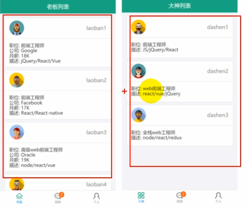

可以发现两个组件显示的内容差不多，只是获取到的列表不同，抽取一个共同的组件——用户列表组件，只需要改变向用户列表组件传入的列表，从而显示不同的列表信息

所以思路为：首先获取指定类型的用户列表信息,分别是laoban类型和dashen类型

## 10.1 后台：定义获取指定用户列表的路由

在`routes/index.js`中,发送请求后，在响应中返回所有属于指定类型的用户,因为要显示所有该类型的用户信息，所以返回的是一个列表，列表元素为单个用户对象

```
// 查看用户信息的路由
router.get("/userlist", (req, res) => {
  const { type } = req.query;
  // 得到所有type类型的用户
  UserModel.find({ type: type }, filter, function (err, users) {
    res.send({ code: 0, data: users });
  });
});
```

测试接口：此请求中会携带一个参数 type,所以在 postman 中发送请求时需要添加请求参数
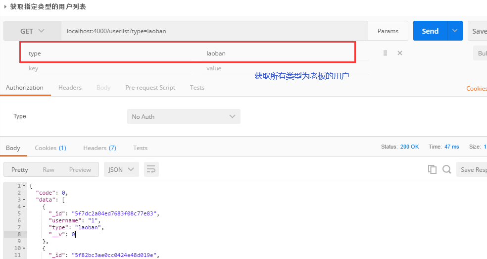

## 10.2 前台:ajax 请求

在`src/api/index.js`中,需要传入请求的参数 type,因为我们需要根据请求的用户类型返回相应的用户信息

```
// 获取用户列表
export const reqUserList = (type) => ajax("/userlist", { type });
```

## 10.3 redux 管理

`action-types.jsx`:

```
// 操作userlist状态
export const RECEIVE_USERLIST = "receive_userlist"; // 接收用户列表
```

`action.jsx`:

```
// 获取用户列表的同步action
export const receiveUserList = (userList) => ({
  type: RECEIVE_USERLIST,
  data: userList,
});

// 获取用户列表的异步action
export const getUserList = (type) => {
  return async (dispatch) => {
    // 执行异步ajax请求
    const response = await reqUserList(type);
    const result = response.data;
    // 分发一个同步action
    if (result.code === 0) {
      dispatch(receiveUserList(result.data));
    }
  };
};
```

`reducers.js`:之前创建的 reducer 是处理 user 状态的，现在我们有一个新的状态 userList,所以需要创建一个新的 reducer

```
// 产生userlist状态的reducer
const initUserList = [];
function userList(state = initUserList, action) {
  switch (action.type) {
    case RECEIVE_USERLIST:
      return action.data; // data是userlist
    default:
      return state;
  }
}
// 合并所有的reducer函数，向外暴露
export default combineReducers({
  user,
  userList,  //这里向外暴露是啥，在connect中传出的就是啥
});
```

## 10.4 建立共同的组件 UserList

分析可知，这个组件不需要与 redux 进行交互，它只需要接收到两个列表信息，并且显示即可，所以在`src/components/userlist/userlist.jsx`中：

使用固定数值设置静态组件：

```
/* 显示执行用户类型的列表信息 */
import React from "react";
import { WingBlank, WhiteSpace, Card } from "antd-mobile";

const Header = Card.Header;
const Body = Card.Body;

class UserList extends React.Component {
  render() {
    return (
      <div>
        <WingBlank>
          <div>
            <WhiteSpace />
            <Card>
              <Header
                thumb={require(`../../assets/images/头像1.png`).default}
                extra="aa"
              />
              <Body>
                <div>职位：前端工程师</div>
                <div>公司：IBM</div>
                <div>月薪：18K</div>
                <div>描述：React/Vue</div>
              </Body>
            </Card>
          </div>
        </WingBlank>
      </div>
    );
  }
}

export default UserList;
```

从父组件中获取 userlist 属性，动态化显示用户信息：

```
/* 显示执行用户类型的列表信息 */
import React from "react";
import PropTypes from "prop-types";
import { WingBlank, WhiteSpace, Card } from "antd-mobile";

const Header = Card.Header;
const Body = Card.Body;

class UserList extends React.Component {
  static propTypes = {
    userlist: PropTypes.array.isRequired,
  };
  render() {
    const { userList } = this.props;
    console.log(userList);
    return (
      <WingBlank>
        {userList.map((user) => (
          <div key={user._id}>
            <WhiteSpace />
            <Card>
              <Header
                thumb={
                  user.header
                    ? require(`../../assets/images/${user.header}.png`).default
                    : null
                }
                extra={user.username}
              />
              <Body>
                <div>职位：{user.post}</div>
                {user.company ? <div>公司：{user.company}</div> : null}
                {user.salary ? <div>月薪：{user.salary}</div> : null}
                <div>描述：{user.info}</div>
              </Body>
            </Card>
          </div>
        ))}
      </WingBlank>
    );
  }
}

export default UserList;
```

注意：这里存在一个问题：将UserList的Header组件中的thumb如此设置时，就会出现下面的问题

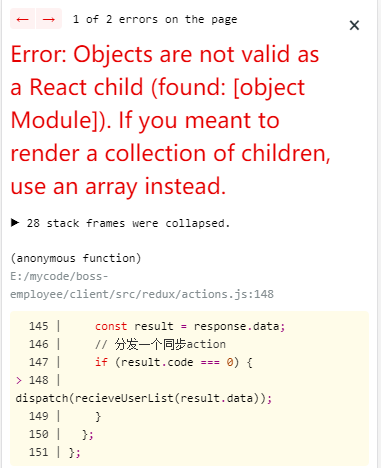

在验证了多次之后，发现所有的userList中的内容均可以在后台正常得到，并且前台的render也可以完成，只是不能显示，将其修改为下面的内容，可以显示：

```
<Header
  thumb={
    user.header ? (
      </img>
    ) : (
      ""
    )
  }
  extra={user.username}
/>
```

## 10.5 修改 Laoban 组件和 Dashen 组件

做两件事：首先在 componentDidMount 中发起异步请求，其次通过 connect 将 userlist 传递给 Laoban 组件，再将 userlist 传递给子组件 UserList

`src/containers/laoban/laoban.jsx`:

```
/* 老板主界面路由容器组件 */

import React from "react";
import { connect } from "react-redux";

import UserList from "../../components/userlist/userlist";
import { getUserList } from "../../redux/actions";

class Laoban extends React.Component {
  componentDidMount() {
    // 获取userlist，更新redux中的userlist状态
    this.props.getUserList("laoban");
  }
  render() {
    return (
      <div>
        <UserList userList={this.props.user}></UserList>
      </div>
    );
  }
}

export default connect((state) => ({ userList: state.userList }), {
  getUserList,
})(Laoban);
```

`src/containers/dashen/dashen.jsx`:

```
/* 老板主界面路由容器组件 */

import React from "react";
import { connect } from "react-redux";

import UserList from "../../components/userlist/userlist";
import { getUserList } from "../../redux/actions";

class Dashen extends React.Component {
  componentDidMount() {
    // 获取userlist
    this.props.getUserList("dashen");
  }
  render() {
    return (
      <div>
        <UserList userList={this.props.userList}></UserList>
      </div>
    );
  }
}

export default connect((state) => ({ userList: state.userList }), {
  getUserList,
})(Dashen);
```

## 10.6 解决两个布局问题

第一个问题：当滑动条滑动到最下方时，最后一个用户的信息不能完整显示，被遮挡住了一部分内容
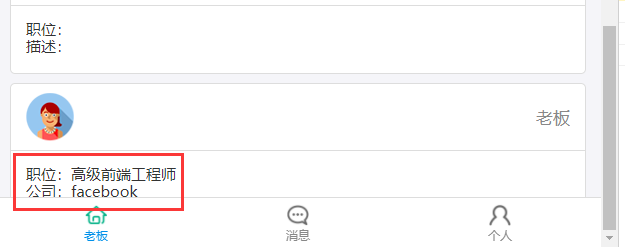
第二个问题：顶部导航栏会随着滑动条向上滑动
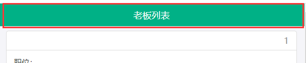

### 10.6.1 解决第一个问题

这个问题存在是由于底部导航栏遮挡住了部分用户信息，所以考虑为用户列表项添加一个下边距，这个下边距的高度正好等于底部导航栏的高度，从而解决问题

在浏览器的开发界面，选中底部导航栏，得到其高度为 50px:
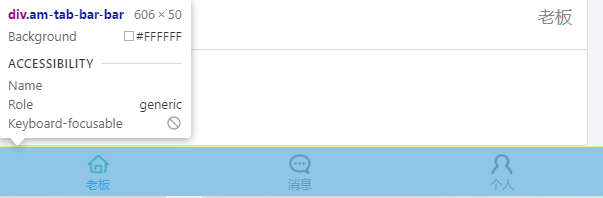

然后在 userlist.jsx 中为其添加样式：`<WingBlank style={{ marginBottom: 50 }}>`

### 10.6.2 解决第二个问题

使得顶部导航栏始终位于顶部，不跟随页面滑动:为main中的`<Navbar>`添加一个类，定义其样式为固定定位,在`assets/css/index.less`中：

```
.sticky-header {
  /* 使得顶部导航栏始终在底部 */
  position: fixed;
  top: 0;
  width: 100%;
}
```

但是这样之后发现它的层级不够，所以需要再添加一个层级属性，提高其层级：
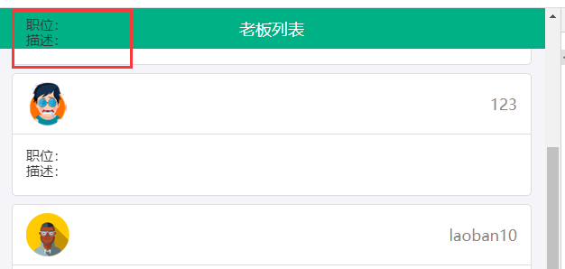

```
.sticky-header {
  /* 使得顶部导航栏始终在底部 */
  position: fixed;
  top: 0;
  width: 100%;
  z-index: 10;
}
```

但是这样之后又发现它的第一个用户信息被顶部导航栏遮住了，所以需要为用户列表添加一个顶部外边距：
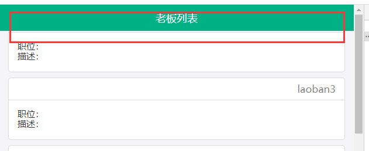
在 userlist.jsx 中：

```
<WingBlank style={{ marginBottom: 50, marginTop: 50 }}>
```

### 10.6.3 解决个人中心顶部导航栏和底部导航栏遮挡用户信息的问题

问题如下：
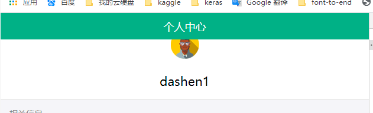

在`src/containers/personal/personal.jsx`中为内部信息设置上下外边距：

```
<div style={{ marginBottom: 50, marginTop: 50 }}>
```

# 11 学习 socket.io 的使用

首先需要下载安装 socket.io 包：`npm install --save socket.io`，这个包实际上包含了两个包：socket.io 用户服务器端，socket.io-client 用于客户端（浏览器端）

**注意：前台应用和后台应用均需要使用这个包，所以均需要下载**

如果在node_modules中没有发现socket.io-client这个包，则单端安装一下即可

## 11.1 socket.io 简介

socket.io 是一个可以实现多人远程实时通信或者聊天的库
它包装的是 H5 WebSocket 和轮询poiling，如果是较新的浏览器内部使用 Web Socket,如果浏览器不支持，其内部就会使用轮询实现实时通信

	- 轮询：客户端每隔一段时间就向浏览器发送消息，直到浏览器不忙并且接收到该消息为止
	-  H5 WebSocket：浏览器与服务器可以相互发送消息
	
	io:服务器端核心的管理对象
	socket: 客户端与服务器端的连接对象
	
	emit(name,data):发送消息
	on(name,function(data){}):绑定关于name事件的监听
	
	注意：服务器(客户端)发送消息的name和客户端(服务器)接收消息的name要保持一致

### 11.2 使用 socket.io 的例子

#### 11.2.1 服务器端

新建一个文件夹：`socketIO/test.js`

```
module.exports = function (server) {
  // 先引入socket.io这个库，得到一个函数，以server为参数，表示挂在这个服务器上，得到了一个IO对象
  const io = require("socket.io")(server);

  // 监视连接 当有任何一个客户端连接上服务器时运行回调
  io.on("connection", function (socket) {
    console.log("socketio connected");

    // 绑定sendMsg监听，接收客户端发送的消息
    socket.on("sendMsg", function (data) {
      console.log("服务器接收到浏览器的消息", data);

      // 处理接收到的数据
      const data = data.name + "_" + data.date;

      // 向客户端发送消息(名称，数据)
      io.emit("receiveMsg", data); // io是全局对象，发送给所有连接上服务器的客户端
      // socket.emit("receiveMsg", data); // socket是局部对象，发送给当前socket对应的客户端，只有一个
      console.log("服务器向浏览器发送消息", data);
    });
  });
};
```

在`bin/www`中引入 test.js 文件(在创建了 server 语句之后,因为它要作为 test.js 中创建的函数的参数引入)：

```
/**
 * Create HTTP server.
 */

var server = http.createServer(app);
// ------------------- 关键代码start -----------------
require("../socketIO/test")(server);
// ------------------- 关键代码end -----------------
```

#### 11.2.2 客户端

在`src`下新建一个文件夹：`src/test/socketio_test.js`

```
// 引入客户端 io
import io from "socket.io-client";

// 连接服务器, 得到代表连接的 socket 对象     
// {transports: ["websocket"] }可以解决CROS跨域的问题，强制连接方式为websocket
// 默认设置为{ transports: [“poiling","websocket"] }
const socket = io("ws://localhost:4000", { transports: ["websocket"] });

// 绑定'reciveMsg'的监听, 来接收服务器发送的消息
socket.on("receiveMsg", function (data) {
  console.log("浏览器端接收到消息:", data);
});

// 向服务器发送消息
socket.emit("sendMsg", { name: "Tom", date: Date.now() });
console.log("浏览器端向服务器发送消息:", { name: "Tom", date: Date.now() });

```

在客户端的入口文件`src/index.js`中引入该 socketio 的测试模块：

```
import "./test/socketio_test";
```

然后分别运行服务器端和浏览器端，可以直接得到：
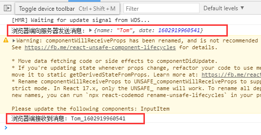

# 12 实现实时聊天

## 12.1 聊天功能组件：chat.jsx

实现的功能：

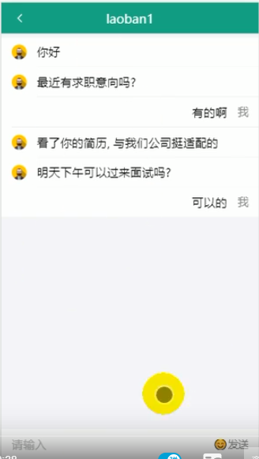

可以发现我们需要保存的信息有：

	- 发送方的username,header
	- from,to,chat_id,content,read,create_time

### 12.1.1 服务器端：

#### 12.1.1.1 定义数据库的集合模型

需要将消息保存在数据库中，所以需要定义数据库模型，在`db/models.js`中：

```
// 定义chats集合的文档结构
const chatSchema = mongoose.Schema({
  from: { type: String, required: true }, // 发送消息的用户id
  to: { type: String, required: true }, // 接收消息的用户id
  chat_id: { type: String, required: true }, // from和to组成的字符串
  content: { type: String, required: true }, // 消息的内容
  read: { type: Boolean, default: false }, // 消息是否已读
  create_time: { type: Number }, // 消息创建的时间，最后在消息列表中谁最近发了消息，它所对应的消息内容就会出现在顶部
});
// 定义操作chats集合数据的Model
const ChatModel = mongoose.model("chat", chatSchema);
// 向外暴露Model
exports.ChatModel = ChatModel;
```

#### 12.1.1.2 定义后台发送 ajax 请求对应的路由

响应 ajax 请求时，需要返回的数据类型为对象，包含两个属性，code 表示发送请求成功，data 中存放两个属性，users 是当前所有的用户组成的一个对象，chatMsgs 是与当前用户相关的所有信息组成的列表(当前用户发出的和当前用户接收的)

    {
        "code": 0,
        "data": {
            "users": {
                "5ae1d5d19151153d30e008fd": {
                    "username": "ds2"
                },
                "5ae1ddd99ca58023d82351ae": {
                    "username": "aa",
                    "header": "头像1"
                },
                "5ae1df049ca58023d82351af": {
                    "username": "aa2"
                },
                "5ae1e72aa072c522e024b18e": {
                    "username": "bb",
                    "header": "头像3"
                },
                "5ae1f088d37a442b749fc143": {
                    "username": "laoban1",
                    "header": "头像2"
                }
            },
            "chatMsgs": [
    			{
                    "read": false,
                    "_id": "5ae1f3c3a95eb824841199f1",
                    "from": "5ae1f088d37a442b749fc143",
                    "to": "5ae1ddd99ca58023d82351ae",
                    "content": "aa",
                    "create_time": 1524757443374,
                    "__v": 0
                }
    		]
        }
    }

在`routes/index.js`：

```
const ChatModel = require("../db/models").ChatModel;// 查看用户信息的路由

// 获取当前用户的聊天消息列表
router.get("/msglist", function (req, res) {
  // 获取cookies中保存的用户的userid
  const userid = req.cookies.userid;
  console.log("userid:", userid);

  // 查询得到所有user的文档数组
  /*
  users={
    id1:{username,header},
    id2:{username,header},
    ...
  }
  */
  UserModel.find(function (err, userDocs) {
    const users = {};
    userDocs.forEach((doc) => {
      users[doc._id] = { username: doc.username, header: doc.header };
    });

    /*
    上面的内容等同于
    const users = userDoc.reduce(function(users,doc){
      users[doc._id] = { username: doc.username, header: doc.header };
      return users;
    })
    */

    /*
  查询userid相关的所有聊天信息:由userid发出的消息或者由userid接收的消息
  */
    ChatModel.find(
      { $or: [{ from: userid }, { to: userid }] },
      filter,
      function (err, chatMsgs) {
        console.log({ chatMsgs });
        // chatMsgs是数组
        //  返回包含所有用户和当前用户相关的所有聊天消息的数据
        res.send({ code: 0, data: { users, chatMsgs } });
      }
    );
  });
});
```

### 12.1.2 前端部分

#### 12.1.2.1 创建聊天界面的静态组件 Chat

在`src/containers/chat/chat.jsx`中：

```
import React from "react";
import { connect } from "react-redux";

class Chat extends React.Component {
  render() {
    return <div></div>;
  }
}

export default connect((state) => ({}), {})(Chat);
```

因为 Chat 组件也是 main 组件的一个子路由，所以需要在 main 组件中引入，在`src/containers/main/main.jsx`中：

    注意这个路由的路径：是取当前被点击的用户的_id属性的，表示是当前登录用户与哪一位用户的聊天界面
    还有：这里设置的userid:会自动在当前用户的match属性中的params中创建一个属性userid

```
import Chat from "../chat/chat";

<Route path="/chat/:userid" component={Chat}></Route>
```

然后，因为我们是在大神列表或者老板列表点击其中一个用户，进入当前登录的用户与该用户的聊天界面，所以需要在 userlist.jsx 中添加事件点击函数，为 history 添加一个目标路径，直接导入到聊天界面

```
<Card
  onClick={() => {
    this.props.history.push(`/chat/${user._id}`);
  }}
>
```

编辑 Chat 组件的静态界面：


    设置对方的消息需要显式对方的头像
    我自己的消息不用显示头像

```
import React from "react";
import { connect } from "react-redux";
import { NavBar, List, InputItem } from "antd-mobile";

const Item = List.Item;

class Chat extends React.Component {
  render() {
    return (
      <div id="chat-page">
        <NavBar>aa</NavBar>
        <List>
          <Item thumb={require(`../../assets/images/头像1.png`).default}>你好</Item>
          <Item thumb={require(`../../assets/images/头像1.png`).default}>你好 2</Item>
          <Item extra="我" className="chat-me">
            很好
          </Item>
          <Item extra="我" className="chat-me">
            很好 2
          </Item>
        </List>
        <div className="am-tab-bar">
          <InputItem placeholder="请输入" extra={<span>发送</span>}></InputItem>
        </div>
      </div>
    );
  }
}

export default connect((state) => ({}), {})(Chat);
```

添加样式`src/assets/css/index.less`:

```
// 设置消息文本居右
#chat-page .chat-me .am-list-extra {
  // flex-basis的尺寸是作用在content-box上的,设置为auto表示占据其它元素剩余之外的所有宽度和高度
  flex-basis: auto;
}
#chat-page .chat-me .am-list-content {
  padding-right: 15px;
  text-align: right;
}
```

为发送按钮添加 onClick 事件监听：

    发送数据前需要收集相关的数据
        from:谁发消息，就是当前登录的用户
        to:发给谁，这可以在当前的match的params中查看
        content:发消息的内容，使用受控组件的方式将当前输入数据存入state中，并且在state中获取显示在页面中，然后为发送按钮提供事件处理程序
    	发送消息属于异步操作，需要使用redux

```
./chat.jsx
import { sendMsg } from "../../redux/actions";

class Chat extends React.Component {
  state = {
    content: "",
  };
  handleSend = () => {
    // 收集数据
    const from = this.props.user._id;
    const to = this.props.match.params.userid;
    const content = this.state.content.trim();
    // 发送请求(发消息)
    if (content) {
      // 异步操作
      this.props.sendMsg(from, to, content);
    }
    // 清除输入数据
    this.setState({ content: "" });
  };
  render() {
    return (
      <div id="chat-page">
        ...
        <div className="am-tab-bar">
          <InputItem
            className="am-tab-bar"
            placeholder="请输入"
            extra={<span onClick={this.handleSend}>发送</span>}
            value={this.state.content}
            onChange={(val) => this.setState({ content: val })}
          ></InputItem>
        </div>
      </div>
    );
  }
}

export default connect((state) => ({ user: state.user }), { sendMsg })(Chat);

```

./actions.js

```
export const sendMsg = (from, to, content) => {
  return (dispatch) => {
    console.log("发送消息：", from ,to,content);
  };
};
```

#### 12.1.2.2 实现前后台的收发消息

客户端向服务器端发送消息：`action.jsx`中:

    发送消息使用的是socket.io,所以需要先引入socket.io创建io对象
    连接服务器操作只需要执行一次(要保证内存中只创建了一个socket对象)，将所创建的socket对象保存在io中，创建socket连接对象之前先判断io中是否已经存在socket连接器了，没有再创建
    
    注意：之前在测试socket.io时，在入口文件中引入了import "./test/socketio_test";这个已经不用了，所以将其删掉
    
    另外，此时socket对象是在发消息时才创建的，也就是说只有我发了消息之后，socket连接器对象才会存在，我收到别人发给我的消息时我才会有所反应，这是不对的，后面需要修改

```
import io from "socket.io-client";

/*
单例对象：整个内存中仅有一个socket
   1 创建对象之前：判断对象是否已经创建，只有当不存在时才创建
   2 创建对象之后：保存socket对象在io对象中,这样避免多次创建
*/
function initIO() {
  // 1 创建对象之前：判断对象是否已经创建，只有当不存在时才创建
  if (!io.socket) {
    // 连接服务器,得到与服务器的连接对象 ws是协议，类似于http
    io.socket = io("ws://localhost:4000", { transports: ["websocket"] });

    // 接收来自服务器端的消息
    io.socket.on("receiveMsg", function (data) {
      console.log("接收来自服务器端的消息：", data);
    });
  }
}

// 发送消息的异步action
export const sendMsg = ({ from, to, content }) => {
  return (dispatch) => {
    console.log("客户端向服务器发送消息", { from, to, content });
    // 发送消息用的是socket.io
    initIO();
    // 发消息
    io.socket.emit("sendMsg", { from, to, content });
  };
};
```

服务器端接收客户端发送的消息，并且保存到数据库中，处理数据，然后再将数据发送给所有的浏览器端，在浏览器端再判断是否是发送给自己的数据，如果是发送给自己的数据，就保存到 redux 中。新建文件`socketIO/socketio_server.js`：

```
const ChatModel = require(`../db/models`).ChatModel;

module.exports = function (server) {
  const io = require("socket.io")(server);

  // 监视客户端与服务器的连接
  io.on("connection", function (socket) {
    console.log("有一个客户端连接到了服务器....");

    // 接收客户端的消息
    socket.on("sendMsg", function ({ from, to, content }) {
      console.log("服务器接收到客户端发送的消息：", { from, to, content });
      // 处理数据（保存消息）
      /* 准备数据
         (目前我们有的消息内容：from,to,content,但是我们的chat模型中还包含chat_id，read,create_time)
         所以需要先准备好数据
      */
      const chat_id = [from, to].sort().join("_"); //from_to或者to_from
      const create_time = Date.now();
      new ChatModel({ from, to, content, chat_id, create_time }).save(function (
        err,
        chatMsg
      ) {
        // 向所有客户端发送消息
        io.emit("receiveMsg", chatMsg);
        console.log("服务器向客户端发送消息", chatMsg);
      });
    });
  });
};
```

然后测试：在消息页面，输入 abc,点击发送，在浏览器中可以看到：
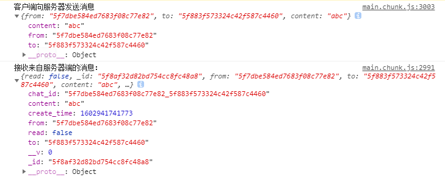
在服务器端，可以看到：
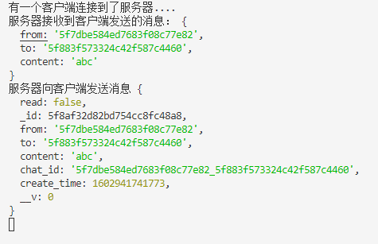

之后打开数据库也可以发现数据库中出现了一个 chats 集合，并且其内部具有一个文档：
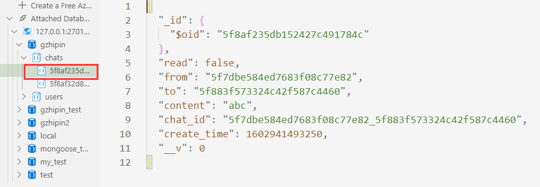

目前完成的功能：可以发送和接收消息，但是接收或者发送的消息还没有在聊天界面显示出来，之后就需要完成这个功能：

    1 首先获取与当前登录的用户相关的所有消息列表
    2 再筛选信息与每一个用户的关系(是当前用户与该用户收发的消息吗)，显示当前用户与该用户的聊天信息界面

## 12.2 实现用户间收发消息实时显示

实现的功能：


### 12.2.1 获取当前用户的聊天消息列表

获取当前用户与其他所有用户的消息信息，请求的 url:`localhost:4000/msglist`,请求方式为 get

#### 12.2.1.1 指定发送 ajax 请求的函数

`api/index.js`中：

    编辑获取当前用户的所有聊天信息的ajax请求函数
    reqReadMsg函数是后期在指定消息为已读时操作的

```
// 获取当前用户的聊天消息列表
export const reqChatMsgList = () => ajax("/msglist");
```

#### 12.2.1.2 Redux 部分

先定义两个 action-type:

```
// 获取用户的消息列表   与当前登录用户相关的所有消息
export const RECEIVE_Msg_LIST = "receive_msg_list";
// 当前登录的用户接收到一条消息
export const RECEIVE_Msg = "receive_msg";
```

由于目前操作的状态变成了 MsgList,所以需要定义一个新的 reducer,在`reducers.js`中：

```
// 产生聊天状态的reducer
const initChat = {
  users: {}, // 所有用户信息的对象  属性名：userid, 属性值：{username,header}
  chatMsgs: [], // 当前用户发出的信息以及接收到的信息的数组
  unReadCount: 0, //总的未读数量，显式在底部导航栏的
};
function chat(state = initChat, action) {
  switch (action.type) {
    case RECEIVE_MSG_LIST:
      return;
    case RECEIVE_MSG:
      return;
    default:
      return state;
  }
}
```

只要用户登录成功就需要得到当前登录用户的消息列表，而之前写的 action 中，用户注册、登录或者自动登录时，就属于登陆成功，所以需要在这三个 action creator 中均添加获取当前登录用户的消息列表的 action,所以先将其封装为一个函数，再分别引入，在`action.jsx`中：

另外，对于 12.1.2.1 中存在的 socket 对象创建时机不对的问题，可以在获取消息列表之前就创建 socket 对象，所以注释掉之前在 sendMsg 中的 iniIO(),在 getMsgList 中添加 initIO()。getMsgList 是在用户登录成功之后执行的，此时初始化 IO 比较好

```
// 接收消息列表的同步action
export const receiveMsgList = ({ users, chatMsgs }) => ({
  type: RECEIVE_Msg_LIST,
  data: { users, chatMsgs },
});

// 异步获取消息列表数据
async function getMsgList(dispatch) {
  initIO();
  const response = await reqChatMsgList();
  const result = response.data;
  if (result.code === 0) {
    const { users, chatMsgs } = result.data;
    // 分发同步action
    dispatch(receiveMsgList({ users, chatMsgs }));
  }
}

// 注册异步action
export const register = (user) => {
  const { username, password, password2, type } = user;

  // 做表单的前台验证
  if (!username) {
    return errorMsg("用户名不能为空");
  } else if (password !== password2) {
    return errorMsg("两次输入密码不一致");
  }

  //表单数据合法，返回一个发ajax请求的异步action函数
  return async (dispatch) => {
    const response = await reqRegister({ username, password, type });
    const result = response.data;
    if (result.code === 0) {
      // -----------------关键代码---------------------
      getMsgList(dispatch);
      // -----------------关键代码---------------------
      // 成功,分发授权成功的同步action
      dispatch(authSuccess(result.data));
    } else {
      // 失败,分发提示错误信息的同步action
      dispatch(errorMsg(result.msg));
    }
  };
};

// 登录异步action
export const login = (user) => {
  const { username, password } = user;
  // 做表单的前台验证
  if (!username) {
    return errorMsg("用户名不能为空");
  } else if (!password) {
    return errorMsg("密码不能为空");
  }

  return async (dispatch) => {
    const response = await reqLogin({ username, password });
    const result = response.data;
    if (result.code === 0) {
      // -----------------关键代码---------------------
      getMsgList(dispatch);
      // -----------------关键代码---------------------
      // 成功,分发授权成功的同步action
      dispatch(authSuccess(result.data));
    } else {
      // 失败,分发提示错误信息的同步action
      dispatch(errorMsg(result.msg));
    }
  };
};

// 获取用户异步action
export const getUser = () => {
  return async (dispatch) => {
    // 执行异步ajax请求
    const response = await reqUser();
    const result = response.data;
    if (result.code === 0) {
      // -----------------关键代码---------------------
      getMsgList(dispatch);
      // -----------------关键代码---------------------
      dispatch(receiveUser(result.data));
    } else {
      dispatch(resetUser(result.msg));
    }
  };
};
```

修改 reducer.jsx:

```
// 产生聊天状态的reducer
const initChat = {
  users: {}, // 所有用户信息的对象  属性名：userid, 属性值：{username,header}
  chatMsgs: [], // 当前用户发出的信息以及接收到的信息的数组
  unReadCount: 0, //总的未读数量，显式在底部导航栏的
};
function chat(state = initChat, action) {
  switch (action.type) {
    // ------------关键代码----------------
    case RECEIVE_Msg_LIST:
      const { users, chatMsgs } = action.data;
      return { users, chatMsgs, unReadCount: 0 };
    // ------------关键代码----------------
    case RECEIVE_Msg:
      return;
    default:
      return state;
  }
}
```

目前完成的功能：获得了某个用户的所有聊天信息列表

### 12.2.2 实现已获取到的消息列表数据的动态显示

接下来显示登录用户与任一用户的聊天界面，实现两个用户的聊天信息的显示，修改 `chat.jsx`:

    (1) 将state.chat通过connect传递给Chat组件的props属性  chat:{users,chatMsgs}
    (2) 由于目标用户发的消息和登录用户发的消息的摆放位置不同，所以需要分类，并且以不同的方式显示
    (3) 有一点要特别注意：需要判断一下当前的users中是否已经从异步端获得了所有的指定类型的用户信息，因为如果还没有获得，则说明目前不具备与目标用户的聊天信息，所以header等信息就无法获得,从而会报错

```
import React from "react";
import { connect } from "react-redux";
import { NavBar, List, InputItem } from "antd-mobile";
import { sendMsg } from "../../redux/actions";

const Item = List.Item;

class Chat extends React.Component {
  state = {
    content: "",
  };
  handleSend = () => {
    // 收集数据
    const from = this.props.user._id;
    const to = this.props.match.params.userid;
    const content = this.state.content.trim();
    // 发送请求(发消息)
    if (content) {
      // 异步操作
      this.props.sendMsg({ from, to, content });
    }
    // 清除输入数据
    this.setState({ content: "" });
  };
  render() {
    // debugger;
    // console.log("我又render了一次.....");

    // ------------------关键代码-------------------
    const { user, chat } = this.props;
    const { users, chatMsgs } = chat;
    //当前chatMsgs中包含我和所有其他用户的聊天信息，我现在只需要显示我和某个特定用户的聊天信息
    // 所以需要过滤
    // 先得到当前的chat_id
    const meId = user._id;

    // 刚开始users中是没有数据的，是一个空对象，需要发送异步请求获取消息列表的同时
    // 获取到users
    if (!users[meId]) {
      return null;
    }

    const targetId = this.props.match.params.userid;
    const chat_id = [meId, targetId].sort().join("_");
    const msgs = chatMsgs.filter((msg) => msg.chat_id === chat_id);
    // msgs中的消息有两种情况：我发的，对方发的

    console.log(targetId);
    // 获取目标用户的头像
    const targetHeader = users[targetId].header;
    // 有一个问题，对方可能还没有完善信息，并不具备icon
    // 这里直接在外部获取到指定用户的头像即可，如果在map函数中就需要执行多次，但是用户是固定的，所以没必要require多次
    const targetIcon = targetHeader
      ? require(`../../assets/images/${targetHeader}.png`).default
      : null;
    // ------------------关键代码-------------------

    return (
      <div id="chat-page">
        <NavBar>{users[targetId].username}</NavBar>
        <List>
        // ------------------关键代码-------------------
          {msgs.map((msg) => {
            if (msg.to === meId) {
              // 对方发给我的
              return (
                (
                  <Item key={msg._id} thumb={targetIcon}>
                    msg.content
                  </Item>
                )
              );
            } else {
              //我发给对方的
              return (
                <Item key={msg._id} extra="我" className="chat-me">
                  {msg.content}
                </Item>
              );
            }
          })}
          // ------------------关键代码-------------------
        </List>
        <div className="am-tab-bar">
          <InputItem
            placeholder="请输入"
            extra={<span onClick={this.handleSend}>发送</span>}
            value={this.state.content}
            onChange={(val) => this.setState({ content: val })}
          ></InputItem>
        </div>
      </div>
    );
  }
}

// ------------------关键代码-------------------
export default connect((state) => ({ user: state.user, chat: state.chat }), {
  sendMsg,
})(Chat);
// ------------------关键代码-------------------
```

### 12.2.3 实现收发消息(单个消息)的实时显示

因为在接收消息的判断时使用的是全局对象 io,所以需要先判断接收到的数据是否与当前登录的用户有关，是否是发给当前用户的，所以需要修改接收消息的监听，在`actions.js`中：

    1 使用当前用户的userid与chatMsg中的to或者from比较，是当前用户发出的消息，或者是当前用户接收到的消息，才将其保存，所以需要传入一个参数userid
    2 要保存最新接收的或者发送的消息，所以需要分发同步任务，所以需要传入dispatch作为第二个参数
    3 分发同步任务就需要定义接收单个消息的同步action
    4 修改initIO的调用，因为在getMsgList中调用了initIO,所以需要在getMsgList中传入userid和dispatch参数，在异步注册、异步登录及自动登录中调用getMsgList的地方：加入userid和dispatch参数

```
// 接收到一个消息的同步action
const receiveMsg = (chatMsg) => ({
  type: RECEIVE_Msg,
  data: chatMsg,
});

function initIO(userid, dispatch) {
  if (!io.socket) {
    // 连接服务器,得到与服务器的连接对象 ws是协议，类似于http
    io.socket = io("ws://localhost:4000");

    // 接收来自服务器端的消息
    io.socket.on("receiveMsg", function (chatMsg) {
      console.log("接收来自服务器端的消息：", chatMsg);

      // ----------------------关键代码-----------------------
      // 只有当chatMsg是与当前用户相关的消息，才去分发同步action保存
      if (userid === chatMsg.from || userid === chatMsg.to) {
        dispatch(receiveMsg(chatMsg));
      }
      // ----------------------关键代码-------------------------
    });
  }
}

// 异步获取消息列表数据
async function getMsgList(userid, dispatch) {
  initIO(userid, dispatch);
  const response = await reqChatMsgList();
  const result = response.data;
  if (result.code === 0) {
    const { users, chatMsgs } = result.data;
    // 分发同步action
    dispatch(receiveMsgList({ users, chatMsgs }));
  }
}
```

修改`reducers.js`,将与当前用户相关的收发的单个消息 chatMsg 放入总的消息列表 chatMsgs 中：

```
function chat(state = initChat, action) {
  switch (action.type) {
    case RECEIVE_Msg_LIST:
      const { users, chatMsgs } = action.data;
      return { users, chatMsgs, unReadCount: 0 };
    case RECEIVE_Msg: // data:chatMsg
    // -------------关键代码--------------------
      const chatMsg = action.data;
      return {
        users: state.users,
        chatMsgs: [...state.chatMsgs, chatMsg],
        unReadCount: 0,
      };
      // -------------关键代码--------------------
    default:
      return state;
  }
}
```

然后就可以实时显示当前用户收发到的消息了

### 12.2.4 在 Chat 组件中添加表情功能

每一个表情就是一个字符文本，可以作为字符串直接使用，各个操作系统均能显示

在线可用的表情：https://emojipedia.org/

首先，添加一个表情图标：
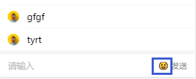

```
<InputItem
  placeholder="请输入"
  extra={
    <span>
     //----关键代码------------
      <span onClick={this.toggleShow} style={{ marginRight: 5 }}>
        😃
      </span>
       //----关键代码------------
      <span onClick={this.handleSend} style={{ marginRight: 5 }}>>发送</span>
    </span>
  }
  value={this.state.content}
  onChange={(val) => this.setState({ content: val })}
  onFocus={() => this.setState({ isShow: false })}
></InputItem>
```

然后为该图标设置事件监听，使得点击该图标之后显示很多个表情图标：

    1 添加一个状态isShow表示是否显示表情列表
    2 在打开对话框时，加载表情列表
    4 为表情图标添加事件单击函数toggleShow,通过转变isShow的状态，来确定是否显示列表
    5 在render中，通过判断当前的isShow,决定是否显示表情列表

```
state = {
  content: "",
  isShow: false, //是否显示表情列表
};
componentWillMount() {
  // 在第一次render之前调用，表示在打开对话框时已经加载到了表情文本
  const emojis = [
    "😀","😃","😄","😁","😆","😅","🤣",
    "😂","🙂","🙃","😀","😃","😄","😁",
  ];
  // this.emojis是一个元素为对象的数组
  this.emojis = emojis.map((emoji) => ({ text: emoji }));
}
toggleShow = () => {
    const isShow = !this.state.isShow;
    this.setState({ isShow });
};

{this.state.isShow ? (
<Grid
  data={this.emojis}
  columnNum={8}
  carouselMaxRow={4}
  isCarousel={true}
  onClick={(item) => {
    this.setState({ content: this.state.content + item.text });
  }}
/>
) : null}
```

此时运行程序，发现在点击了表情图标后，出现了问题，表情图标不能全部显示：
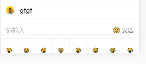

首先需要将底部导航栏的高度指定为inherint,即跟随内容的高度变化,否则由于之前设定了底部导航栏高度为50px，并且始终贴在底部，则导致表情框无法展示在页面中

```
.am-tab-bar {
  /* 使得导航栏始终在底部 */
  position: fixed;
  bottom: 0;
  width: 100%;
  height: inherit;
}
```

这是 anti-mobile 自身设计的问题，需要修改 toggleShow,如下：

```
toggleShow = () => {
  const isShow = !this.state.isShow;
  this.setState({ isShow });
  // 这是为了解决表情列表显示时的bug
  if (isShow) {
    // 异步手动派发一个resize事件，解决表情列表显示的bug
    setTimeout(() => {
      window.dispatchEvent(new Event("resize"));
    }, 0);
  }
};
```

然后还会发现滑动消息列表时，顶部导航栏也会被滑动上去，所以我们要为其添加一个之前定义好的类：sticky-header

```
<NavBar
  className="sticky-header"
>
```

与此同时发现消息列表的部分消息被上下导航栏遮挡住了，所以需要为消息列表 List 添加上下外边框：

```
<List style={{ marginTop: 50, marginBottom: 50 }}>
```

在顶部导航栏左边应该还有一个退回按钮，退回到大神或者老板列表：

```
<NavBar
  icon={<Icon type="left" />}
  onLeftClick={() => {
    this.props.history.goBack();
  }}
  className="sticky-header"
>
```

然后我们发现每一次打开和某个用户的聊天界面，最开始显示的都是最早发送的消息那一页，所以我们需要在页面加载后自动滑动到最新的消息处：

```
componentDidMount() {
  // 初始化显示列表，使滑动到与该用户收发的最新消息处
  window.scrollTo(0, document.body.scrollHeight);
}
```

此时可以发现打开和某个用户的聊天界面后出现的就是最近的信息页，但是当我们发送了一个新消息，却没有自动滑动到新消息显示页，需要手动向下滑,所以需要在状态改变后自动令其下滑到最新的消息处：

```
componentDidUpdate() {
  // 更新显示列表
  window.scrollTo(0, document.body.scrollHeight);
}
```

另外，发现当表情框展开时，会遮挡住一部分的信息，此时需要根据isShow动态调整List的下外边距：

```
当表情框展开时，增大List的下外边距，这个值通过在html中查看展开后的底部导航栏+表情框的高度决定
当表情框折叠时，下外边距就是底部导航栏的高度
<List
  style={
    isShow
      ? { marginTop: 50, marginBottom: 240 }
      : { marginTop: 50, marginBottom: 50 }
  }
>
```

这样做之后还是存在一个问题：当发送了表情消息后，表情框不会折叠，需要再次点击表情才可以实现折叠，这个问题暂时遗留

## 12.3 显示分组消息列表 message.jsx

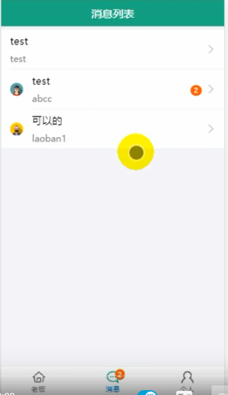

### 12.3.1 完成静态组件

```
import React from "react";
import { connect } from "react-redux";
import { List, Badge } from "antd-mobile";

const Item = List.Item;
const Brief = Item.Brief;

class Message extends React.Component {
  render() {
    const { user } = this.props;
    const { users, chatMsgs } = this.props.chat;
    // 对chatMsgs使用chat_id进行分组
    const lastMsgs = getLastMsgs(chatMsgs);
    return (
      <div>
        {/* 设置上下外边距       我们在这个界面只需要显示聊天的最后一条消息即可 */}
        <List style={{ marginTop: 50, marginBottom: 50 }}>
            <Item
              extra={<Badge text={3} />} // 未读消息数量
              thumb={require(`../../assets/images/头像1.png`)} // 头像
              arrow="horizontal"
            >
              消息内容
              <Brief>用户名</Brief>
            </Item>
        </List>
      </div>
    );
  }
}
export default connect(
  (state) => ({user:state.user,chat:state.chat }),
  {}
)(Message);
```

### 12.3.2 实现动态化显示最后一条消息

    首先我们需要获取到当前用户与其他用户聊天的最后一条消息，因为在当前页面我们只需要显示最后一条消息即可，所有的消息显示是在chat.jsx中处理的
        定义getLastMsg函数
    获取到当前用户与其他用户聊天的最后一条消息列表后，通过map的形式显示即可
    	首先，当前用户与某一位用户的所有聊天内容的chat_id都是相同的,即为from_to或者to_from，所以可以根据chat_id对当前用户的所有聊天信息进行分组，找到每一组中发送时间create_time最大的那条消息，因为create_time是按照时间戳的方式产生的，所以越晚建立的消息的时间戳越大

```
/* 消息列表界面的路由组件 */
import React from "react";
import { connect } from "react-redux";
import { List, Badge } from "antd-mobile";

const Item = List.Item;
const Brief = Item.Brief;

function getLastMsgs(chatMsgs) {
  // 1 找到每个聊天的lastMsg,并用一个容器对象来保存{chat_id:lastMsg}
  const lastMsgObjs = {};
  chatMsgs.forEach((msg) => {
    // 得到msg的聊天id  谁给谁发的消息  fromid_toid
    const chatId = msg.chat_id;
    // 获取已保存的当前组的lastMsg
    const lastMsg = lastMsgObjs[chatId];
    if (!lastMsg) {
      // 没有则说明当前msg就是所在组的lastMsg
      lastMsgObjs[chatId] = msg;
    } else {
      // 如果msg比lastmsg晚，就将msg保存为lastmsg
      if (msg.create_time > lastMsg.create_time) {
        lastMsgObjs[chatId] = msg;
      }
    }
  });
  // console.log(lastMsgObjs);   {chat_id:msg}
  // 得到所有的lastMsg的数组,将对象形式转换为数组形式
  const lastMsgs = Object.values(lastMsgObjs);
  // console.log(lastMsgs);  [msg,...]
  // 排序(按照create_time)降序排列
  lastMsgs.sort(function (m1, m2) {
    // 结果小于0，则m1在前
    return m2.create_time - m1.create_time;
  });
  return lastMsgs;
}

class Message extends React.Component {
  render() {
    const { user } = this.props;
    const { users, chatMsgs } = this.props.chat;
    // 对chatMsgs使用chat_id进行分组
    const lastMsgs = getLastMsgs(chatMsgs);
    return (
      <div>
        {/* 设置上下外边距       我们在这个界面只需要显示聊天的最后一条消息即可 */}
        <List style={{ marginTop: 50, marginBottom: 50 }}>
          {lastMsgs.map((msg) => {
            // 得到目标用户的id
            const targetUserId = msg.to === user._id ? msg.from : msg.to;
            const targetUser = users[targetUserId];
            return (
              <Item
                key={msg._id}
                extra={<Badge text={3} />} // 未读消息数量
                thumb={
                  targetUser.header
                    ? require(`../../assets/images/${targetUser.header}.png`).default
                    : null
                } // 头像
                arrow="horizontal"
                onClick={() => this.props.history.push(`/chat/${targetUserId}`)}
              >
                {msg.content}
                <Brief>{targetUser.username}</Brief>
              </Item>
            );
          })}
        </List>
      </div>
    );
  }
}
export default connect(
  (state) => ({ user: state.user, chat: state.chat }),
  {}
)(Message);
```

## 12.3 未读消息数量显示

实现的功能：两个地方
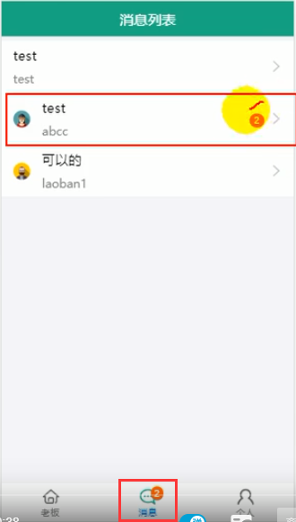

### 12.3.1 每一个分组的未读数量显示

在 message.jsx 中，首先修改 getLastMsg 函数，在遍历所有的聊天消息时，先为每一个聊天消息添加一个 unReadCount 属性，判断如果该消息是发给当前用户(即不是用户自己发出的)并且消息的 read 属性为 false,则表示该条消息未读，则令 unReadCount=1,否则令 unReadCount=0;

获取每组的未读消息总数：遍历所有的 msg,从 lastMsgObjs 中取出 lastMsg,通过判断 lastMsg 是否存在，不存在则当前的 msg 就是该组的最后一条 msg,否则则需要使用当前 lastMsg 的 unReadCount 属性+当前 msg 的 unReadCount 累加得到当前组的未读消息总数。

```
function getLastMsgs(chatMsgs, userId) {

// --------------------关键代码start--------------------------

  // 1 找到每个聊天的lastMsg,并用一个容器对象来保存{chat_id,lastMsg}
  const lastMsgObjs = {};
  chatMsgs.forEach((msg) => {
    // 对msg进行统计
    if (msg.to === userId && !msg.read) {
      // 如果消息是发给我的并且消息显示未读，则将msg的unReadCOunt设置为1
      msg.unReadCount = 1;
    } else {
      msg.unReadCount = 0;
    }
// --------------------关键代码end--------------------------
    // 得到msg的聊天id  谁给谁发的消息  fromid_toid
    const chatId = msg.chat_id;
    // 获取已保存的当前组的lastMsg
    const lastMsg = lastMsgObjs[chatId];
    if (!lastMsg) {
      // 没有则说明当前msg就是所在组的lastMsg
      lastMsgObjs[chatId] = msg;
    } else {
// --------------------关键代码start--------------------------
      // 累加unReadCount
      const unReadCount = lastMsg.unReadCount + msg.unReadCount;
      // 如果msg比lastmsg晚，就将msg保存为lastmsg
      if (msg.create_time > lastMsg.create_time) {
        lastMsgObjs[chatId] = msg;
      }
      // 保存在最新的lastMsg上
      lastMsgObjs[chatId].unReadCount = unReadCount;
// --------------------关键代码end--------------------------
    }
  });
  // console.log(lastMsgObjs);   {chat_id:msg}
  // 得到所有的lastMsg的数组,将对象形式转换为数组形式
  const lastMsgs = Object.values(lastMsgObjs);
  // console.log(lastMsgs);  [msg,...]
  // 排序(按照create_time)降序排列
  lastMsgs.sort(function (m1, m2) {
    // 结果小于0，则m1在前
    return m2.create_time - m1.create_time;
  });
  return lastMsgs;
}
```

最后再显示该数量即可：

```
<Item
  extra={<Badge text={msg.unReadCount} />} // 未读消息数量
>
```

### 12.3.2 总的未读数量获取及显示

总的未读消息我们使用 redux 实现，之前在 redux 中添加聊天状态 chat 时，为其初始化了一个 unReadCount 属性，所以需要修改 chat 纯函数：

首先在接收到消息列表后，我们需要更新 unReadCount 属性，需要使用 reduce 方法，累加其中的发送给用户本人的并且 read 属性为 false 的消息。

```
case RECEIVE_Msg_LIST:
  const { users, chatMsgs, userid } = action.data;
  return {
    users,
    chatMsgs,
    unReadCount: chatMsgs.reduce(
      (preTotal, msg) =>
        preTotal + (!msg.read && msg.to === userid ? 1 : 0),
      0
    ),
  };
```

reduce 用法：`arr.reduce(callback,[initialValue])`

    callback （执行数组中每个值的函数，包含四个参数）
        1、previousValue （上一次调用回调返回的值，或者是提供的初始值（initialValue））
        2、currentValue （数组中当前被处理的元素）
        3、index （当前元素在数组中的索引）
        4、array （调用 reduce 的数组）
    
    initialValue （作为第一次调用 callback 的第一个参数。）

需要注意的是：接收同步消息列表的 action 中返回的 data 中在之前的定义中不包含 userid,所以还需要修改接收同步消息列表的 action 以及它的异步调用

```
const receiveMsgList = ({ users, chatMsgs, userid }) => ({
  type: RECEIVE_Msg_LIST,
  data: { users, chatMsgs, userid },
});

// 异步获取消息列表数据
async function getMsgList(userid, dispatch) {
  initIO(userid, dispatch);
  const response = await reqChatMsgList();
  const result = response.data;
  if (result.code === 0) {
    const { users, chatMsgs } = result.data;
    // 分发同步action
    dispatch(receiveMsgList({ users, chatMsgs, userid }));
  }
}
```

接收到一个新消息时，因为我们这里定义的接收到一个消息，指的是不管是本人发给别人的，还是别人发给本人的，所以也需要判断该消息是否是发给我的以及它的 read 属性：

```
case RECEIVE_Msg: // data:chatMsg
  const { chatMsg } = action.data;
  return {
    users: state.users,
    chatMsgs: [...state.chatMsgs, chatMsg],
    unReadCount:
      state.unReadCount +
      (!chatMsg.read && chatMsg.to === action.data.userid ? 1 : 0),
  };
```

同样需要注意：接收同步消息的 action 中返回的 data 中在之前的定义中不包含 userid,所以还需要修改接收同步消息的 action 以及它的异步调用

```
// 接收到一个消息的同步action
const receiveMsg = (chatMsg, userid) => ({
  type: RECEIVE_Msg,
  data: { chatMsg, userid },
});

function initIO(userid, dispatch) {
  if (!io.socket) {
    // 连接服务器,得到与服务器的连接对象 ws是协议，类似于http
    io.socket = io("ws://localhost:4000");

    // 接收来自服务器端的消息
    io.socket.on("receiveMsg", function (chatMsg) {
      console.log("接收来自服务器端的消息：", chatMsg);
      // 只有当chatMsg是与当前用户相关的消息，才去分发同步action保存
      if (userid === chatMsg.from || userid === chatMsg.to) {
        dispatch(receiveMsg(chatMsg, userid));
      }
    });
  }
}
```

显示未读消息总数量：在`src/components/nav-footer/nav-footer.jsx`中,因为它是一个 UI 组件，所以不能通过 connect 传递属性，所以只能通过父组件传递给子组件的方式，所以我们先假定它从父组件接收到了一个 unReadCount 属性，然后可以通过判断当前的路径确定打开了消息列表，从而显示未读消息总数，如果当前路径不是'/message'，则不显示

```
static propTypes = {
  navList: PropTypes.array.isRequired,
  unReadCount: PropTypes.number.isRequired,
};

<Item
  badge={nav.path === "/message" ? unReadCount : 0}
></Item>
```

然后在`src/containers/main/main.jsx`中，通过 connect 接收 unReadCount 属性，然后传递给其子组件 NavFooter：

```
export default connect(
  (state) => ({ user: state.user, unReadCount: state.chat.unReadCount }),
  { getUser }
)(Main);

const { user, unReadCount } = this.props;

<NavFooter navList={navList} unReadCount={unReadCount}></NavFooter>
```

### 12.3.3 更新未读消息的数量

目前的状态：未读消息数量可以显示，但是当我们点击进入与某个用户的聊天界面又退出到消息列表(即查看了该消息)后，未读消息数量仍然没有消失，这需要进行更新，即当用户进入到与某个用户的聊天界面后，就发出请求，修改其组的未读消息数量以及总的未读消息数量

#### 12.3.3.1 编写后台路由

修改指定消息为已读，api 文档：

    请求URL：localhost:4000/readmsg
    请求方式：post
    参数类型
      	|参数		|是否必选 |类型     |说明
      	|from       |Y       |string   |发送消息用户的id
    返回示例：{code: 0, data: 2}   data中保存的是修改的消息的数量

```
/* 修改消息为已读:标记消息已读只能修改别人发给我的消息为已读，我发给别人的需要人家改 */

router.post("/readmsg", function (req, res) {
  // 得到请求中的 from 和 to
  const from = req.body.from; // 给当前登录的用户发消息的用户
  const to = req.cookies.userid; // 当前登录的用户
  /*
  更新数据库中的chat数据
  */
  ChatModel.update(
    { from, to, read: false }, // 修改的条件：其他人发给当前用户的，并且消息显示未读的
    { read: true }, // 将read属性修改为true
    { multi: true }, // multi为true表示一次更新多条符合条件的信息
    function (err, doc) {
      res.send({ code: 0, data: doc.nModified }); // 返回更新的消息数量
    }
  );
});
```

#### 12.3.3.2 编写前台请求

在`src/api/index.js`中编写 ajax 请求的函数：

```
// 修改指定消息为已读
export const reqReadMsg = (from) => ajax("/readmsg", { from }, "POST");
```

在 chat.jsx 中：现在假定发送异步请求的函数为 sendMsg

```
import { sendMsg, readMsg } from "../../redux/actions";

componentDidMount() {
  // 初始化显示列表，使滑动到与该用户收发的最新消息处
  window.scrollTo(0, document.body.scrollHeight);

  // 发请求更新未读消息的数量
  const from = this.props.match.params.userid;
  const to = this.props.user._id;
  // 发送异步请求
  this.props.readMsg(from, to);
}

export default connect((state) => ({ user: state.user, chat: state.chat }), {
  sendMsg,
  readMsg,
})(Chat);
```

在`action-type.js`中：

```
// 读取了消息,查看过了
export const MSG_READ = "msg_read";
```

在`action.js`中：

```
// 读取消息的同步action
const msgRead = ({ count, from, to }) => ({
  type: MSG_READ,
  data: { count, from, to },
});

// 读取消息的异步action,更新未读消息数量
export const readMsg = (from, to) => {
  return async (dispatch) => {
    const response = await reqReadMsg(from);
    const result = response.data;
    if (result.code === 0) {
      const count = result.data; // 后台返回的
      console.log(from, to, count, "dsdd");
      dispatch(msgRead({ count, from, to }));
    }
  };
};
```

在`reducers.js`中添加关于此请求的 case:

```
function chat(state = initChat, action) {
  switch (action.type) {
    case RECEIVE_Msg_LIST:
      const { users, chatMsgs, userid } = action.data;
      return {
        users,
        chatMsgs,
        unReadCount: chatMsgs.reduce(
          (preTotal, msg) =>
            preTotal + (!msg.read && msg.to === userid ? 1 : 0),
          0
        ),
      };
    case RECEIVE_Msg: // data:chatMsg
      const { chatMsg } = action.data;
      return {
        users: state.users,
        chatMsgs: [...state.chatMsgs, chatMsg],
        unReadCount:
          state.unReadCount +
          (!chatMsg.read && chatMsg.to === action.data.userid ? 1 : 0),
      };
// --------------关键代码start-----------------------------
    case MSG_READ:
      const { from, to, count } = action.data;
      return {
        users: state.users,
        // 找到某些信息的read属性，将其修改为false
        chatMsgs: state.chatMsgs.map((msg) => {
          if (msg.from === from && msg.to === to && !msg.read) {
            // 需要更新
            return { ...msg, read: true, unReadCount: 0 };
          } else {
            // 不需要更新
            return msg;
          }
        }),
        unReadCount: state.unReadCount - count,
      };
// --------------关键代码end-----------------------------
    default:
      return state;
  }
}
```

## 12.4 给老板列表或者大神列表添加动画效果

先安装一个包：`npm install --save rc-queue-anim`
这个包是 antd-mobile 相关的，使用 Ant Motion 能够快速在 React 框架中使用动画。我们需要使用其中的进出场动画

在`https://mobile.ant.design/index-cn`页面的最底部：

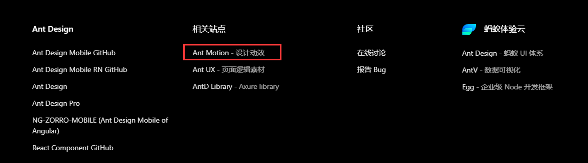

```
// 引入包
import QueueAnim from 'rc-queue-anim'

// 使用QueueAnim组件将所有需要动画的内容包裹起来，例如message.jsx中，将所有列表项包裹起来：

<List style={{ marginTop: 50, marginBottom: 50 }}>
  <QueueAnim type="scaleX">
    {lastMsgs.map((msg) => {
      // 得到目标用户的id
      const targetUserId = msg.to === user._id ? msg.from : msg.to;
      const targetUser = users[targetUserId];
      const unReadCount = msg.unReadCount;
      console.log("unReadCount", unReadCount);
      return (
        <Item
          key={msg._id}
          extra={<Badge text={unReadCount} />} // 未读消息数量
          thumb={
            targetUser.header
              ? require(`../../assets/images/${targetUser.header}.png`)
              : null
          } // 头像
          arrow="horizontal"
          onClick={() =>
            this.props.history.push(`/chat/${targetUserId}`)
          }
        >
          {msg.content}
          <Brief>{targetUser.username}</Brief>
        </Item>
      );
    })}
  </QueueAnim>
</List>
```

# H5websocket的使用

### 1. 客户端：

1. 建立websocket对象

2. 代码段：

   ```
   <script>
   	const websocket = new Websocket('ws:http://localhost:3000');
   	websocket.addEventListener("open",function(){
   		console.log('连接服务器成功!');
   	})
   	// 点击按钮给服务器发送消息
   	button.addEventListener("click",function(){
   		const val = input.value;
   		websocket.send(val);
   	})
   </script>
   ```

### 2. 服务器端：

`nodejs` 可以通过`nodejs-websocket`来实现创建一个 websocket 的服务

1. 安装：npm install nodejs-websocket

2. 代码段：https://www.jianshu.com/p/f0baf93a3795

   ```
   // websocket.js
   const ws = require('nodejs-websocket')
   
   const createServer = () => {
     // 创建一个 server 对象
     let server = ws.createServer(connection => {
     	// 每一个用户连接进入的时候，都会创建一个connection对象，表示当前连接进入的用户
       connection.on('text', function(result) {
         console.log('发送消息', result)
       })
       connection.on('connect', function(code) {
         console.log('开启连接', code)
       })
       connection.on('close', function(code) {
         console.log('关闭连接', code)
       })
       connection.on('error', function(code) {
         console.log('异常关闭', code)
       })
     })
     return server
   }
   
   // 服务端广播
   function broadcast(server, msg) {
     // server.connections得到当前连接入服务器的所有用户
     server.connections.forEach(function(conn) {
       conn.sendText(msg)
     })
   }
   
   module.exports = createServer();
   ```

**注意：websocket-nodejs不允许后台向前台发送除字符串或者buffer之外的数据，所以一旦需要传送一个对象，需要使用`JSON.stringify`将对象转换为一个json字符串**

### 3 使用websocket的弊端

1. 事件很少，广播事件还要自己写，比较麻烦
2. 兼容性，不支持websocket的浏览器无法实现该功能

# Socket.IO

[即时通讯框架SocketIO的入门学习 (baidu.com)](https://baijiahao.baidu.com/s?id=1687288407113009630&wfr=spider&for=pc)

Socket.IO是一个库，基于 Node.js 的实时应用程序框架。可以在浏览器和服务器之间实现实时，双向和基于事件的通信。它适用于每个平台、浏览器或设备，同样注重可靠性和速度。它包含两个库：socket.io和socket.io-client,分别用于创建服务器端的连接对象和客户端的连接对象

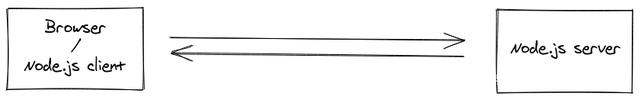

SocketIO将WebSocket、AJAX和其它的通信方式全部封装成了统一的通信接口，也就是说，我们在使用SocketIO时，不用担心兼容问题，底层会自动选用最佳的通信方式。

**特点：**

1. 易用性：Socket.io封装了服务端和客户端，使用起来非常简单方便。
2. 跨平台：Socket.io是跨平台的，可以实现多平台的即时通讯，Socket.io支持跨平台，这就意味着你有了更多的选择，可以在自己喜欢的平台下开发实时应用。
3. 自适应：Socket.io 实现了实时双向的基于事件的通讯机制，是基于 webSocket 的封装，但它不仅仅包括 webSocket，还对轮询（Polling）机制以及其它的实时通信方式封装成了通用的接口，并且在服务端实现了这些实时机制的相应代码，它会自动根据浏览器从WebSocket、AJAX长轮询、Iframe流等等各种方式中选择最佳的方式来实现网络实时应用，非常方便和人性化，而且支持的浏览器最低达IE5.5。
4. 直接使用io对象发送消息(io.emit())相当于广播，所有连接到该服务器的用户都会收到该消息；使用io对象创建的socket对象发消息(socket.emit())，则只有该socket对应的用户会收到消息

### 1 服务器不借助第三方平台搭建

客户端：

1. 安装：`npm install socket.io`

2. 代码：

   <script src='/socket.io/socket.io.js'></script>
   <!-- 它会直接去socket.io包中顺着上面的目录去找到客户端的socket.io.js -->

   <script>
   	const socket = io('http://localhost:3000');
       // 接收服务器的sendMsg事件返回的数据
   	socket.on("sendMag",function(data){
   		console.log('连接服务器成功!');
           // 客户端给服务器端发送数据
           socket.emit("receiveMsg",'客户端发送数据给服务器');
   	})
   </script>

服务器端:

1. 安装：`npm install socket.io`

```
const server = require('http').createServer();

server.on('request',function(req,res){
	res.end('啦啦啦啦');
})

const options = { /* ... */ };
const io = require('socket.io')(server, options);
io.on('connection', socket => { 
	console.log('新用户连接了!');
	socket.on("recieveMsg",data=>{
		console.log('服务器接收到来自客户端的消息:',data)
		
		// 服务器给用户发送信息
		socket.emit("sendMsg",'服务器给用户发送信息');
	});
});

server.listen(3000);
```

### 2 服务器借助express搭建

服务器端：

```
const app = require('express')();
const server = require('http').createServer(app);
const options = { /* ... */ };
const io = require('socket.io')(server, options);

app.get('/',function(req,res){
	res.send('哈哈');
})

const options = { /* ... */ };
io.on('connection', socket => { 
	console.log('新用户连接了!');
	socket.on("recieveMsg",data=>{
		console.log('服务器接收到来自客户端的消息:',data)
		
		// 服务器给用户发送信息
		socket.emit("sendMsg",'服务器给用户发送信息');
	});
});

server.listen(3000);
```

