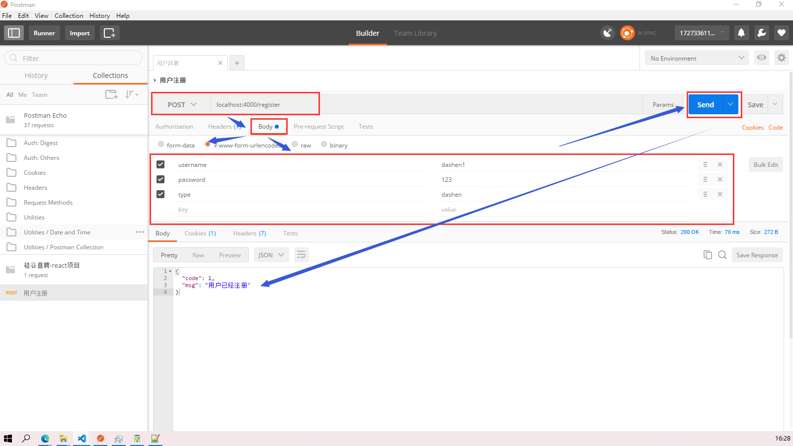

- [1 前台项目准备](#1-前台项目准备)
    - [1.1 项目描述](#11-项目描述)
    - [1.2 项目的功能界面](#12-项目的功能界面)
    - [1.3 项目打包](#13-项目打包)
    - [1.4 使用 antd-mobile 实现按需打包并且自定义 anti-mobile 主题颜色](#14-使用-antd-mobile-实现按需打包并且自定义-anti-mobile-主题颜色)
      - [1.4.1 准备工作](#141-准备工作)
      - [1.4.2 antd-mobile 按需加载](#142-antd-mobile-按需加载)
      - [1.4.3 antd-mobile 定制主题颜色](#143-antd-mobile-定制主题颜色)
- [2 前台组件的初步搭建](#2-前台组件的初步搭建)
  - [2.1 创建根组件，3 个一级路由组件](#21-创建根组件3-个一级路由组件)
  - [2.2 引入 redux](#22-引入-redux)
  - [2.3 实现登录和注册操作的页面](#23-实现登录和注册操作的页面)
    - [2.3.1 静态注册界面的实现](#231-静态注册界面的实现)
    - [2.3.2 实现静态登录界面](#232-实现静态登录界面)
- [3 搭建后台应用，完成后台准备工作](#3-搭建后台应用完成后台准备工作)
  - [3.1 创建 node+express 应用](#31-创建-nodeexpress-应用)
  - [3.2 实现后台应用自动重运行---nodemon 包](#32-实现后台应用自动重运行---nodemon-包)
  - [3.3 在后台产生一个用于响应 POST 请求的路由](#33-在后台产生一个用于响应-post-请求的路由)
  - [3.4 测试后台注册操作的 Post 请求响应路由是否设置成功](#34-测试后台注册操作的-post-请求响应路由是否设置成功)
- [4 使用 mongoose 操作数据库](#4-使用-mongoose-操作数据库)
  - [4.1 回顾数据库的几个基本操作](#41-回顾数据库的几个基本操作)
  - [4.2 使用 vscode 操作数据库](#42-使用-vscode-操作数据库)
- [5 完成注册登录的后台处理](#5-完成注册登录的后台处理)
  - [5.1 连接数据库，定义集合模型](#51-连接数据库定义集合模型)
  - [5.2 定义用户注册的响应路由：](#52-定义用户注册的响应路由)
  - [5.3 定义用户登录的响应路由：](#53-定义用户登录的响应路由)
- [6 完成注册、登录的前台处理](#6-完成注册登录的前台处理)
    - [6.1 axios-ajax 与后台交互](#61-axios-ajax-与后台交互)
    - [6.2 redux 状态管理](#62-redux-状态管理)
  - [6.3 解决跨域请求问题：](#63-解决跨域请求问题)
- [7 完成用户的信息完善界面](#7-完成用户的信息完善界面)
  - [7.1 完成组件的静态页面](#71-完成组件的静态页面)
    - [7.1.1 头像部分单独作为一个 UI 组件](#711-头像部分单独作为一个-ui-组件)
    - [7.1.2 老板信息完善页面的静态实现](#712-老板信息完善页面的静态实现)
    - [7.1.3 大神信息完善页面的静态实现](#713-大神信息完善页面的静态实现)
  - [7.2 动态交互](#72-动态交互)
    - [7.2.1 数据收集](#721-数据收集)
    - [7.2.2 前后台交互](#722-前后台交互)
- [8 主界面](#8-主界面)
  - [8.1 实现自动登陆](#81-实现自动登陆)
  - [8.2 主界面的子组件——老板列表和大神列表的框架实现](#82-主界面的子组件老板列表和大神列表的框架实现)
    - [8.2.1 大神用户的老板列表](#821-大神用户的老板列表)
    - [8.2.2 老板用户的大神列表](#822-老板用户的大神列表)
    - [8.2.3 信息列表：](#823-信息列表)
    - [8.2.4 个人中心：](#824-个人中心)
    - [8.2.5 发生错误时的组件](#825-发生错误时的组件)
    - [8.2.6 在 main 中动态化引入子组件](#826-在-main-中动态化引入子组件)
    - [8.2.7 制作底部导航栏组件](#827-制作底部导航栏组件)
    - [8.2.8 解决问题 1：底部导航栏位置错误](#828-解决问题-1底部导航栏位置错误)
    - [8.2.9 解决问题 2：底部导航栏显示了四个路由组件](#829-解决问题-2底部导航栏显示了四个路由组件)
- [9 个人中心](#9-个人中心)
  - [9.1 显示静态界面](#91-显示静态界面)
  - [9.2 实现动态化处理：关联显示当前登录的用户信息](#92-实现动态化处理关联显示当前登录的用户信息)
  - [9.3 退出登录操作](#93-退出登录操作)
- [10 大神/老板列表功能](#10-大神老板列表功能)
  - [10.1 后台：定义获取指定用户列表的路由](#101-后台定义获取指定用户列表的路由)
  - [10.2 前台:ajax 请求](#102-前台ajax-请求)
  - [10.3 redux 管理](#103-redux-管理)
  - [10.4 建立共同的组件 UserList](#104-建立共同的组件-userlist)
  - [10.5 修改 Laoban 组件和 Dashen 组件](#105-修改-laoban-组件和-dashen-组件)
  - [10.6 解决两个布局问题](#106-解决两个布局问题)
    - [10.6.1 解决第一个问题](#1061-解决第一个问题)
    - [10.6.2 解决第二个问题](#1062-解决第二个问题)
    - [10.3 解决个人中心顶部导航栏和底部导航栏遮挡用户信息的问题](#103-解决个人中心顶部导航栏和底部导航栏遮挡用户信息的问题)
- [11 学习 socket.io 的使用](#11-学习-socketio-的使用)
  - [11.1 socket.io 简介](#111-socketio-简介)
    - [11.2 使用 socket.io 的例子](#112-使用-socketio-的例子)
      - [11.2.1 服务器端](#1121-服务器端)
      - [11.2.2 客户端](#1122-客户端)
- [12 实现实时聊天](#12-实现实时聊天)
  - [12.1 聊天功能组件：chat.jsx](#121-聊天功能组件chatjsx)
    - [12.1.1 服务器端：](#1211-服务器端)
      - [12.1.1.1 定义数据库的集合模型](#12111-定义数据库的集合模型)
      - [12.1.1.2 定义后台发送 ajax 请求对应的路由](#12112-定义后台发送-ajax-请求对应的路由)
    - [12.1.2 前端部分](#1212-前端部分)
      - [12.1.2.1 创建聊天界面的静态组件 Chat](#12121-创建聊天界面的静态组件-chat)
      - [12.1.2.2 实现前后台的收发消息](#12122-实现前后台的收发消息)
  - [12.2 实现用户间收发消息实时显示](#122-实现用户间收发消息实时显示)
    - [12.2.1 获取当前用户的聊天消息列表](#1221-获取当前用户的聊天消息列表)
      - [12.2.1.1 指定发送 ajax 请求的函数](#12211-指定发送-ajax-请求的函数)
      - [12.2.1.2 Redux 部分](#12212-redux-部分)
    - [12.2.2 实现已获取到的消息列表数据的动态显示](#1222-实现已获取到的消息列表数据的动态显示)
    - [12.2.3 实现收发消息(单个消息)的实时显示](#1223-实现收发消息单个消息的实时显示)
    - [12.2.4 在 Chat 组件中添加表情功能](#1224-在-chat-组件中添加表情功能)
  - [12.3 未读消息数量显示](#123-未读消息数量显示)

# 1 前台项目准备

### 1.1 项目描述

- (1) 这是一个前后台分离的招聘的 SPA 应用，包括前台应用和后台应用
- (2) 包括用户注册、登录，大神列表、老板列表，实时聊天等模块
- (3) 前端：使用 React+ES6+Webpack 等技术
- (4) 后端：使用 Node+express+mongodb+socketIO 等技术
- (5) 采用模块化、组件化、工程化的模式开发

### 1.2 项目的功能界面


### 1.3 项目打包

- 生成打包文件：npm run build
- 下载静态服务器：npm install -g serve
- 运行打包文件：serve build
- 如果想通过 npm 命令运行打包文件，可以在项目文件夹的 package.json 文件的 scripts 中添加`"client": "serve build"`,然后通过 npm run client 实现打包文件的运行
  - 可以发现 npm start，npm run build 等都是这样设定 npm 命令的

```
"scripts": {
    "start": "react-scripts start",
    "build": "react-scripts build",
    "test": "react-scripts test",
    "eject": "react-scripts eject",
    "client": "serve build"
},
```

### 1.4 使用 antd-mobile 实现按需打包并且自定义 anti-mobile 主题颜色

- 参考：https://www.jianshu.com/p/7097348cd900

#### 1.4.1 准备工作

- 首先需要下载一些依赖包：`babel-plugin-import react-app-rewired customize-cra`

```
npm install --save-dev babel-plugin-import react-app-rewired customize-cra
```

- 然后修改 package.json 文件，使用 react-app-rewired 启动、编译项目：

```
/* package.json */
"scripts": {
   "start": "react-app-rewired start",
   "build": "react-app-rewired build",
   "test": "react-app-rewired test",
}
```

- 然后在项目根目录下创建一个`config.overrides.js`，用于修改默认配置

```
module.exports = function override(config, env) {
  // do stuff with the webpack config...
  return config;
};
```

#### 1.4.2 antd-mobile 按需加载

- 这里使用 customize-cra 对 webpack 配置进行覆盖，避免将 webpack 直接暴露出来。修改 config-overrides.js 文件：

```
 const { override, fixBabelImports } = require('customize-cra');

 module.exports = override(
   fixBabelImports('import', {
     libraryName: 'antd-mobile',
     libraryDirectory: 'es',
     style: 'css',
   }),
 );
```

- 修改 antd-mobile 组件导入方式：`import { Button } from 'antd-mobile';`
- 然后重启项目，就可以看到组件样式存在了

#### 1.4.3 antd-mobile 定制主题颜色

- 下载相关的依赖包,注意：less-loader 需要制定版本号，否则会报错

```
npm install --save-dev less style-loader css-loader
npm install --save-dev less-loader@5.0.0
```

- 修改 config-overrides.js 文件实现主题颜色的更改：使用 addLessLoader 插入 less-loader，`修改style为true`，确保加载 less 文件。根据 modifyVars 项自由定制主题，一般由外部导入主题包赋值给 modifyVars

```
const { override, fixBabelImports, addLessLoader } = require('customize-cra');

module.exports = override(
    addLessLoader({
      javascriptEnabled: true,
      modifyVars: {
        "@brand-primary": "#ff5722", //平常的颜色
        "@brand-primary-tap": "#ffccbc",  // 按下时的颜色
        "@color-text-base-inverse": "#3f51b5"  // 字体的颜色
      },
    }),
    fixBabelImports('import', {
      libraryName: 'antd-mobile',
      libraryDirectory: 'es',
      // 要修改，否则只会加载css文件
      style: true,
    }),
);
```

# 2 前台组件的初步搭建

## 2.1 创建根组件，3 个一级路由组件

先创建 register,login,main 组件

    首先下载依赖包：`npm install react-router-dom --save`
    定义路由组件：
      一般路由组件均会与 redux 进行交互，所以会将路由组件放在 containers 中
      创建三个空的一级路由组件：注册界面，登录界面，主界面(老板列表/大神列表)
      在入口文件中引入相关的路由组件，实现初始化


```
// 入口js文件:src/index.js
import React from 'react'
import ReactDOM from 'react-dom'
import {Button} from 'antd-mobile'
import {HashRouter, Route, Switch} from 'react-router-dom'

import Register from './containers/register/register'
import Login from './containers/login/login'
import Main from './containers/main/main'

ReactDOM.render(
  (
    <HashRouter>
      <Switch>
        <Route path='/register' component={Register}></Route>
        <Route path='/login' component={Login}></Route>
        {/* 除了path是上面两个外，其余路径均会显示Main组件 */}
        <Route component={Main}></Route>
      </Switch>
    </HashRouter>
  ),
  document.getElementById('root')
)
```

## 2.2 引入 redux

- 先下载依赖包:
  - redux 负责管理组件状态，主要就是创建 store 对象
  - react-redux 负责减小耦合，提供了 Provider 组件和 connect 连接器
  - redux-thunk 在 redux 中实现异步任务
  - redux-devtools-extension 是 redux 调试工具

```
// 注意：redux不能下载最新版本
npm install --save redux@3.7.2 react-redux redux-thunk
npm install --save-dev redux-devtools-extension
```

redux 部分的内容比较固定，先在 redux 文件夹中创建相关的文件


由于 store.js 文件内容比较固定，就是从包中加载得到 store 对象，但是由于它需要使用到 reducers.js 中设定的纯函数，所以先按照纯函数的形式大致定义 reducers.js 的代码如下：

```
/*
包含n个reducer函数：根据老的state和指定的action返回一个新的state
*/
import {combineReducers} from 'redux'

function xx(state=0, action){
    return state;
}

function yy(state=0, action){
    return state;
}

// 合并所有的reducer函数，向外暴露
export default combineReducers({
    xx,
    yy
})

// 向外暴露的结构：{xx:0, yy:0}
```

然后确定 store.js 文件，得到 store 对象：

```
/*
redux最核心的管理模块:这个代码比较固定
*/

import {createStore, applyMiddleware} from 'redux'
import thunk from 'redux-thunk'
import {composeWithDevTools} from 'redux-devtools-extension'

import reducers from './reducers'

var store = createStore(
    reducers,
    composeWithDevTools(applyMiddleware(thunk))
)
// 向外暴露store对象
export default store;
```

最后在 index.js 入口文件中引入 store 对象及相关的组件：

```
// 入口js文件
import React from 'react'
import ReactDOM from 'react-dom'
import {HashRouter, Route, Switch} from 'react-router-dom'
import {Provider} from 'react-redux'

import Register from './containers/register/register'
import Login from './containers/login/login'
import Main from './containers/main/main'
import store from './redux/store'

ReactDOM.render(
  (
      <Provider store={store}>
        <HashRouter>
          <Switch>
            <Route path='/register' component={Register}></Route>
            <Route path='/login' component={Login}></Route>
            {/* 除了path是上面两个外，其余路径均会显示Main组件 */}
            <Route component={Main}></Route>
          </Switch>
        </HashRouter>
      </Provider>
  ),
  document.getElementById('root')
)
```

- 项目运行后，发现在调试工具中 state 有值，则上面的内容设置成功
- 

## 2.3 实现登录和注册操作的页面

### 2.3.1 静态注册界面的实现

- 界面比较简单，基本的组件都是由 antd-mobile 提供的，可以去官网查看每个组件的具体用法，都比较简单

```
/*
    注册路由组件
*/

import React from 'react'
import {NavBar, WingBlank, List, InputItem, WhiteSpace, Radio, Button} from 'antd-mobile'

import Logo from '../../components/logo/logo'

const ListItem = List.Item;
export default class Register extends React.Component{
    state = {
        username: '',    //用户名
        password: '',    // 密码
        password2: '',   // 确认密码
        type: 'laoban'         // 用户类型
    }

    register = () => {
      // 获取注册的信息
        console.log(this.state);
    }

    handleChange = (name, value) => {
        // 更新状态,要用[name]，这样才会作为变量，否则就会直接去查找state中的name属性，而state中没有name属性
        this.setState({[name]:value})
    }

    toLogin =() =>{
        // 已有账户，则进入登录界面
        this.props.history.replace('/login');
    }

    render(){
        const {type} = this.state;
        return (
            <div>
                <NavBar>硅&nbsp;谷&nbsp;直&nbsp;聘</NavBar>
                <Logo></Logo>
                {/* WingBlank表示两边留白  WhiteSpace表示上下留白 */}
                <WingBlank>
                    <List>
                        <InputItem placeholder='请输入用户名' onChange={value => {this.handleChange('username',value)}}>用户名：</InputItem>
                        <WhiteSpace />
                        <InputItem placeholder='请输入密码' type='password' onChange={value => {this.handleChange('password',value)}}>密&nbsp;&nbsp;&nbsp;码：</InputItem>
                        <WhiteSpace />
                        <InputItem placeholder='请再次输入密码进行确认' type='password' onChange={value => {this.handleChange('password2',value)}}>确认密码：</InputItem>
                        <ListItem>
                            <span>用户类型：</span>&nbsp;&nbsp;&nbsp;
                            <Radio checkd={type==='dashen'} onChange={()=>this.handleChange('type','dashen')}>大神</Radio>&nbsp;&nbsp;&nbsp;&nbsp;&nbsp;&nbsp;
                            <Radio checkd={type==='laoban'} onChange={()=>this.handleChange('type','laoban')}>老板</Radio>
                        </ListItem>
                        <Button type='primary' onClick={this.register}>注&nbsp;&nbsp;&nbsp;册</Button>
                        <Button onClick={this.toLogin}>已有账户</Button>
                    </List>
                </WingBlank>
            </div>
        )
    }
}
```

### 2.3.2 实现静态登录界面

```
/*
    登录路由组件
*/

import React from 'react'
import {NavBar, WingBlank, List, InputItem, WhiteSpace, Button} from 'antd-mobile'

import Logo from '../../components/logo/logo'

export default class Login extends React.Component{

    state = {
        username: '',  // 用户名
        password: ''   // 密码
    }

    handleChange = (name, value) => {
        // 修改状态值
        this.setState({[name]:value});
    }

    logIn = () => {
        // 得到状态值，也就是文本框中输入的表单数据
        console.log(this.state);
    }

    toRegister = () => {
        // 还没有账户，则直接进入注册界面
        this.props.history.replace('/register');
    }
    render(){
        return (
            <div>
                <NavBar>硅&nbsp;谷&nbsp;直&nbsp;聘</NavBar>
                <Logo></Logo>
                {/* 表示两边留白 */}
                <WingBlank>
                    <List>
                        <InputItem placeholder='请输入用户名' onChange={value => {this.handleChange('username', value)}}>用户名：</InputItem>
                        <WhiteSpace />
                        <InputItem placeholder='请输入密码' type='password' onChange={value => {this.handleChange('password', value)}}>密&nbsp;&nbsp;&nbsp;码：</InputItem>
                        <WhiteSpace />
                        <Button type='primary' onClick={this.logIn}>登&nbsp;&nbsp;&nbsp;录</Button>
                        <Button onClick={this.toRegister}>还没有账户?点击注册</Button>
                    </List>
                </WingBlank>
            </div>
        )
    }
}
```

# 3 搭建后台应用，完成后台准备工作

## 3.1 创建 node+express 应用

- 1 在 vscode 中先安装 express 插件
  
- 2 再安装 express 应用生成器：`npm install -g express-generator`
- 3 产生 express 应用：`express -e app_name`
  - 使用`-e`是因为这样产生的应用下的 views 文件夹下是.ejs 文件
  - `express -e app_name`or`express app_name`在 views 文件夹下会产生`.jade`文件
  - 使用`express --no-view app_name`产生的是 html 界面，在 public 文件夹下
- 4 安装其他的依赖包:`npm install`
  - express 创建项目的时候，对于一些依赖的模块，在 package.json 中的 dependences 中说明了，用命令 npm install 初始化一下，把这些 express 依赖的库装入。
- 5 运行项目：`npm start`,然后在浏览器的 3000 端口查看结果：http://127.0.0.1:3000/
  

- 6 目录结构：

```
  bin, 存放启动项目的脚本文件,管理的是使用 url 访问项目的端口号，以及url访问出错情况下的一些处理
  node_modules, 存放所有的项目依赖库。
  public，静态文件(css,js,img)
  routes，路由文件(MVC中的C,controller)
  views，页面文件(Ejs模板)
  package.json，项目依赖配置及开发者信息
  app.js，应用核心配置文件
```

## 3.2 实现后台应用自动重运行---nodemon 包

- 每次修改应用代码，都需要重新执行命令 npm start 才会生效，太麻烦了
- 解决：使用 nodemon 包，下载`npm install --save-dev nodemon`
- 在 json 文件中配置：`"start":"nodemon ./bin/www"`
- 这样，npm start 后，只要修改任何文件的内容，保存之后，就会自动重启整个项目

## 3.3 在后台产生一个用于响应 POST 请求的路由

用户请求的信息如下：

    a)path 为: /register
    b)请求方式为: POST
    c)接收 username 和 password 参数
    d)admin 是已注册用户
    e)注册成功返回: {code: 0, data: {\_id: 'abc', username: ‘xxx’, password:’123’}
    f)注册失败返回: {code: 1, msg: '此用户已存在'}

- 在`routes->index.js`中添加以下代码：

```
// 注册一个路由: 用户注册

router.post('/register', function (req, res) {
  console.log('register()')
  // 1. 获取请求参数
  const {username, password} = req.body
  // 2. 处理
  if(username==='admin') { // 注册会失败
    // 返回响应数据(失败)
    res.send({code: 1, msg: '此用户已存在222'})
  } else { // 注册会成功
    // 返回响应数据(成功)
    res.send({code: 0, data: {id: 'abc123', username, password}})
  }
})
```

## 3.4 测试后台注册操作的 Post 请求响应路由是否设置成功

- 测试 Post 请求的路由是否设置成功的软件：postman
- 因为我们设置的是 post 请求的响应，而浏览器一般发送的都是 get 请求，所以需要借助这个软件操作
  

# 4 使用 mongoose 操作数据库

- 先下载 mongoose 包和一个用于实现 md5 加密的包`npm install --save mongoose blueimp-md5`
- 在`gzhipin-server`文件夹下创建一个文件`db-->db_test.js`,用户回顾并且测试相关的数据库操作方法

## 4.1 回顾数据库的几个基本操作

```
/*
测试使用mongoose操作mongodb数据库
1. 连接数据库
  1.1. 引入mongoose
  1.2. 连接指定数据库(URL只有数据库是变化的)
  1.3. 获取连接对象
  1.4. 绑定连接完成的监听(用来提示连接成功)
2. 得到对应特定集合的Model
  2.1. 字义Schema(描述文档结构)
  2.2. 定义Model(与集合对应, 可以操作集合)
3. 通过Model或其实例对集合数据进行CRUD操作
  3.1. 通过Model实例的save()添加数据
  3.2. 通过Model的find()/findOne()查询多个或一个数据
  3.3. 通过Model的findByIdAndUpdate()更新某个数据
  3.4. 通过Model的remove()删除匹配的数据
 */

//  引入md5加密包
const md5 = require('blueimp-md5');  //得到一个md5加密函数

 // 连接数据库
 // 1.1. 引入mongoose
 const mongoose = require('mongoose');
//  1.2. 连接指定数据库(URL只有数据库是变化的)
 mongoose.connect('mongodb://localhost:27017/gzhipin_test', { useNewUrlParser: true, useUnifiedTopology: true });
//  1.3. 获取连接对象
 const conn = mongoose.connection;
//  1.4. 绑定连接完成的监听(用来提示连接成功)
 conn.on("connected",function(){
     // 连接成功回调
     console.log('数据库连接成功...')
 })

//  2. 得到对应特定集合的Model
//   2.1. 字义Schema(描述文档结构)
var Schema = mongoose.Schema;
var userSchema = new Schema({
    username: {type:String,required:true}, // 用户名
    password: {type:String,required:true}, // 密码
    type: {type:String,required:true} //用户类型，dashen或者laoban
})
//   2.2. 定义Model(与集合对应, 可以操作集合)
var UserModel = mongoose.model('user',userSchema);  //集合名users


// 3. 通过Model或其实例对集合数据进行CRUD操作
//   3.1. 通过Model实例的save()添加数据
function testSave(){
    const userModel = new UserModel({
        username: '百度老板',
        password: md5('baidulaoban'),
        type: 'dashen'
    })
    // 调用save保存数据
    userModel.save(function(err,userdocs){
        if(!err){
            console.log(userdocs);
        }
    })
}
// testSave()
//   3.2. 通过Model的find()/findOne()查询多个或一个数据
function testFind(){
    // find查询多个，没有匹配则返回[]
    UserModel.find({},function(err,userdocs){
        if(!err){
            console.log(userdocs);
        }
    })
    // 查询匹配的第一个，没有匹配返回null
    UserModel.findOne({_id:'5f7d6937e216a53e741f7caa'},function(err,userdoc){
        if(!err){
            console.log(userdoc);
        }
    })
}
// testFind()
//   3.3. 通过Model的findByIdAndUpdate()更新某个数据
function testUpdate(){
    // 查询匹配的第一个，没有匹配返回null
    UserModel.findByIdAndUpdate({_id:'5f7d6937e216a53e741f7caa'},{$set:{username:'阿里巴巴'}},function(err,userdoc){
        // 这里可以不用$set,直接{username:'阿里巴巴'}即可更改
        if(!err){
            // 返回的doc是改变之前的内容
            console.log(userdoc);
        }
    })
}
// testUpdate()
//   3.4. 通过Model的remove()删除匹配的数据
function testRemove(){
    // 查询匹配的第一个，没有匹配返回null
    UserModel.remove({_id:'5f7d6937e216a53e741f7caa'},function(err,res){
        if(!err){
            // 返回的是{ ok: 1, n: 1, deletedCount: 1 }
            // res.n表示匹配的doc的数量，ok:1表示删除成功，res.deletedCount表示删除的doc的数量
            console.log(res);
        }
    })
}
testRemove()
```

## 4.2 使用 vscode 操作数据库

- 下载插件`Azure Cosmos DB`
  
- 然后点击最后的小图标，`Attach Database Accounts-->mongodb-->选择对应的数据库`
  

# 5 完成注册登录的后台处理

## 5.1 连接数据库，定义集合模型

- 1 连接数据库，定义用户集合模型，方便进行新用户注册的查询和保存管理`db/models.js`

```
// 1. 连接数据库
// 1.1. 引入mongoose
const mongoose = require('mongoose');
// 1.2. 连接指定数据库(URL只有数据库是变化的)
mongoose.connect('mongodb://localhost:27017/gzhipin',{ useNewUrlParser: true, useUnifiedTopology: true })
// 1.3. 获取连接对象
const conn = mongoose.connection;
// 1.4. 绑定连接完成的监听(用来提示连接成功)
conn.on('connected',function(){
    console.log('数据库连接成功....');
})
// 2. 定义出对应特定集合的Model并向外暴露
// 2.1. 字义Schema(描述文档结构)
var Schema = mongoose.Schema;
var userSchema = new Schema({
    username: {type:String, required:true},  //用户名
    password: {type:String, required:true},  // 密码
    type: {type:String, required:true},      // 类型dashen或者laoban
    header:{type:String},  //头像名称
    post:{type:String},    // 职位
    info:{type:String},    // 个人或者职位简介
    company:{type:String}, // 公司名称
    salary:{type:String}   // 工资
})
// 2.2. 定义Model(与集合对应, 可以操作集合)
const UserModel = mongoose.model('user',userSchema);
// 2.3. 向外暴露Model
exports.UserModel = UserModel;
```

## 5.2 定义用户注册的响应路由：

在`routes-->index.js`中修改注册路由：

```
// 加密
const md5 = require('blueimp-md5')
// 引入用户的集合模型，实现新用户数据的保存
const UserModel = require('../db/models').UserModel;

// 处理注册请求的路由
router.post('/register',function(req,res){
  // 获取请求参数
  const {username,password,type} = req.body;
  // 处理
    // 判断用户是否已经存在，存在则不能注册，返回错误信息，不存在则保存注册信息
    UserModel.findOne({username},function(err,userdox){
      // 如果user有值，则存在，不能注册
      if(userdox){
        // 返回错误信息
        res.send({code:1, msg:'用户已经注册'});
      }else{
        // 保存用户信息到数据库并且返回响应信息
        // 密码的保存不能以明文的方式，需要加密
        var userModle = new UserModel({username,password:md5(password),type});
        userModle.save(function(err,userdox){
          // 生成一个cookie，1000表示1秒钟，1000*60*60*24*7表示7天
          res.cookie("userid",userdox.id,{maxAge:1000*60*60*24*7});  //
          //返回包含user的json数据
          // 响应数据中不要携带密码，所以自己先封装一个对象
          const data = {username,type,_id:userdox._id}
          res.send({code:0, data});
        })
      }
    })
  // 返回响应数据
})
```

测试注册路由，使用 postman 软件

    先注册一个新用户，发送请求，然后再次发送请求，会返回{code:1, msg:'用户已经注册'}
    这就表明成功



## 5.3 定义用户登录的响应路由：

在`routes-->index.js中`定义登录路由：

```
// 登录的路由
router.post('/login',function(req,res){
  // 获取请求参数
  const {username,password} = req.body;
  // 处理
    // 根据username和password查询，没有则用户不存在，提示错误信息，有则返回登陆成功的信息
    const filter = {password:0,_v:0};  // 或者'-password -_v' 返回的userdox中不包含password
  UserModel.findOne({username,password:md5(password)},filter,function(err,userdox){
    if(userdox){
      // 登陆成功
      // 生成一个cookie，1000表示1秒钟，1000*60*60*24*7表示7天
      res.cookie("userid",userdox.id,{maxAge:1000*60*60*24*7});
      // 返回登陆成功的信息
      res.send({code:0,data:userdox})
    }else{
      res.send({code:1,msg:'用户名或者密码不正确'})
    }
  })
  // 返回响应结果
})
```

测试登录路由

# 6 完成注册、登录的前台处理

### 6.1 axios-ajax 与后台交互

    (1) 下载依赖包：`npm --save install axios`
    (2) 在`src-->api--->ajax.js`中建立发送 ajax 请求的函数，将 post 请求和 get 请求封装在一个函数中

在`src/api/ajax.js`中：

```
// 能发送ajax请求的函数模块
import axios from 'axios'
export default function ajax(url,data={},method='GET'){
    if(method === "GET"){
        // {username:tom,password:123}
        // paramStr: username=tom&password=123
        let paramStr = '';
        Object.keys(data).forEach(key => {
            paramStr += ( key + '=' + data[key] +'&');
        })
        if(paramStr){
            paramStr = paramStr.substring(0,paramStr.length-1);
        }
        // 使用axios发送get请求
        return axios.get(url+'?'+paramStr);
    }else{
        axios.post(url,data);
    }
}
```

在`api--->index.js`中定义注册时发送 ajax 请求、登录时发送 ajax 请求的方法：

```
/*
包含了n个接口请求的模块
*/
import ajax from './ajax'

// 注册接口
export const reqRegister = (user) => ajax('/register', user, 'POST')
// 登陆接口
export const reqLogin = ({username, password}) => ajax('/login',{username, password}, 'POST')
```

### 6.2 redux 状态管理

    (1) 首先需要产生一个 action 对象
    (2) 然后由 dispatch 方法将 action 对象传递给 reducer
    (3) reducer 根据旧的 state 和 action 对象产生新的 state,可以有多个小的 reducers,每个 reducers 分别独立地操作 state tree 的不同部分
    (4) store 对象负责更新 state,并且由于容器组件将 state 作为 props 传递给了展示组件 Register,所以 state 更新后，展示组件就会渲染更新的部分

先确定需要使用的 action 行为名称，在`action-type.js`:保存 action 对象的名称类型，是干什么事的

```
// 用户注册成功或者登陆成功时需要dispatch的内容
export const AUTH_SUCCESS = 'auth_success'  //注册或者登陆成功的action-type
export const ERROR_MSG = 'error_msg'
```

在`action.js`中产生 action 对象

```
/*
包含多个action creators
    异步action
    同步action
*/
import {reqRegister,reqLogin} from '../api'
import {AUTH_SUCCESS,ERROR_MSG} from './action-types'

// 授权成功的同步action对象
const authSuccess = (user) => ({type:AUTH_SUCCESS, data:user})
// 授权失败，错误提示信息的同步action对象
const errorMsg = (msg) => ({type:ERROR_MSG, data:msg})

// 注册异步action
export const register = (user) => {

    // 注册时的user是由表单项组成的，注册时需要填写以下四项内容，所以解析得到的就是这四项
    const {username,password,password2,type} = user;

    // 做表单的前台验证
    if(!username) {
        return errorMsg('用户名不能为空');
    }
    else if(password !== password2) {
        return errorMsg('两次输入密码不一致');
    }

    //表单数据合法，返回一个发ajax请求的异步action函数
    return async dispatch => {
        // 发送注册的异步请求   使用await可以直接获取到response，不使用await得到的是promise对象
        // 还需要再then再得到response
        // 但是一旦某个语句使用了await,就需要在其前面添加async
        /*

        // 这里用的是之前定义的发送注册ajax请求的函数，返回的是Promise对象
        const promise = reqRegister(user);
        promise.then(response => {
            const result = response.data;  {code:0/1,data:user,msg:''}
        })
        */
        const response = await reqRegister({username,password,type});
        const result = response.data;

        // 根据发送ajax请求后，响应报文的设定，code:0表示注册成功，用户信息已经添加到数据库中
        // code:1表示该用户已经注册过或者必须需要填写的项没有填写
        if(result.code === 0){
            // 成功,分发授权成功的同步action
            dispatch(authSuccess(result.data));
        }else{
            // 失败,分发提示错误信息的同步action
            dispatch(errorMsg(result.msg))    // 此用户已经注册过了
        }
    }
}

// 登录异步action
export const login = (user) => {
    const {username,password} = user;
    // 做表单的前台验证
    if(!username) {
        return errorMsg('用户名不能为空');
    }
    else if(!password) {
        return errorMsg('密码不能为空');
    }

    return async dispatch => {
        // 发送注册的异步请求   使用await可以直接获取到response，不使用await得到的是promise对象
        // 还需要再then再得到response
        // 但是一旦某个语句使用了await,就需要在其前面添加async
        /*
        const promise = reqRegister(user);
        promise.then(response => {
            const result = response.data;  {code:0/1,data:user,msg:''}
        })
        */
        const response = await reqLogin({username,password});
        const result = response.data;
        if(result.code === 0){
            // 成功,分发授权成功的同步action
            dispatch(authSuccess(result.data));
        }else{
            // 失败,分发提示错误信息的同步action
            dispatch(errorMsg(result.msg))      // 这里会提示什么信息呢？？？？
        }
    }
}
```

获得新的 state,在 reducers.jsx 中定义纯函数：

```
/*
包含n个reducer函数：根据老的state和指定的action返回一个新的state
*/
import {combineReducers} from 'redux'

import {AUTH_SUCCESS,ERROR_MSG} from './action-types'

// 产生user状态的reducer
const initUser = {
    username: '',   // 用户名
    type: '',   //用户类型
    msg: '',   // 存放错误提示信息
    redirectTo:''  //需要自动重定向的路由路径
}
function user(state=initUser, action){
    switch (action.type){
        case AUTH_SUCCESS:   //data存放user
            return {...state, ...action.data,redirectTo:'/'};
        case ERROR_MSG:   // data存放msg
            return {...state, msg:action.data};
        default:
            return state;
    }
}

// 合并所有的reducer函数，向外暴露
export default combineReducers({
    user
})

// 向外暴露的结构：{user:{}}
```

在 containers/register/register.jsx 中:

    （1）引入 react-redux 包中的 connect 函数，将 store 对象中的 state 属性及产生异步 action 对象的 register 函数传递给 Register 组件
    （2）为注册按钮添加事件单击函数，单击注册按钮后自动发送注册 ajax 异步请求

```
import {connect} from 'react-redux'

class Register extends React.components{

  // 点击注册调用,this
  register = () => {
    // console.log(this.state);
    // 不需要传入password2,
    this.props.register(this.state);
  }
  ...
}

export default connect(
    state => ({user:state.user}),
    {register}
)(Register)
```

## 6.3 解决跨域请求问题：

前端应用端口号为 3001,后台应用端口号为 4000，所以前端去想后台发送请求就属于跨域：

    解决办法：加入代理
      在 package.json 中添加"proxy": "http://localhost:4000"
    原理：前台应用 3000，添加一个代理服务器帮忙将请求转发到另一个端口实现请求

# 7 完成用户的信息完善界面


可以看到这两个界面对应两个路由组件 LaobanInfo、dashenInfo，可以看到在选择头像并且进行信息的补充之后需要保存信息，即需要将信息保存到数据库中，也就是需要进行交互，所以应该将这两个组件放在 containers 中

## 7.1 完成组件的静态页面

观察两个组件可以发现具有相同的一部分，头像选择部分的形式相同，所以可以将这一部分单独拎出来作为一个 UI 组件:headerSelector:

### 7.1.1 头像部分单独作为一个 UI 组件

在`src/components/header-selector/header-selector.jsx`中：

```
import React from "react";
import { List, Grid } from "antd-mobile";

export default class HeaderSelector extends React.Component {
  constructor(props) {
    super(props);

    // 准备需要显示的数据
    this.headerList = [];
    for (let i = 0; i < 20; i++) {
      this.headerList.push({
        text: "头像" + (i + 1),
        // 不能使用import,并且用的不是单引号，模板字符串用的是``
        icon: require(`./images/头像${i + 1}.png`),
      });
    }
  }

  render() {
    // 头部界面
    const listHeader = "请选择头像";
    return (
      <div>
        <list renderHeader={() => listHeader}>
          {/* columnNum 指定Grid的列数 */}
          <Grid data={this.headerList} columnNum={5}></Grid>
        </list>
      </div>
    );
  }
}
```

### 7.1.2 老板信息完善页面的静态实现

```
/*
老板信息完善的路由容器组件
*/

import React from "react";
import { connect } from "react-redux";
import { NavBar, InputItem, TextareaItem, Button } from "antd-mobile";

import HeaderSelector from "../../components/header-selector/header-selector";

class LaobanInfo extends React.Component {
  render() {
    return (
      <div>
        <NavBar>老板信息完善</NavBar>
        <HeaderSelector></HeaderSelector>
        <InputItem placeholder="请输入职位">招聘职位：</InputItem>
        <InputItem placeholder="请输入公司名称">公司名称：</InputItem>
        <InputItem placeholder="请输入该职位的薪资">职位薪资：</InputItem>
        <TextareaItem
          title="职位要求："
          rows={3}
          placeholder="请输入该职位的要求"
        />
        <Button type="primary">保&nbsp;&nbsp;&nbsp;存</Button>
      </div>
    );
  }
}

export default connect((state) => ({}), {})(LaobanInfo);
```

### 7.1.3 大神信息完善页面的静态实现

```
/*
大神信息完善的路由容器组件
*/

import React from "react";
import { connect } from "react-redux";
import { NavBar, InputItem, TextareaItem, Button } from "antd-mobile";

import HeaderSelector from "../../components/header-selector/header-selector";

class DashenInfo extends React.Component {
  render() {
    return (
      <div>
        <NavBar>大神信息完善</NavBar>
        <HeaderSelector></HeaderSelector>
        <InputItem placeholder="请输入理想职位">应聘职位：</InputItem>
        <TextareaItem
          title="个人介绍："
          rows={3}
          placeholder="请简单介绍自己"
        />
        <Button type="primary">保&nbsp;&nbsp;&nbsp;存</Button>
      </div>
    );
  }
}

export default connect((state) => ({}), {})(DashenInfo);
```

## 7.2 动态交互

### 7.2.1 数据收集

分析：
老板信息收集主要有 5 个部分：老板的头像、提供的职位、公司、薪资、职位要求

    onChange事件将这些数据更新到LaobanInfo组件的state中
    有一个问题：设置头像
      在Grid中有一个事件点击onClick函数,点击某个头像就会给其onClick函数传入两个参数：text,icon,这两个参数就是设置头像需要使用的
      但是我们的头像文本header保存在父组件LaobanInfo中，如果我们想要在子组件HeaderSelector中修改父组件的state属性，就应该在父组件中定义一个函数setHeader进行修改，然后将该函数传递给子组件

      在HeaderSelector组件中，由于点击某个头像之后，显示的文本会从"请选择头像"变为"已选择头像"，所以需要设置一个state属性去判断，该state={icon:null},icon是一个图片对象，点击了某个头像后，就会更新该组件的state，此时icon就变成了一个有内容的对象，通过判断icon是否有内容，就可以选择是显示"请选择头像"，还是显示"已选择头像icon"

      在点击了某个头像并且更新了icon后，还需要更新父组件的状态中的header属性,就可以调用父组件传过来的setHeader(text)。

之前定义了一个 redirectTo 属性，用于在注册/登录成功之后跳转页面，但是目前我们都是写定的'/',即它在注册/登录成功之后都会直接跳转到主页面 main,但是现在添加了信息完善功能，在注册成功之后还需要进行信息的完善，所以需要修改它:src/utils/index.js

```
/*
用户主界面
    大神：/dashen
    老板 /laoban
用户的信息完善界面
    大神 /dasheninfo
    老板 /laobaninfo

确定是否要跳转到信息完善界面：
    首先判断用户类型：看user.type
        确定是大神还是老板
    判断是否已经完善信息：就是看user.header是否有值    header:'头像3'
        已经完善过信息的：header是有值的
        没有完善过信息的：header是空串

*/

// 返回对应的路由路径
export function getRedirectTo(type, header) {
  let path = "";
  // type
  if (type === "laoban") {
    path = "/laoban";
  } else {
    path = "/dashen";
  }
  // header
  if (!header) {
    // header为空，则需要完善信息，返回信息完善界面
    path += "info";
  }
  return path;
}
```

然后在 reducer.js 再进行修改：

```
function user(state = initUser, action) {
  switch (action.type) {
    case AUTH_SUCCESS: //data存放user
    // ---------关键代码：start---------
      const { type, header } = action.data;
      return {
        ...state,
        ...action.data,
        redirectTo: getRedirectTo(type, header),
        ---------关键代码：end---------
      };
    case ERROR_MSG: // data存放msg
      return { ...state, msg: action.data };
    default:
      return state;
  }
}
```

但是注意：目前这样写，在注册成功之后会判断 header 为空，从而跳转到用户信息完善界面，在登陆成功之后也会得到相同的结果，但是一般用户在注册成功之后就会完成信息的完善，所以登陆成功之后是不需要完善信息的
但是因为此时还没有实现后台的交互，就是说注册成功并且完善界面之后我们并没有将 header 等信息送到数据库中，注册按钮在发起 ajax 请求后，得到的响应体中并不包含 header,用户的 action 中的 data 中只有下面的内容：

    data:
      type: "laoban"
      username: "laoban4"
      _id: "5f82bface0cc0424e48d01a0"

所以才会导致登录之后也会进入到用户信息完善界面

### 7.2.2 前后台交互

后台：routes/index.js

```
// 更新用户信息：完善信息的路由
router.post("/update", function (req, res) {
  /* 得到提交的用户数据，即是哪一个用户的信息更新
  但是目前在req.body中并没有用户名或者id,无法和数据库中的id进行匹配获取具体是哪一个用户
  需要使用cookie,在用户注册时已经将用户id存放到了浏览器的cookie中
  所以需要在请求的cookie中先得到userid */
  // 从cookie中获取当前注册的用户的id,cookie是一个对象，内容以键值对的形式存在的
  const userid = req.cookies.userid;
  // 但是我们可以在浏览器的开发端手动删除当前的cookie信息，所以需要判断一下
  // 如果不存在，则返回一个信息提示结果
  if (!userid) {
    return res.send({ code: 1, msg: "请先登录！" });
  }
  // 存在，则根据userid更新该用户在数据库中的信息
  const user = req.body;
  UserModel.findByIdAndUpdate({ _id: userid }, user, function (err, oldUser) {
    if (!oldUser) {
      // cookie数据被篡改了，和数据库中的id不匹配，需要删除该cookie数据
      res.clearCookie("userid");
      return res.send({ code: 1, msg: "请先登录！" });
    } else {
      // 合并用户的信息，user是新添加的用户信息，oldUser是之前的用户信息
      // assign(Object1,Object2,....)  后面的可能会覆盖掉前面的同名属性
      // 响应的数据中不能包含密码，所以先在oldUser中取出username, type, _id
      const { username, type, _id } = oldUser;
      const data = Object.assign(req.body, { username, type, _id });
      return res.send({ code: 0, data: data });
    }
  });
});
```

前台：

    首先定义发送ajax请求的函数
    然后创建发送异步请求的action creator,分两种情况讨论：
        1 更新信息成功，则发布同步action,更新store中的state中的user信息
        2 更新信息失败，则发布同步action,更新store中的state中的msg
    在老板信息完善界面：
        1 将action creator通过connect传入LaobanInfo组件的props中，更新保存按钮的点击函数
        2 将store中的state中的user信息传递给LaobanInfo组件的props中，一旦发现信息已经完善，则直接跳转到老板主界面
    在大神信息完善界面同理
    存在一种特殊情况：在注册或者登陆完成之后，如果cookies的信息被恶意删除或者破坏，则需要将页面重新转入登陆界面，请用户重新登陆，这个功能需要在main.jsx中实现

# 8 主界面

## 8.1 实现自动登陆

实现自动登陆：

    安装js-cookie包：npm install js-cookie --save
    在 componentDidMount()中实现：
        (1) 登陆过，但是关掉了该窗口(cookies 中有 userid)，之后再打开没有再次登录(redux 管理的 user 中没有\_id)，发送请求获取对应的用户信息
    在 render()中实现：
        (2) cookies 中没有 userid(之前没有登录，或者登陆了也注销了) 自动进入 login 界面
        (3) cookies 中有 userid：判断 redux 管理的 user 中是否有\_id：
           1：没有暂时不做任何显示(因为我们需要在 componentDidMount 中发送请求)
           2：有说明当前已经登陆，则显示对应的界面(请求的路径)
           如果请求根路径，会根据 user 的 header 和 type 计算得到一个重定向的路径，
           并且自动重定向

在 src/main/main.jsx 中，先完成除了(1)之外的其余步骤：

```
import React from "react";
import { Switch, Route, Redirect } from "react-router-dom";
import { connect } from "react-redux";
import Cookies from "js-cookie"; //可以操作前端cookie的对象 set()/remove()

import LaobanInfo from "../laoban-info/laoban-info";
import DashenInfo from "../dashen-info/dashen-info";
import { getRedirectTo } from "../../utils";
import { getUser } from "../../redux/actions";

class Main extends React.Component {

  // -----------------关键代码start---------------------
  componentDidMount() {
    /* 实现异步过程 */
    console.log("componentDidMount()执行啦");

    // (1) 登陆过，但是关掉了该窗口(cookies中有userid)，
    // 之后再打开没有再次登录(redux管理的user中没有_id)
    const userid = Cookies.get("userid");
    const { _id } = this.props.user;
    if (userid && !_id) {
      // 发送异步请求，获取user信息
      console.log('发送异步请求');
      // 这部分需要先在后台写ajax响应，在前台写发送ajax的方法，以及在redux中调用该方法，dispatch对应的action实现
    }
  }
  // -----------------关键代码end---------------------

  render() {

    // -----------------关键代码start---------------------

    /* (2) cookies中没有userid,则直接重定向到登录界面 */
    // 读取cookies中的userid
    const userid = Cookies.get("userid");
    if (!userid) {
      // 如果没有，则自动重定向到登录界面
      return <Redirect to="/login"></Redirect>;
    }

    /*
      (3) cookies中有userid
      判断redux管理的user中是否有_id(有则说明打开浏览器界面时又登录了一次)
    */
    const { user } = this.props;
    /*
      在这个添加一个debugger,则在第一次渲染界面上就会出现断点
      如果我们之前登陆了，然后关闭了该页面(cookies中有userid)，再次打开访问根路径
          则会自动根据type和header重导向到laobaninfo/daseninfo/laoban/dashen
      然后刷新一下界面，则会出现redux没有使用的状态，这是因为还没有dispatch任何的action
          所以redux还没有使用
      刷新页面之后，会自动pause，此时cookies中有userid,但是user中没有_id
      点击下一步：就会进入return null的步骤
      然后再点击 resume script execution 则会结束第一次render,自动调用componentDidMount,
          发送异步请求，dispatch(action)，然后更新redux,从而更新Main组件中的user,并且再次
          render(),到了debugger这儿再次pause,点击 resume script execution 之后会直接显示
          对应的页面
    */
    debugger;
    if (!user._id) {
      // 如果user没有_id,则返回一个null,不做任何显示
      return null;
    } else {
      /* 如果有_id,则显示对应的界面，比如大神界面，老板界面，个人中心界面等 */

      // 获取请求的路径
      let path = this.props.location.pathname;
      // 如果请求的是根路径，就需要根据user的header和type计算得到一个重定向的路径，并且自动重定向
      if (path === "/") {
        path = getRedirectTo(user.type, user.header);
        return <Redirect to={path}></Redirect>;
      }
    }

    // -----------------关键代码end---------------------

    return (
      <div>
        <Switch>
          <Route path="/laobaninfo" component={LaobanInfo}></Route>
          <Route path="/dasheninfo" component={DashenInfo}></Route>
        </Switch>
      </div>
    );
  }
}

// -------------- 关键代码start ----------------
export default connect((state) => ({ user: state.user }), {})(Main);
// -------------- 关键代码end ----------------
```

在后台定义请求响应函数 src/routes/index.js

```
// 获取用户信息的路由
router.get("/user", function (req, res) {
  // 从cookie中获取当前注册的用户的id,cookie是一个对象，内容以键值对的形式存在的
  const userid = req.cookies.userid; // cookie中保存的信息会在发请求时自动携带
  // 但是我们可以在浏览器的开发端手动删除当前的cookie信息，所以需要判断一下
  // 如果不存在，则返回一个信息提示结果
  if (!userid) {
    return res.send({ code: 1, msg: "请先登录！" });
  }
  // 存在，则查询对应的user
  UserModel.findOne({ _id: userid }, filter, function (error, user) {
    if (!user) {
      // cookie数据被篡改了，和数据库中的id不匹配，需要删除该cookie数据
      res.clearCookie("userid");
      return res.send({ code: 1, msg: "请先登录！" });
    } else {
      return res.send({ code: 0, data: user });
    }
  });
});
```

在前台定义发送 ajax 请求的方法 src/index.js:

```
// 获取用户信息,默认是get请求，所以不用写
export const reqUser = () => ajax("/user");
```

在 redux 中定义获取用户信息的 action creator,action.jsx 中：(由于此次请求的返回结果与之前更新用户信息时相同，所以 diapatch 的同步 action creator 也应该相同，故不需要再写同步 action creator,从而 reducer 也不用改了)

```
// 获取用户异步action
export const getUser = () => {
  return async (dispatch) => {
    // 执行异步ajax请求
    const response = await reqUser();
    const result = response.data;
    if (result.code === 0) {
      dispatch(receiveUser(result.data));
    } else {
      dispatch(resetUser(result.msg));
    }
  };
};
```

在 main.jsx 中发送异步请求，获取用户信息：

```
import { getUser } from "../../redux/actions";

componentDidMount() {
  /* 实现异步过程 */
  console.log("componentDidMount()执行啦");

  // (1) 登陆过，但是关掉了该窗口(cookies中有userid)，
  // 之后再打开没有再次登录(redux管理的user中没有_id)
  const userid = Cookies.get("userid");
  const { _id } = this.props.user;
  if (userid && !_id) {

    // -------------------关键代码start----------------
    // 发送异步请求，获取user信息
    // 需要在后台先写请求响应，然后在前台写发送ajax请求的函数、redux等，最后在可以在这里使用
    this.props.getUser();
    /*
      发送请求后更新了redux中的state，从而使得Main组件接收到的user属性发生了改变，从而重新render()
      根据我们在render()中写的内容，此时就会return null
    */

    // -------------------关键代码end----------------
  }
}

export default connect((state) => ({ user: state.user }), { getUser })(Main);
```

## 8.2 主界面的子组件——老板列表和大神列表的框架实现


观察这个界面可以发现它有四个路由组件：老板用户的大神列表，大神用户的老板列表，消息列表和个人中心，所以首先先写 4 个路由组件：

### 8.2.1 大神用户的老板列表

在`src/containers/dashen/dashen.jsx`:

```
/* 大神主界面路由容器组件 */

import React from "react";
import { connect } from "react-redux";

class Dashen extends React.Component {
  render() {
    return <div>老板列表</div>;
  }
}

export default connect((state) => ({}), {})(Dashen);
```

### 8.2.2 老板用户的大神列表

在`src/containers/dashen/laoban.jsx`：

```
/* 老板主界面路由容器组件 */

import React from "react";
import { connect } from "react-redux";

class Laoban extends React.Component {
  render() {
    return <div>老板列表</div>;
  }
}

export default connect((state) => ({}), {})(Laoban);
```

### 8.2.3 信息列表：

在`src/containers/message/message.jsx`

```
/* 消息列表界面的路由组件 */
import React from "react";
import { connect } from "react-redux";

class Message extends React.Component {
  render() {
    return <div>消息列表</div>;
  }
}
export default connect((state) => ({}), {})(Message);
```

### 8.2.4 个人中心：

在`src/containers/personal/personal.jsx`

```
/* 个人中心界面的路由组件 */
import React from "react";
import { connect } from "react-redux";

class Personal extends React.Component {
  render() {
    return <div>个人中心</div>;
  }
}
export default connect((state) => ({}), {})(Personal);
```

### 8.2.5 发生错误时的组件

再写一个路由组件，当发生 404 错误时跳转：src/component/notfound/notfound.jsx ，由于这个组件不和 redux 进行交互，所以将其放置在 component 目录下：

```
/* 404错误组件 */

import React from "react";
import { Button } from "antd-mobile";

class NotFound extends React.Component {
  render() {
    return (
      <div>
        <h2>抱歉，找不到该界面!</h2>
        <Button type="primary" onClick={() => this.props.history.replace("/")}>
          回到首页
        </Button>
      </div>
    );
  }
}
export default NotFound;
```

### 8.2.6 在 main 中动态化引入子组件

在 main.jsx 中将刚才定义的路由组件引入，在引入之前先分析：

    （1）首先可以发现引入laoban/dashen/message/personal组件都需要4个内容：路径，顶部导航栏的文字，中间的路由组件，底部导航栏的图标和底部导航栏的文字。所以先通过一个数组的形式，放置4个元素，每个元素是一个对象，对应放置path,component,title,icon,text

    （2）通过map的方式动态化地引入即可

```
import React from "react";
import { Switch, Route, Redirect } from "react-router-dom";
import { connect } from "react-redux";
import Cookies from "js-cookie"; //可以操作前端cookie的对象 set()/remove()
import { NavBar } from "antd-mobile";

import LaobanInfo from "../laoban-info/laoban-info";
import DashenInfo from "../dashen-info/dashen-info";
import { getRedirectTo } from "../../utils";
import { getUser } from "../../redux/actions";

// ------------------关键代码start----------------------
import Dashen from "../dashen/dashen";
import Laoban from "../laoban/laoban";
import Message from "../message/message";
import Personal from "../personal/personal";
import NotFound from "../../components/notfound/notfound";
// ------------------关键代码end----------------------

class Main extends React.Component {
  // ------------------关键代码start----------------------
  // 给组件对象添加属性，添加static是给组件类添加属性
  navList = [
    {
      path: "/laoban", // 路由路径
      component: Laoban, // 显示的路由组件
      title: "大神列表", // 顶部的导航栏内容
      icon: "dashen", // 底部显示的图标
      text: "大神", // 图标下的文字
    },
    {
      path: "/dashen",
      component: Dashen,
      title: "老板列表",
      icon: "laoban",
      text: "老板",
    },
    {
      path: "/message",
      component: Message,
      title: "消息列表",
      icon: "message",
      text: "消息",
    },
    {
      path: "/personal",
      component: Personal,
      title: "个人中心",
      icon: "personal",
      text: "个人",
    },
  ];
  // ----------------关键代码end -----------------------
  componentDidMount() {
    /* 实现异步过程 */
    console.log("componentDidMount()执行啦");

    // (1) 登陆过，但是关掉了该窗口(cookies中有userid)，
    // 之后再打开没有再次登录(redux管理的user中没有_id)
    const userid = Cookies.get("userid");
    const { _id } = this.props.user;
    if (userid && !_id) {
      // 发送异步请求，获取user信息
      // 需要在后台先写请求响应，然后在前台写发送ajax请求的函数、redux等，最后在可以在这里使用
      this.props.getUser();
      // 发送请求后更新了redux中的state，从而使得Main组件接收到的user属性发生了改变，从而重新render()
      // 根据我们在render()中写的内容，此时就会return null
    }
  }

  render() {
    /* (2) cookies中没有userid,则直接重定向到登录界面 */
    // 读取cookies中的userid
    const userid = Cookies.get("userid");
    if (!userid) {
      // 如果没有，则自动重定向到登录界面
      return <Redirect to="/login"></Redirect>;
    }

    /*
      (3) cookies中有userid
      判断redux管理的user中是否有_id(有则说明打开浏览器界面时又登录了一次)
    */
    const { user } = this.props;
    // debugger;
    if (!user._id) {
      // 如果user没有_id,则返回一个null,不做任何显示
      return null;
    } else {
      /* 如果有_id,则显示对应的界面，比如大神界面，老板界面，个人中心界面等 */

      // 获取请求的路径
      let path = this.props.location.pathname;
      // 如果请求的是根路径，就需要根据user的header和type计算得到一个重定向的路径，并且自动重定向
      if (path === "/") {
        path = getRedirectTo(user.type, user.header);
        return <Redirect to={path}></Redirect>;
      }
    }

    // ------------------关键代码start----------------------
    // 判断navList中有没有和当前请求的路径相同的路径，有则显示对应的顶部导航栏，否则不显示
    // 因为除了dashen/laoban/message/personal外，其余组件均具备自己的导航栏
    const { navList } = this;
    const path = this.props.location.pathname; //当前请求的路径
    const currentNav = navList.find((nav) => nav.path === path);
    // ------------------关键代码end----------------------

    return (
      <div>
      // ------------------关键代码start----------------------
        {currentNav ? <NavBar>{currentNav.title}</NavBar> : null}
        <Switch>
          <Route path="/laobaninfo" component={LaobanInfo}></Route>
          <Route path="/dasheninfo" component={DashenInfo}></Route>

          {navList.map((nav) => (
            <Route path={nav.path} component={nav.component}></Route>
          ))}
          <Route path="./notfound" component={NotFound}></Route>
        </Switch>
        {/* 底部导航栏同样：判断如果该页面已经有了顶部导航栏，则对应的就不需要底部导航栏了 */}
        {currentNav ? <div>底部导航栏</div> : null}

        // ------------------关键代码end----------------------
      </div>
    );
  }
}

export default connect((state) => ({ user: state.user }), { getUser })(Main);
```

### 8.2.7 制作底部导航栏组件

底部导航栏不需要与 redux 进行交互，所以直接放在 components 目录下即可

    但是为了区分点击了导航栏的哪一项，所以在选中和不选中时使用了两种颜色的图标，所以会用到路由组件的location属性：
        非路由组件要访问路由组件的API，需要引入react-router-dom的withRouter,使用withRouter包围的组件可以获得history,position,match等属性
    需要用到其父组件的中的NavList属性，所以需要在父组件Main中将其传给底部导航栏组件

在`src/components/nav-footer/nav-footer.jsx`：

```
import React from "react";
import { TabBar } from "antd-mobile";
import PropTypes from "prop-types";
import { withRouter } from "react-router-dom";

const Item = TabBar.Item;
class NavFooter extends React.Component {

  // 从父组件中接收的属性需要使用proptypes声明
  static propTypes = {
    navList: PropTypes.array.isRequired,
  };

  render() {
    const path = this.props.location.pathname;
    return (
      <div>
        <TabBar>
          {navList.map((nav) => (
            <Item
              key={nav.path}
              title={nav.text}
              icon={{ uri: require(`./images/${nav.icon}.png`) }}
              selectedIcon={{
                uri: require(`./images/${nav.icon}-selected.png`),
              }}
              selected={path === nav.path}
              onPress={() => this.props.history.replace(nav.path)}
            ></Item>
          ))}
        </TabBar>
      </div>
    );
  }
}

// 使用withRouter包装产生的组件可以使用路由组件的API，原来的组件NavFooter属于非路由组件
// 非路由组件不能访问路由组件的API
// 被withRouter包装的组件会自动传入history,location,match等路由组件的API
export default withRouter(NavFooter);
```

### 8.2.8 解决问题 1：底部导航栏位置错误

底部导航栏并没有位于底部，这可以使用 antd-mobile 中为 Navbar 设置的类实现
在`assets/index.css`中：

```
/* 这是antd-mobile中定义的，是给NavBar特有的类名 */
.am-tab-bar {
  /* 使得导航栏始终在底部 */
  position: fixed;
  bottom: 0;
  width: 100%;
}
```

### 8.2.9 解决问题 2：底部导航栏显示了四个路由组件

此时底部导航栏会显示 4 个组件：laoban/dashen/message/personal，实际上我们需要它显示 3 个组件，在 laoban 和 dashen 组件中选一个

在父组件中做判断，如果当前请求的路径中与 navList 中的某个路径相同，则判断 user.type，如果是'dashen'则给 navList 中的老板对象添加 hide=true,反之则给大神对象添加

`Main.jsx:`

```
/*
    主路由组件
*/

import React from "react";
import { Switch, Route, Redirect } from "react-router-dom";
import { connect } from "react-redux";
import Cookies from "js-cookie"; //可以操作前端cookie的对象 set()/remove()
import { NavBar } from "antd-mobile";

import LaobanInfo from "../laoban-info/laoban-info";
import DashenInfo from "../dashen-info/dashen-info";
import { getRedirectTo } from "../../utils";
import { getUser } from "../../redux/actions";
import Dashen from "../dashen/dashen";
import Laoban from "../laoban/laoban";
import Message from "../message/message";
import Personal from "../personal/personal";
import NotFound from "../../components/notfound/notfound";
import NavFooter from "../../components/nav-footer/nav-footer";

class Main extends React.Component {
  // 给组件对象添加属性，添加static是给组件类添加属性
  navList = [
    {
      path: "/laoban", // 路由路径
      component: Laoban, // 显示的路由组件
      title: "大神列表", // 顶部的导航栏内容
      icon: "dashen", // 底部显示的图标
      text: "大神", // 图标下的文字
    },
    {
      path: "/dashen",
      component: Dashen,
      title: "老板列表",
      icon: "laoban",
      text: "老板",
    },
    {
      path: "/message",
      component: Message,
      title: "消息列表",
      icon: "message",
      text: "消息",
    },
    {
      path: "/personal",
      component: Personal,
      title: "个人中心",
      icon: "personal",
      text: "个人",
    },
  ];
  componentDidMount() {
    /* 实现异步过程 */
    console.log("componentDidMount()执行啦");

    // (1) 登陆过，但是关掉了该窗口(cookies中有userid)，
    // 之后再打开没有再次登录(redux管理的user中没有_id)
    const userid = Cookies.get("userid");
    const { _id } = this.props.user;
    if (userid && !_id) {
      // 发送异步请求，获取user信息
      // 需要在后台先写请求响应，然后在前台写发送ajax请求的函数、redux等，最后在可以在这里使用
      this.props.getUser();
      // 发送请求后更新了redux中的state，从而使得Main组件接收到的user属性发生了改变，从而重新render()
      // 根据我们在render()中写的内容，此时就会return null
    }
  }

  render() {
    /* (2) cookies中没有userid,则直接重定向到登录界面 */
    // 读取cookies中的userid
    const userid = Cookies.get("userid");
    if (!userid) {
      // 如果没有，则自动重定向到登录界面
      return <Redirect to="/login"></Redirect>;
    }

    /*
      (3) cookies中有userid
      判断redux管理的user中是否有_id(有则说明打开浏览器界面时又登录了一次)
    */
    const { user } = this.props;
    /*
      在这个添加一个debugger,则在第一次渲染界面上就会出现断点
      如果我们之前登陆了，然后关闭了该页面(cookies中有userid)，再次打开访问根路径
          则会自动根据type和header重导向到laobaninfo/daseninfo/laoban/dashen
      然后刷新一下界面，则会出现redux没有使用的状态，这是因为还没有dispatch任何的action
          所以redux还没有使用
      刷新页面之后，会自动pause，此时cookies中有userid,但是user中没有_id
      点击下一步：就会进入return null的步骤
      然后再点击 resume script execution 则会结束第一次render,自动调用componentDidMount,
          发送异步请求，dispatch(action)，然后更新redux,从而更新Main组件中的user,并且再次
          render(),到了debugger这儿再次pause,点击 resume script execution 之后会直接显示
          对应的页面


    */
    // debugger;
    if (!user._id) {
      // 如果user没有_id,则返回一个null,不做任何显示
      return null;
    } else {
      /* 如果有_id,则显示对应的界面，比如大神界面，老板界面，个人中心界面等 */

      // 获取请求的路径
      let path = this.props.location.pathname;
      // 如果请求的是根路径，就需要根据user的header和type计算得到一个重定向的路径，并且自动重定向
      if (path === "/") {
        path = getRedirectTo(user.type, user.header);
        return <Redirect to={path}></Redirect>;
      }
    }

    // 判断navList中有没有和当前请求的路径相同的路径，有则显示对应的导航栏，否则不显示
    // 因为除了dashen/laoban/message/personal外，其余组件均具备自己的导航栏
    const { navList } = this;
    const path = this.props.location.pathname; //当前请求的路径
    const currentNav = navList.find((nav) => nav.path === path);

   // --------------------关键代码start-------------------
    if (currentNav) {
      // 决定哪个路由需要隐藏
      if (user.type === "laoban") {
        // 隐藏数组的第2个
        navList[1].hide = true;
      } else {
        // 隐藏数组的第一个
        navList[0].hide = true;
      }
    }
     // --------------------关键代码end-------------------

    return (
      <div>
        {currentNav ? <NavBar>{currentNav.title}</NavBar> : null}
        <Switch>
          <Route path="/laobaninfo" component={LaobanInfo}></Route>
          <Route path="/dasheninfo" component={DashenInfo}></Route>

          {navList.map((nav) => (
            <Route path={nav.path} component={nav.component}></Route>
          ))}
          <Route path="./notfound" component={NotFound}></Route>
        </Switch>
         // --------------------关键代码start-------------------
        {currentNav ? <NavFooter navList={navList}></NavFooter> : null}
         // --------------------关键代码end-------------------
      </div>
    );
  }
}

export default connect((state) => ({ user: state.user }), { getUser })(Main);
```

在底部导航栏组件中：在显示之前先过滤掉 navList 中 hide 属性为 true 的元素，再渲染
`nav-footer.jsx`:

```
import React from "react";
import { TabBar } from "antd-mobile";
import PropTypes from "prop-types";
import { withRouter } from "react-router-dom";

const Item = TabBar.Item;
class NavFooter extends React.Component {
  static propTypes = {
    navList: PropTypes.array.isRequired,
  };

  render() {

    // ------------------关键代码start---------------
    //   需要显示的导航项
    let { navList } = this.props;
    // 过滤掉hide为true的nav
    navList = navList.filter((nav) => !nav.hide);
    // ------------------关键代码end---------------

    // 获取当前请求的路径
    const path = this.props.location.pathname;
    return (
      <div>
        <TabBar>
          {navList.map((nav) => (
            <Item
              key={nav.path}
              title={nav.text}
              icon={{ uri: require(`./images/${nav.icon}.png`) }}
              selectedIcon={{
                uri: require(`./images/${nav.icon}-selected.png`),
              }}
              selected={path === nav.path}
              onPress={() => this.props.history.replace(nav.path)}
            ></Item>
          ))}
        </TabBar>
      </div>
    );
  }
}

// 使用withRouter包装产生的组件可以使用路由组件的API，原来的组件NavFooter属于非路由组件
// 非路由组件不能访问路由组件的API
// 被withRouter包装的组件会自动传入history,location,match等路由组件的API
export default withRouter(NavFooter);
```

# 9 个人中心

## 9.1 显示静态界面

以固定的信息先建立界面，虽然界面实现了，但是里面显示的内容却无法动态调整，与当前登录的用户信息没有关联到

```
/* 个人中心界面的路由组件 */
import React from "react";
import { connect } from "react-redux";
import { Result, List, Button } from "antd-mobile";

const Item = List.Item;
const Brief = Item.Brief;

class Personal extends React.Component {
  render() {
    return (
      <div>
        <Result
          img={}
          title="张三"
          message="IBM"
        />

        <List renderHeader={() => "相关信息"}>
          <Item multipleLine>
            {/* Item默认是单行显示， multipleLine表示多行显示*/}
            <Brief>职位：前端工程师</Brief>
            <Brief>简介：React/Vue/JQuery</Brief>
            <Brief>薪资：20k</Brief>
          </Item>
        </List>

        <Button type="warning">退出登录</Button>
      </div>
    );
  }
}
export default connect((state) => ({}), {})(Personal);
```

## 9.2 实现动态化处理：关联显示当前登录的用户信息

需要从 redux 中取数据显示

```
/* 个人中心界面的路由组件 */
import React from "react";
import { connect } from "react-redux";
import { Result, List, Button } from "antd-mobile";

const Item = List.Item;
const Brief = Item.Brief;

class Personal extends React.Component {
  render() {
    const {
      username,
      type,
      header,
      company,
      post,
      salary,
      info,
    } = this.props.user;
    return (
      <div>
        {/* Result中规定的内容有就会显示，没有就不会显示 */}
        <Result
          img={}
          title={username}
          message={company}
        />

        <List renderHeader={() => "相关信息"}>
          <Item multipleLine>
            {/* Item默认是单行显示， multipleLine表示多行显示*/}
            <Brief>职位：{post}</Brief>
            <Brief>简介：{info}</Brief>
            {/* 需要判断，有salary属性就显示薪资，没有就不显示 */}
            {salary ? <Brief>薪资：{salary}</Brief> : null}
          </Item>
        </List>

        <Button type="warning">退出登录</Button>
      </div>
    );
  }
}
export default connect((state) => ({ user: state.user }), {})(Personal);
```

## 9.3 退出登录操作

点击退出登录按钮后就退回到登录界面：

    (1) 给按钮添加单击响应函数
    (2) 点击按钮后要做两件事：
          a 清除浏览器中保存的cookies信息，这个步骤就需要引入js-cookies包，并
          且使用Cookies.remove('userid')清除
          b 重置redux中的user状态，将user的信息全部删除，替换为初始化redux中的
          state对象时的状态,这个步骤需要将action.js中的同步action creator传入
          Personal组件中

```
/* 个人中心界面的路由组件 */
import React from "react";
import { connect } from "react-redux";
import { Result, List, Button, Modal } from "antd-mobile";
import Cookies from "js-cookie";
import { resetUser } from "../../redux/actions";

const Item = List.Item;
const Brief = Item.Brief;

class Personal extends React.Component {
  logout = () => {
    Modal.alert("退出", "确定退出登录吗？", [
      {
        text: "取消",
        onPress: () => {
          console.log("cancel");
        },
      },
      {
        text: "确定",
        onPress: () => {
          // 干掉cookie中的userid
          Cookies.remove("userid");
          // 重置redux中的user状态
          this.props.resetUser(); //resetUser会将redux中的user设置为初始的state状态
        },
      },
    ]);
  };
  render() {
    const { username, header, company, post, salary, info } = this.props.user;
    return (
      <div>
        {/* Result中规定的内容有就会显示，没有就不会显示 */}
        <Result
          img={
            
          }
          title={username}
          message={company}
        />

        <List renderHeader={() => "相关信息"}>
          <Item multipleLine>
            {/* Item默认是单行显示， multipleLine表示多行显示*/}
            <Brief>职位：{post}</Brief>
            <Brief>简介：{info}</Brief>
            {/* 需要判断，有salary属性就显示薪资，没有就不显示 */}
            {salary ? <Brief>薪资：{salary}</Brief> : null}
          </Item>
        </List>

        <Button type="warning" onClick={this.logout}>
          退出登录
        </Button>
      </div>
    );
  }
}
export default connect((state) => ({ user: state.user }), { resetUser })(
  Personal
);
```

# 10 大神/老板列表功能


可以发现两个组件显示的内容差不多，只是获取到的列表不同，抽取一个共同的组件——用户列表组件，只需要改变向用户列表组件传入的列表，从而显示不同的列表信息

所以思路为：首先获取指定类型的用户列表信息

## 10.1 后台：定义获取指定用户列表的路由

在`routes/index.js`中,发送请求后，在响应中返回所有属于指定类型的用户,因为要显示所有该类型的用户信息，所以返回的是一个列表，列表元素为单个用户对象

```
// 查看用户信息的路由
router.get("/userlist", (req, res) => {
  const { type } = req.query;
  // 得到所有type类型的用户
  UserModel.find({ type: type }, filter, function (err, users) {
    res.send({ code: 0, data: users });
  });
});
```

测试接口：此请求中会携带一个参数 type,所以在 postman 中发送请求时需要添加请求参数


## 10.2 前台:ajax 请求

在`src/api/index.js`中,需要传入请求的参数 type,因为我们需要根据请求的用户类型返回相应的用户信息

```
// 获取用户列表
export const reqUserList = (type) => ajax("/userlist", { type });
```

## 10.3 redux 管理

`action-types.jsx`:

```
// 操作userlist状态
export const RECEIVE_USERLIST = "receive_userlist"; // 接收用户列表
```

`action.jsx`:

```
// 获取用户列表的同步action
export const receiveUserList = (userList) => ({
  type: RECEIVE_USERLIST,
  data: userList,
});

// 获取用户列表的异步action
export const getUserList = (type) => {
  return async (dispatch) => {
    // 执行异步ajax请求
    const response = await reqUserList(type);
    const result = response.data;
    // 分发一个同步action
    if (result.code === 0) {
      dispatch(receiveUserList(result.data));
    }
  };
};
```

`reducers.js`:之前创建的 reducer 是处理 user 状态的，现在我们有一个新的状态 userList,所以需要创建一个新的 reducer

```
// 产生userlist状态的reducer
const initUserList = [];
function userList(state = initUserList, action) {
  switch (action.type) {
    case RECEIVE_USERLIST:
      return action.data; // data是userlist
    default:
      return state;
  }
}
// 合并所有的reducer函数，向外暴露
export default combineReducers({
  user,
  userList,  //这里向外暴露是啥，在connect中传出的就是啥
});
```

## 10.4 建立共同的组件 UserList

分析可知，这个组件不需要与 redux 进行交互，它只需要接收到两个列表信息，并且显示即可，所以在`src/components/userlist/userlist.jsx`中：

使用固定数值设置静态组件：

```
/* 显示执行用户类型的列表信息 */
import React from "react";
import { WingBlank, WhiteSpace, Card } from "antd-mobile";

const Header = Card.Header;
const Body = Card.Body;

class UserList extends React.Component {
  render() {
    return (
      <div>
        <WingBlank>
          <div>
            <WhiteSpace />
            <Card>
              <Header
                thumb={require(`../../assets/images/头像1.png`)}
                extra="aa"
              />
              <Body>
                <div>职位：前端工程师</div>
                <div>公司：IBM</div>
                <div>月薪：18K</div>
                <div>描述：React/Vue</div>
              </Body>
            </Card>
          </div>
        </WingBlank>
      </div>
    );
  }
}

export default UserList;
```

从父组件中获取 userlist 属性，动态化显示用户信息：

```
/* 显示执行用户类型的列表信息 */
import React from "react";
import PropTypes from "prop-types";
import { WingBlank, WhiteSpace, Card } from "antd-mobile";

const Header = Card.Header;
const Body = Card.Body;

class UserList extends React.Component {
  static propTypes = {
    userlist: PropTypes.array.isRequired,
  };
  render() {
    const { userList } = this.props;
    console.log(userList);
    return (
      <WingBlank>
        {userList.map((user) => (
          <div key={user._id}>
            <WhiteSpace />
            <Card>
              <Header
                thumb={
                  user.header
                    ? require(`../../assets/images/${user.header}.png`)
                    : null
                }
                extra={user.username}
              />
              <Body>
                <div>职位：{user.post}</div>
                {user.company ? <div>公司：{user.company}</div> : null}
                {user.salary ? <div>月薪：{user.salary}</div> : null}
                <div>描述：{user.info}</div>
              </Body>
            </Card>
          </div>
        ))}
      </WingBlank>
    );
  }
}

export default UserList;
```

## 10.5 修改 Laoban 组件和 Dashen 组件

做两件事：首先在 componentDidMount 中发起异步请求，其次通过 connect 将 userlist 传递给 Laoban 组件，再将 userlist 传递给子组件 UserList

`src/containers/laoban/laoban.jsx`:

```
/* 老板主界面路由容器组件 */

import React from "react";
import { connect } from "react-redux";

import UserList from "../../components/userlist/userlist";
import { getUserList } from "../../redux/actions";

class Laoban extends React.Component {
  componentDidMount() {
    // 获取userlist，更新redux中的userlist状态
    this.props.getUserList("laoban");
  }
  render() {
    return (
      <div>
        <UserList userList={this.props.user}></UserList>
      </div>
    );
  }
}

export default connect((state) => ({ userList: state.userList }), {
  getUserList,
})(Laoban);
```

`src/containers/dashen/dashen.jsx`:

```
/* 老板主界面路由容器组件 */

import React from "react";
import { connect } from "react-redux";

import UserList from "../../components/userlist/userlist";
import { getUserList } from "../../redux/actions";

class Dashen extends React.Component {
  componentDidMount() {
    // 获取userlist
    this.props.getUserList("dashen");
  }
  render() {
    return (
      <div>
        <UserList userList={this.props.userList}></UserList>
      </div>
    );
  }
}

export default connect((state) => ({ userList: state.userList }), {
  getUserList,
})(Dashen);
```

## 10.6 解决两个布局问题

第一个问题：当滑动条滑动到最下方时，最后一个用户的信息不能完整显示，被遮挡住了一部分内容

第二个问题：顶部导航栏会随着滑动条向上滑动


### 10.6.1 解决第一个问题

这个问题存在是由于底部导航栏遮挡住了部分用户信息，所以考虑为用户列表项添加一个下边距，这个下边距的高度正好等于底部导航栏的高度，从而解决问题

在浏览器的开发界面，选中底部导航栏，得到其高度为 50px:


然后在 userlist.jsx 中为其添加样式：`<WingBlank style={{ marginBottom: 50 }}>`

### 10.6.2 解决第二个问题

使得顶部导航栏始终位于顶部，不跟随页面滑动:为其添加一个类，定义其样式为固定定位,在`assets/css/index.less`中：

```
.sticky-header {
  /* 使得顶部导航栏始终在底部 */
  position: fixed;
  top: 0;
  width: 100%;
}
```

但是这样之后发现它的层级不够，所以需要再添加一个层级属性，提高其层级：


```
.sticky-header {
  /* 使得顶部导航栏始终在底部 */
  position: fixed;
  top: 0;
  width: 100%;
  z-index: 10;
}
```

但是这样之后又发现它的第一个用户信息被顶部导航栏遮住了，所以需要为用户列表添加一个顶部外边距：

在 userlist.jsx 中：

```
<WingBlank style={{ marginBottom: 50, marginTop: 50 }}>
```

### 10.3 解决个人中心顶部导航栏和底部导航栏遮挡用户信息的问题

问题如下：


在`src/containers/personal/personal.jsx`中为内部信息设置上下外边距：

```
<div style={{ marginBottom: 50, marginTop: 50 }}>
```

# 11 学习 socket.io 的使用

首先需要下载安装 socket.io 包：`npm install --save socket.io`，这个包实际上包含了两个包：socket.io 用户服务器端，socket.io-client 用于客户端（浏览器端）

**注意：前台应用和后台应用均需要使用这个包，所以均需要下载**

## 11.1 socket.io 简介

socket.io 是一个可以实现多人远程实时通信或者聊天的库
它包装的是 H5 WebSocket 和轮询，如果是较新的浏览器内部使用 Web Socket,如果浏览器不支持，其内部就会使用轮询实现实时通信

    io:服务器端核心的管理对象
    socket: 客户端与服务器端的连接对象

    emit(name,data):发送消息
    on(name,function(data){}):绑定关于name事件的监听

    注意：服务器(客户端)发送消息的name和客户端(服务器)接收消息的name要保持一致

### 11.2 使用 socket.io 的例子

#### 11.2.1 服务器端

新建一个文件夹：`socketIO/test.js`

```
module.exports = function (server) {
  // 先引入socket.io这个库，得到一个函数，以server为参数，表示挂在这个服务器上，得到了一个IO对象
  const io = require("socket.io")(server);

  // 监视连接 当有任何一个客户端连接上服务器时运行回调
  io.on("connection", function (socket) {
    console.log("socketio connected");

    // 绑定sendMsg监听，接收客户端发送的消息
    socket.on("sendMsg", function (data) {
      console.log("服务器接收到浏览器的消息", data);

      // 处理接收到的数据
      const data = data.name + "_" + data.date;

      // 向客户端发送消息(名称，数据)
      io.emit("receiveMsg", data); // io是全局对象，发送给所有连接上服务器的客户端
      // socket.emit("receiveMsg", data); // socket是局部对象，发送给当前socket对应的客户端，只有一个
      console.log("服务器向浏览器发送消息", data);
    });
  });
};
```

在`bin/www`中引入 test.js 文件(在创建了 server 语句之后,因为它要作为 test.js 中创建的函数的参数引入)：

```
/**
 * Create HTTP server.
 */

var server = http.createServer(app);
// ------------------- 关键代码start -----------------
require("../socketIO/test")(server);
// ------------------- 关键代码end -----------------
```

#### 11.2.2 客户端

在`src`下新建一个文件夹：`src/test/socketio_test.js`

```
// 引入客户端 io
import io from "socket.io-client";

// 连接服务器, 得到代表连接的 socket 对象
const socket = io("ws://localhost:4000");

// 绑定'reciveMsage'的监听, 来接收服务器发送的消息
socket.on("receiveMsg", function (data) {
  console.log("浏览器端接收到消息:", data);
});

// 向服务器发送消息
socket.emit("sendMsg", { name: "Tom", date: Date.now() });
console.log("浏览器端向服务器发送消息:", { name: "Tom", date: Date.now() });

```

在客户端的入口文件`src/index.js`中引入该 socketio 的测试模块：

```
import "./test/socketio_test";
```

然后分别运行服务器端和浏览器端，可以直接得到：


# 12 实现实时聊天

## 12.1 聊天功能组件：chat.jsx

实现的功能：


### 12.1.1 服务器端：

#### 12.1.1.1 定义数据库的集合模型

需要将消息保存在数据库中，所以需要定义数据库模型，在`db/models.js`中：

```
// 定义chats集合的文档结构
const chatSchema = mongoose.Schema({
  from: { type: String, required: true }, // 发送消息的用户id
  to: { type: String, required: true }, // 接收消息的用户id
  chat_id: { type: String, required: true }, // from和to组成的字符串
  content: { type: String, required: true }, // 消息的内容
  read: { type: Boolean, default: false }, // 消息是否已读
  create_time: { type: Number }, // 消息创建的时间，最后在消息列表中谁最近发了消息，它所对应的消息内容就会出现在顶部
});
// 定义操作chats集合数据的Model
const ChatModel = mongoose.model("chat", chatSchema);
// 向外暴露Model
exports.ChatModel = ChatModel;
```

#### 12.1.1.2 定义后台发送 ajax 请求对应的路由

响应 ajax 请求时，需要返回的数据类型为对象，包含两个属性，code 表示发送请求成功，data 中存放两个属性，users 是当前所有指定类型的用户组成的一个对象，chatMsgs 是与当前用户相关的所有信息组成的列表(当前用户发出的和当前用户接收的)

    {
        "code": 0,
        "data": {
            "users": {
                "5ae1d5d19151153d30e008fd": {
                    "username": "ds2"
                },
                "5ae1ddd99ca58023d82351ae": {
                    "username": "aa",
                    "header": "头像1"
                },
                "5ae1df049ca58023d82351af": {
                    "username": "aa2"
                },
                "5ae1e72aa072c522e024b18e": {
                    "username": "bb",
                    "header": "头像3"
                },
                "5ae1f088d37a442b749fc143": {
                    "username": "laoban1",
                    "header": "头像2"
                }
            },
            "chatMsgs": [
    			{
                    "read": false,
                    "_id": "5ae1f3c3a95eb824841199f1",
                    "from": "5ae1f088d37a442b749fc143",
                    "to": "5ae1ddd99ca58023d82351ae",
                    "content": "aa",
                    "create_time": 1524757443374,
                    "__v": 0
                }
    		]
        }
    }

在`routes/index.js`：

```
const ChatModel = require("../db/models").ChatModel;// 查看用户信息的路由

router.get("/userlist", (req, res) => {
  const { type } = req.query;
  // 得到所有type类型的用户
  UserModel.find({ type: type }, filter, function (err, users) {
    res.send({ code: 0, data: users });
  });
});

// 获取当前用户的聊天消息列表
router.get("/msglist", function (req, res) {
  // 获取cookies中保存的用户的userid
  const userid = req.cookies.userid;
  console.log("userid:", userid);

  // 查询得到所有user的文档数组
  /*
  users={
    id1:{username,header},
    id2:{username,header},
    ...
  }
  */
  UserModel.find(function (err, userDocs) {
    const users = {};
    userDocs.forEach((doc) => {
      users[doc._id] = { username: doc.username, header: doc.header };
    });

    /*
    上面的内容等同于
    const users = userDoc.reduce(function(users,doc){
      users[doc._id] = { username: doc.username, header: doc.header };
      return users;
    })
    */

    /*
  查询userid相关的所有聊天信息:由userid发出的消息或者由userid接收的消息
  */
    ChatModel.find(
      { $or: [{ from: userid }, { to: userid }] },
      filter,
      function (err, chatMsgs) {
        console.log({ chatMsgs });
        // chatMsgs是数组
        //  返回包含所有用户和当前用户相关的所有聊天消息的数据
        res.send({ code: 0, data: { users, chatMsgs } });
      }
    );
  });
});

/* 修改消息为已读:标记消息已读只能修改别人发给我的消息为已读，我发给别人的需要人家改 */

router.post("/readmsg", function (req, res) {
  // 得到请求中的 from 和 to
  const from = req.body.from; // 给当前登录的用户发消息的用户
  const to = req.cookies.userid; // 当前登录的用户
  /*
  更新数据库中的chat数据
  */
  ChatModel.update(
    { from, to, read: false }, // 修改的条件：其他人发给当前用户的，并且消息显示未读的
    { read: true }, // 将read属性修改为true
    { multi: true }, // multi为true表示一次更新多条符合条件的信息
    function (err, doc) {
      console.log("/readmsg", doc);
      res.send({ code: 0, data: doc.nModified }); // 返回更新的消息数量
    }
  );
});
```

### 12.1.2 前端部分

#### 12.1.2.1 创建聊天界面的静态组件 Chat

在`src/containers/chat/chat.jsx`中：

```
import React from "react";
import { connect } from "react-redux";

class Chat extends React.Component {
  render() {
    return <div></div>;
  }
}

export default connect((state) => ({}), {})(Chat);
```

因为 Chat 组件也是 main 组件的一个子路由，所以需要在 main 组件中引入，在`src/containers/main/main.jsx`中：

    注意这个路由的路径：是取当前被点击的用户的_id属性的，表示是当前登录用户与哪一位用户的聊天界面
    还有：这里设置的userid:会自动在当前用户的match属性中的params中创建一个属性userid

```
import Chat from "../chat/chat";

<Route path="/chat/:userid" component={Chat}></Route>
```

然后，因为我们是在大神列表或者老板列表点击其中一个用户，进入当前登录的用户与该用户的聊天界面，所以需要在 userlist.jsx 中添加事件点击函数，为 history 添加一个目标路径，直接导入到聊天界面

```
<Card
  onClick={() => {
    this.props.history.push(`/chat/${user._id}`);
  }}
>
```

编辑 Chat 组件的静态界面：

    设置对方的消息需要显式对方的头像
    我自己的消息不用显示头像

```
import React from "react";
import { connect } from "react-redux";
import { NavBar, List, InputItem } from "antd-mobile";

const Item = List.Item;

class Chat extends React.Component {
  render() {
    return (
      <div id="chat-page">
        <NavBar>aa</NavBar>
        <List>
          <Item thumb={require(`../../assets/images/头像1.png`)}>你好</Item>
          <Item thumb={require(`../../assets/images/头像1.png`)}>你好 2</Item>
          <Item extra="我" className="chat-me">
            很好
          </Item>
          <Item extra="我" className="chat-me">
            很好 2
          </Item>
        </List>
        <div className="am-tab-bar">
          <InputItem placeholder="请输入" extra={<span>发送</span>}></InputItem>
        </div>
      </div>
    );
  }
}

export default connect((state) => ({}), {})(Chat);
```

添加样式`src/assets/css/index.less`:

```
// 设置消息文本居右
#chat-page .chat-me .am-list-extra {
  flex-basis: auto;
}
#chat-page .chat-me .am-list-content {
  padding-right: 15px;
  text-align: right;
}
```

为发送按钮添加 onClick 事件监听：

    发送数据前需要收集相关的数据
        from:谁发消息，就是当前登录的用户
        to:发给谁，这可以在当前的match的params中查看
        content:发消息的内容，使用受控组件的方式从当前输入数据中获取
    发送消息属于异步操作，需要使用redux

```
handleSend = () => {
  // 收集数据
  const from = this.props.user._id;
  const to = this.props.match.params.userid;
  const content = this.state.content.trim();
  // 发送请求(发消息)
  if (content) {
    // 异步操作
  }
  // 清除输入数据
  this.setState({ content: "" });
};

<InputItem className="am-tab-bar"
  placeholder="请输入"
  extra={<span onClick={this.handleSend}>发送</span>}
  value={this.state.content}
  onChange={(val) => this.setState({ content: val })}
></InputItem>
```

#### 12.1.2.2 实现前后台的收发消息

客户端向服务器端发送消息：`action.jsx`中:

    发送消息使用的是socket.io,所以需要先引入socket.io创建io对象
    连接服务器操作只需要执行一次(要保证内存中只创建了一个socket对象)，将所创建的socket对象保存在io中，创建socket连接对象之前先判断io中是否已经存在socket连接器了，没有再创建

    注意：之前在测试socket.io时，在入口文件中引入了import "./test/socketio_test";这个已经不用了，所以将其删掉

    另外，此时socket对象是在发消息时才创建的，也就是说只有我发了消息之后，socket连接器对象才会存在，我收到别人发给我的消息时我才会有所反应，这是不对的，后面需要修改

```
import io from "socket.io-client";

/*
单例对象：整个内存中仅有一个socket
   1 创建对象之前：判断对象是否已经创建，只有当不存在时才创建
   2 创建对象之后：保存socket对象在io对象中
*/
function initIO() {
  if (!io.socket) {
    // 连接服务器,得到与服务器的连接对象 ws是协议，类似于http
    io.socket = io("ws://localhost:4000");

    // 接收来自服务器端的消息
    io.socket.on("receiveMsg", function (data) {
      console.log("接收来自服务器端的消息：", data);
    });
  }
}

// 发送消息的异步action
export const sendMsg = ({ from, to, content }) => {
  return (dispatch) => {
    console.log("客户端向服务器发送消息", { from, to, content });
    // 发送消息用的是socket.io
    initIO();
    // 发消息
    io.socket.emit("sendMsg", { from, to, content });
  };
};
```

服务器端接收客户端发送的消息，并且保存到数据库中，处理数据，然后再将数据发送给所有的浏览器端，在浏览器端再判断是否是发送给自己的数据，如果是发送给自己的数据，就保存到 redux 中。新建文件`socketIO/socketio_server.js`：

```
const ChatModel = require(`../db/models`).ChatModel;

module.exports = function (server) {
  const io = require("socket.io")(server);

  // 监视客户端与服务器的连接
  io.on("connection", function (socket) {
    console.log("有一个客户端连接到了服务器....");

    // 接收客户端的消息
    socket.on("sendMsg", function ({ from, to, content }) {
      console.log("服务器接收到客户端发送的消息：", { from, to, content });
      // 处理数据（保存消息）
      /* 准备数据
         (目前我们有的消息内容：from,to,content,但是我们的chat模型中还包含chat_id，read,create_time)
         所以需要先准备好数据
      */
      const chat_id = [from, to].sort().join("_"); //from_to或者to_from
      const create_time = Date.now();
      new ChatModel({ from, to, content, chat_id, create_time }).save(function (
        err,
        chatMsg
      ) {
        // 向所有客户端发送消息
        io.emit("receiveMsg", chatMsg);
        console.log("服务器向客户端发送消息", chatMsg);
      });
    });
  });
};
```

然后测试：在消息页面，输入 abc,点击发送，在浏览器中可以看到：

在服务器端，可以看到：


之后打开数据库也可以发现数据库中出现了一个 chats 集合，并且其内部具有一个文档：


目前完成的功能：可以发送和接收消息，但是接收或者发送的消息还没有在聊天界面显示出来，之后就需要完成这个功能：

    1 首先获取与当前登录的用户相关的所有消息列表
    2 再筛选信息与每一个用户的关系(是当前用户与该用户收发的消息吗)，显示当前用户与该用户的聊天信息界面

## 12.2 实现用户间收发消息实时显示

实现的功能：


### 12.2.1 获取当前用户的聊天消息列表

获取当前用户与其他所有用户的消息信息，请求的 url:`localhost:4000/msglist`,请求方式为 get

#### 12.2.1.1 指定发送 ajax 请求的函数

`api/index.js`中：

    编辑获取当前用户的所有聊天信息的ajax请求函数
    reqReadMsg函数是后期在指定消息为已读时操作的

```
// 获取当前用户的聊天消息列表
export const reqChatMsgList = () => ajax("/msglist");

// 修改指定消息为已读
export const reqReadMsg = (from) => ajax("/readMsg", { from }, "POST");
```

#### 12.2.1.2 Redux 部分

先定义两个 action-type:

```
// 获取用户的消息列表   与当前登录用户相关的所有消息
export const RECEIVE_Msg_LIST = "receive_msg_list";
// 当前登录的用户接收到一条消息
export const RECEIVE_Msg = "receive_msg";
```

由于目前操作的状态变成了 MsgList,所以需要定义一个新的 reducer,在`reducers.js`中：

```
// 产生聊天状态的reducer
const initChat = {
  users: {}, // 所有用户信息的对象  属性名：userid, 属性值：{username,header}
  chatMsgs: [], // 当前用户发出的信息以及接收到的信息的数组
  unReadCount: 0, //总的未读数量，显式在底部导航栏的
};
function chat(state = initChat, action) {
  switch (action.type) {
    case RECEIVE_Msg_LIST:
      return;
    case RECEIVE_Msg:
      return;
    default:
      return state;
  }
}
```

只要用户登录成功就需要得到当前登录用户的消息列表，而之前写的 action 中，用户注册、登录或者自动登录时，就属于登陆成功，所以需要在这三个 action creator 中均添加获取当前登录用户的消息列表的 action,所以先将其封装为一个函数，再分别引入，在`action.jsx`中：

另外，对于 12.1.2.1 中存在的 socket 对象创建时机不对的问题，可以在获取消息列表之前就创建 socket 对象，所以注释掉之前在 sendMsg 中的 iniIO(),在 getMsgList 中添加 initIO()。getMsgList 是在用户登录成功之后执行的，此时初始化 IO 比较好

```
// 接收消息列表的同步action
export const receiveMsgList = ({ users, chatMsgs }) => ({
  type: RECEIVE_Msg_LIST,
  data: { users, chatMsgs },
});

// 异步获取消息列表数据
async function getMsgList(dispatch) {
  initIO();
  const response = await reqChatMsgList();
  const result = response.data;
  if (result.code === 0) {
    const { users, chatMsgs } = result.data;
    // 分发同步action
    dispatch(receiveMsgList({ users, chatMsgs }));
  }
}

// 注册异步action
export const register = (user) => {
  const { username, password, password2, type } = user;

  // 做表单的前台验证
  if (!username) {
    return errorMsg("用户名不能为空");
  } else if (password !== password2) {
    return errorMsg("两次输入密码不一致");
  }

  //表单数据合法，返回一个发ajax请求的异步action函数
  return async (dispatch) => {
    const response = await reqRegister({ username, password, type });
    const result = response.data;
    if (result.code === 0) {
      // -----------------关键代码---------------------
      getMsgList(dispatch);
      // -----------------关键代码---------------------
      // 成功,分发授权成功的同步action
      dispatch(authSuccess(result.data));
    } else {
      // 失败,分发提示错误信息的同步action
      dispatch(errorMsg(result.msg));
    }
  };
};

// 登录异步action
export const login = (user) => {
  const { username, password } = user;
  // 做表单的前台验证
  if (!username) {
    return errorMsg("用户名不能为空");
  } else if (!password) {
    return errorMsg("密码不能为空");
  }

  return async (dispatch) => {
    const response = await reqLogin({ username, password });
    const result = response.data;
    if (result.code === 0) {
      // -----------------关键代码---------------------
      getMsgList(dispatch);
      // -----------------关键代码---------------------
      // 成功,分发授权成功的同步action
      dispatch(authSuccess(result.data));
    } else {
      // 失败,分发提示错误信息的同步action
      dispatch(errorMsg(result.msg));
    }
  };
};

// 获取用户异步action
export const getUser = () => {
  return async (dispatch) => {
    // 执行异步ajax请求
    const response = await reqUser();
    const result = response.data;
    if (result.code === 0) {
      // -----------------关键代码---------------------
      getMsgList(dispatch);
      // -----------------关键代码---------------------
      dispatch(receiveUser(result.data));
    } else {
      dispatch(resetUser(result.msg));
    }
  };
};
```

修改 reducer.jsx:

```
// 产生聊天状态的reducer
const initChat = {
  users: {}, // 所有用户信息的对象  属性名：userid, 属性值：{username,header}
  chatMsgs: [], // 当前用户发出的信息以及接收到的信息的数组
  unReadCount: 0, //总的未读数量，显式在底部导航栏的
};
function chat(state = initChat, action) {
  switch (action.type) {
    // ------------关键代码----------------
    case RECEIVE_Msg_LIST:
      const { users, chatMsgs } = action.data;
      return { users, chatMsgs, unReadCount: 0 };
    // ------------关键代码----------------
    case RECEIVE_Msg:
      return;
    default:
      return state;
  }
}
```

目前完成的功能：获得了某个用户的所有聊天信息列表

### 12.2.2 实现已获取到的消息列表数据的动态显示

接下来显示登录用户与任一用户的聊天界面，实现两个用户的聊天信息的显示，修改 `chat.jsx`:

    (1) 将state.chat通过connect传递给Chat组件的props属性  chat:{users,chatMsgs}
    (2) 由于目标用户发的消息和登录用户发的消息的摆放位置不同，所以需要分类，并且以不同的方式显示
    (3) 有一点要特别注意：需要判断一下当前的users中是否已经从异步端获得了所有的指定类型的用户信息，因为如果还没有获得，则说明目前不具备与目标用户的聊天信息，所以header等信息就无法获得,从而会报错

```
import React from "react";
import { connect } from "react-redux";
import { NavBar, List, InputItem } from "antd-mobile";
import { sendMsg } from "../../redux/actions";

const Item = List.Item;

class Chat extends React.Component {
  state = {
    content: "",
  };
  handleSend = () => {
    // 收集数据
    const from = this.props.user._id;
    const to = this.props.match.params.userid;
    const content = this.state.content.trim();
    // 发送请求(发消息)
    if (content) {
      // 异步操作
      this.props.sendMsg({ from, to, content });
    }
    // 清除输入数据
    this.setState({ content: "" });
  };
  render() {
    // debugger;
    // console.log("我又render了一次.....");

    // ------------------关键代码-------------------
    const { user, chat } = this.props;
    const { users, chatMsgs } = chat;
    //当前chatMsgs中包含我和所有其他用户的聊天信息，我现在只需要显示我和某个特定用户的聊天信息
    // 所以需要过滤
    // 先得到当前的chat_id
    const meId = user._id;

    // 刚开始users中是没有数据的，是一个空对象，需要发送异步请求获取消息列表的同时
    // 获取到users
    if (!users[meId]) {
      return null;
    }

    const targetId = this.props.match.params.userid;
    const chat_id = [meId, targetId].sort().join("_");
    const msgs = chatMsgs.filter((msg) => msg.chat_id === chat_id);
    // msgs中的消息有两种情况：我发的，对方发的

    console.log(targetId);
    // 获取目标用户的头像
    const targetHeader = users[targetId].header;
    // 有一个问题，对方可能还没有完善信息，并不具备icon
    // 这里直接在外部获取到指定用户的头像即可，如果在map函数中就需要执行多次，但是用户是固定的，所以没必要require多次
    const targetIcon = targetHeader
      ? require(`../../assets/images/${targetHeader}.png`)
      : null;
    // ------------------关键代码-------------------

    return (
      <div id="chat-page">
        <NavBar>{users[targetId].username}</NavBar>
        <List>
        // ------------------关键代码-------------------
          {msgs.map((msg) => {
            if (msg.to === meId) {
              // 对方发给我的
              return (
                (
                  <Item key={msg._id} thumb={targetIcon}>
                    msg.content
                  </Item>
                )
              );
            } else {
              //我发给对方的
              return (
                <Item key={msg._id} extra="我" className="chat-me">
                  {msg.content}
                </Item>
              );
            }
          })}
          // ------------------关键代码-------------------
        </List>
        <div className="am-tab-bar">
          <InputItem
            placeholder="请输入"
            extra={<span onClick={this.handleSend}>发送</span>}
            value={this.state.content}
            onChange={(val) => this.setState({ content: val })}
          ></InputItem>
        </div>
      </div>
    );
  }
}

// ------------------关键代码-------------------
export default connect((state) => ({ user: state.user, chat: state.chat }), {
  sendMsg,
})(Chat);
// ------------------关键代码-------------------
```

### 12.2.3 实现收发消息(单个消息)的实时显示

因为在接收消息的判断时使用的是全局对象 io,所以需要先判断接收到的数据是否与当前登录的用户有关，是否是发给当前用户的，所以需要修改接收消息的监听，在`actions.js`中：

    1 使用当前用户的userid与chatMsg中的to或者from比较，是当前用户发出的消息，或者是当前用户接收到的消息，才将其保存，所以需要传入一个参数userid
    2 要保存最新接收的或者发送的消息，所以需要分发同步任务，所以需要传入dispatch作为第二个参数
    3 分发同步任务就需要定义接收单个消息的同步action
    4 修改initIO的调用，因为在getMsgList中调用了initIO,所以需要在getMsgList中传入userid和dispatch参数，在异步注册、异步登录及自动登录中调用getMsgList的地方：加入userid和dispatch参数

```
// 接收到一个消息的同步action
const receiveMsg = (chatMsg) => ({
  type: RECEIVE_Msg,
  data: chatMsg,
});

function initIO(userid, dispatch) {
  if (!io.socket) {
    // 连接服务器,得到与服务器的连接对象 ws是协议，类似于http
    io.socket = io("ws://localhost:4000");

    // 接收来自服务器端的消息
    io.socket.on("receiveMsg", function (chatMsg) {
      console.log("接收来自服务器端的消息：", chatMsg);

      // ----------------------关键代码-----------------------
      // 只有当chatMsg是与当前用户相关的消息，才去分发同步action保存
      if (userid === chatMsg.from || userid === chatMsg.to) {
        dispatch(receiveMsg(chatMsg));
      }
      // ----------------------关键代码-------------------------
    });
  }
}

// 异步获取消息列表数据
async function getMsgList(userid, dispatch) {
  initIO(userid, dispatch);
  const response = await reqChatMsgList();
  const result = response.data;
  if (result.code === 0) {
    const { users, chatMsgs } = result.data;
    // 分发同步action
    dispatch(receiveMsgList({ users, chatMsgs }));
  }
}
```

修改`reducers.js`,将与当前用户相关的收发的单个消息 chatMsg 放入总的消息列表 chatMsgs 中：

```
function chat(state = initChat, action) {
  switch (action.type) {
    case RECEIVE_Msg_LIST:
      const { users, chatMsgs } = action.data;
      return { users, chatMsgs, unReadCount: 0 };
    case RECEIVE_Msg: // data:chatMsg
    // -------------关键代码--------------------
      const chatMsg = action.data;
      return {
        users: state.users,
        chatMsgs: [...state.chatMsgs, chatMsg],
        unReadCount: 0,
      };
      // -------------关键代码--------------------
    default:
      return state;
  }
}
```

然后就可以实时显示当前用户收发到的消息了

### 12.2.4 在 Chat 组件中添加表情功能

## 12.3 未读消息数量显示

实现的功能：两个地方

